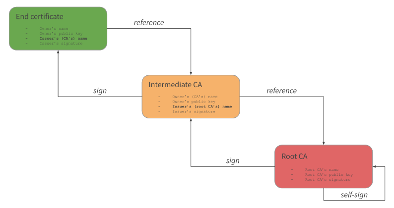

# How to create the external CA Infrastructure

## Certificates and requirements

Kubernetes requires PKI certificates for authentication over TLS. If you install Kubernetes with kubeadm, the certificates that your cluster requires are automatically generated. You can also generate your own certificates – for example, to keep your private keys more secure by not storing them on the API server. This page explains how to generate and install your own certificates.

> Full referenced here: https://kubernetes.io/docs/setup/best-practices/certificates/

## Root and Intermediate CAs

<p align="center">
  
</p>

### What is the purpose of the Intermediate CA certificate

To improve the security of the root certificate, we will create two intermediate certificates from which SSL certificates are signed and issued.

An intermediate certificate is a subordinate certificate issued by the trusted root, specifically for issuing server certificates for the final subject. The result is a chain of certificates that starts at the trusted root CA, includes the intermediary certificates and ends with the SSL certificate issued to you. These certificates are called chained root certificates.

Creating certificates directly from the root certificate of the CA increases the risk of compromising the root certificate, and if the root certificate is compromised, the entire trust infrastructure created by the SSL provider will fail. The use of intermediate certificates to issue SSL certificates to final entities, therefore, provides an additional layer of security. You must install the intermediate certificates on your server together with the issued SSL certificate to complete the trusted chain and make the certificate effective.

The use of intermediate certificates does not cause any installation, performance or compatibility issues.

<p align="center">
  
  
</p>

### A little analogy for better understanding this concept

> Once upon a time, there was a kingdom known as **Cluster Land**. In this kingdom, there was no currency that allowed people to trade with each other. All the commerce happened through bartering.

> One day, many king's subjects started complaining about how the bartering process wasn't fair. The king, a very wise man, decided to create a currency called **Cluster Coins**. The coins were supposed to be created by the king's subjects themselves, using a special material (silver) and a press provided by the king's wedges. This was a just in-time process and happened everytime the king's subjects made formal requests to do so.

> At first, this process worked really well, and currency began to circulate in the reign. The trading was perceived as being very fair, and everybody was pretty happy with this new model.

> One day though, somebody realized the amount of coins circulating was out of control, and the royal guard was tasked to investigate what was happening. It was found that some counterfeiters were falsifying the coins and the currency value wasn't as fair as it used to be, because the number of coins circulating was much higher and the prices weren't fair anymore, creating an hyperinflation scenario. This made the currency to be depreciated and lose its value.

> To solve this problem, the king came up with a solution: instead of providing the presses to the subjects, all coins would now be created in a central place. The **Kingdom's Mint** was born. Now, many security measures were imposed and it was increasily difficult to falsify coins. Besides the inumerous security measures added to the process, now gold, a much rarer material, was used for creating the new coins.

> This new process worked really well. The old coin was deprecated and, though some counterfeiters still tried to falsify the coins, it was now much harder and expensive to succeed. Besides that, it was clear to the subjects when somebody tried to fool themselves with false coins and the counterfeiters were immediatelly denounced to the king.

## OpenSSL

<p align="center">
  
</p>

_OpenSSL is a software library for applications that secure communications over computer networks against eavesdropping or need to identify the party at the other end. It is widely used by Internet servers, including the majority of HTTPS websites._

_OpenSSL contains an open-source implementation of the SSL and TLS protocols. The core library, written in the C programming language, implements basic cryptographic functions and provides various utility functions. Wrappers allowing the use of the OpenSSL library in a variety of computer languages are available._

_The OpenSSL Software Foundation (OSF) represents the OpenSSL project in most legal capacities including contributor license agreements, managing donations, and so on. OpenSSL Software Services (OSS) also represents the OpenSSL project, for Support Contracts._

_OpenSSL is available for most Unix-like operating systems (including Linux, macOS, and BSD) and Microsoft Windows._

> Full reference here: https://www.openssl.org/

## Creating the certificates

1. Create the certificate template

   > This sample was created for Ubuntu and Debian distributions

   ```console
   debian@busybox:~$ mkdir certificates
   ```

   ```console
   debian@busybox:~$ cd certificates
   ```

   > Reference: man 5 config  
   > Reference: man 1 req  
   > Reference: man 1 ca  
   > Reference: man 1 x509

   ```console
   debian@busybox:~/certificates$ cat <<EOF > config.conf
   [ req ]
   default_bits            = 2048
   default_md              = sha256
   distinguished_name      = dn
   prompt                  = no

   [ dn ]
   C                       = BR
   ST                      = SP
   L                       = Campinas
   O                       = Kubernetes, Labs
   OU                      = Labs
   CN                      = \${ENV::CN}

   [ root ]
   basicConstraints        = critical,CA:TRUE
   subjectKeyIdentifier    = hash
   authorityKeyIdentifier  = keyid:always,issuer
   keyUsage                = critical,digitalSignature,keyEncipherment,keyCertSign,cRLSign

   [ ca ]
   basicConstraints        = critical,CA:TRUE,pathlen:0
   subjectKeyIdentifier    = hash
   authorityKeyIdentifier  = keyid:always,issuer:always
   keyUsage                = critical,digitalSignature,keyEncipherment,keyCertSign,cRLSign

   [ server ]
   subjectKeyIdentifier    = hash
   basicConstraints        = critical,CA:FALSE
   extendedKeyUsage        = serverAuth
   keyUsage                = critical,keyEncipherment,dataEncipherment
   authorityKeyIdentifier  = keyid,issuer:always
   subjectAltName          = DNS:localhost,\${ENV::SAN},IP:127.0.0.1,IP:127.0.1.1

   [ peer ]
   subjectKeyIdentifier    = hash
   basicConstraints        = critical,CA:FALSE
   extendedKeyUsage        = serverAuth,clientAuth
   keyUsage                = critical,keyEncipherment,dataEncipherment
   authorityKeyIdentifier  = keyid,issuer:always
   subjectAltName          = DNS:localhost,\${ENV::SAN},IP:127.0.0.1,IP:127.0.1.1

   [ user ]
   subjectKeyIdentifier    = hash
   basicConstraints        = critical,CA:FALSE
   extendedKeyUsage        = clientAuth
   keyUsage                = critical,keyEncipherment,dataEncipherment
   authorityKeyIdentifier  = keyid,issuer:always
   EOF
   ```

2. Create the Root CA certificate

   ```console
   debian@busybox:~/certificates$ CN="Root, CA" SAN= \
       openssl req -x509 -newkey rsa:2048 -nodes \
           -keyout root-key.pem \
           -days 3650 \
           -config config.conf \
           -extensions root \
           -out root-cert.pem
   ```

   Expected output:

   ```text
   Generating a RSA private key
   ...........................................................+++++
   ...............+++++
   writing new private key to 'root-cert.pem'
   -----
   ```

3. Create the intermediate `kubernetes-ca` CA certificate request

   ```console
   debian@busybox:~/certificates$ CN="Kubernetes, CA" SAN= \
       openssl req -newkey rsa:2048 -nodes \
           -keyout ca-kubernetes-key.pem \
           -config config.conf \
           -out ca-kubernetes-cert.csr
   ```

   Expected output:

   ```text
   Generating a RSA private key
   ..........+++++
   ......................................................................................+++++
   writing new private key to 'ca-kubernetes-key.pem'
   -----
   ```

4. Create the intermediate `kubernetes-front-proxy-ca` CA certificate request

   ```console
   debian@busybox:~/certificates$ CN="Kubernetes front proxy, CA" SAN= \
       openssl req -newkey rsa:2048 -nodes \
           -keyout ca-kubernetes-front-proxy-key.pem \
           -config config.conf \
           -out ca-kubernetes-front-proxy-cert.csr
   ```

   Expected output:

   ```text
   Generating a RSA private key
   ..........+++++
   ......................................................................................+++++
   writing new private key to 'ca-kubernetes-front-proxy-key.pem'
   -----
   ```

5. Create the intermediate `etcd-ca` CA certificate request

   ```console
   debian@busybox:~/certificates$ CN="Etcd, CA" SAN= \
       openssl req -newkey rsa:2048 -nodes \
           -keyout ca-etcd-key.pem \
           -config config.conf \
           -out ca-etcd-cert.csr
   ```

   Expected output:

   ```text
   Generating a RSA private key
   ..........+++++
   ......................................................................................+++++
   writing new private key to 'ca-etcd-key.pem'
   -----
   ```

6. Create the intermediate `certificate-manager-ca` CA certificate request

   ```console
   debian@busybox:~/certificates$ CN="Certificate Manager, CA" SAN= \
      openssl req -newkey rsa:2048 -nodes \
         -keyout ca-certificate-manager-key.pem \
         -config config.conf \
         -out ca-certificate-manager-cert.csr
   ```

   Expected output:

   ```text
   Generating a RSA private key
   ..........+++++
   ......................................................................................+++++
   writing new private key to 'ca-certificate-manager-key.pem'
   -----
   ```

7. Sign the intermediate `kubernetes-ca` CA certificate with the root CA certificate

   ```console
   debian@busybox:~/certificates$ CN="Kubernetes, CA" SAN= \
       openssl x509 -req \
           -extfile config.conf \
           -extensions ca \
           -in ca-kubernetes-cert.csr \
           -CA root-cert.pem \
           -CAkey root-key.pem \
           -CAcreateserial \
           -out ca-kubernetes-cert.pem \
           -days 3650 -sha256
   ```

   Expected output:

   ```text
   Signature ok
   subject=C = BR, ST = SP, L = Campinas, O = "Kubernetes, Labs", OU = Labs, CN = "Kubernetes, CA"
   Getting CA Private Key
   ```

   Create the intermediate `kubernetes-ca` CA certificate chain

   ```console
   debian@busybox:~/certificates$ cat ca-kubernetes-cert.pem root-cert.pem > ca-kubernetes-chain-cert.pem
   ```

8. Sign the intermediate `kubernetes-front-proxy-ca` CA certificate with the root CA certificate

   ```console
   debian@busybox:~/certificates$ CN="Kubernetes front proxy, CA" SAN= \
       openssl x509 -req \
           -extfile config.conf \
           -extensions ca \
           -in ca-kubernetes-front-proxy-cert.csr \
           -CA root-cert.pem \
           -CAkey root-key.pem \
           -CAcreateserial \
           -out ca-kubernetes-front-proxy-cert.pem \
           -days 3650 -sha256
   ```

   Expected output:

   ```text
   Signature ok
   subject=C = BR, ST = SP, L = Campinas, O = "Kubernetes, Labs", OU = Labs, CN = "Kubernetes front proxy, CA"
   Getting CA Private Key
   ```

   Create the `kubernetes-front-proxy-ca` intermediate CA certificate chain

   ```console
   debian@busybox:~/certificates$ cat ca-kubernetes-front-proxy-cert.pem root-cert.pem > ca-kubernetes-front-proxy-chain-cert.pem
   ```

9. Sign the intermediate `etcd-ca` CA certificate with the root CA certificate

   ```console
   debian@busybox:~/certificates$ CN="Etcd, CA" SAN= \
       openssl x509 -req \
           -extfile config.conf \
           -extensions ca \
           -in ca-etcd-cert.csr \
           -CA root-cert.pem \
           -CAkey root-key.pem \
           -CAcreateserial \
           -out ca-etcd-cert.pem \
           -days 3650 -sha256
   ```

   Expected output:

   ```text
   Signature ok
   subject=C = BR, ST = SP, L = Campinas, O = "Kubernetes, Labs", OU = Labs, CN = "Etcd, CA"
   Getting CA Private Key
   ```

   Create the intermediate `etcd-ca` CA certificate chain

   ```console
   debian@busybox:~/certificates$ cat ca-etcd-cert.pem root-cert.pem > ca-etcd-chain-cert.pem
   ```

10. Sign the intermediate `certificate-manager-ca` CA certificate with the root CA certificate

    ```console
    debian@busybox:~/certificates$ CN="Certificate Manager, CA" SAN= \
       openssl x509 -req \
          -extfile config.conf \
          -extensions ca \
          -in ca-certificate-manager-cert.csr \
          -CA root-cert.pem \
          -CAkey root-key.pem \
          -CAcreateserial \
          -out ca-certificate-manager-cert.pem \
          -days 3650 -sha256
    ```

    Expected output:

    ```text
    Signature ok
    subject=C = BR, ST = SP, L = Campinas, O = "Kubernetes, Labs", OU = Labs, CN = "Certificate Manager, CA"
    Getting CA Private Key
    ```

    Create the intermediate `etcd-ca` CA certificate chain

    ```console
    debian@busybox:~/certificates$ cat ca-certificate-manager-cert.pem root-cert.pem > ca-certificate-manager-chain-cert.pem
    ```

11. Verify the signatures

    ```console
    debian@busybox:~/certificates$ for instance in ca-kubernetes ca-kubernetes-front-proxy ca-certificate-manager ca-etcd; do
       openssl verify -CAfile root-cert.pem ${instance}-cert.pem
    done
    ```

    Expected output:

    ```text
    ca-kubernetes-cert.pem: OK
    ca-kubernetes-front-proxy-cert.pem: OK
    ca-certificate-manager-cert.pem: OK
    ca-etcd-cert.pem: OK
    ```

## Summary

In this process, we:

1. Created the root certificate;
2. Create an intermediary certificate for each component of our cluster (`kubernetes-ca`, `kubernetes-front-proxy-ca`, `etcd-ca` and `certificate-manager-ca`) and sign them with the root certificate;
3. Create the final certificates for each component, signing them with their respective intermediary certificates previously created;
