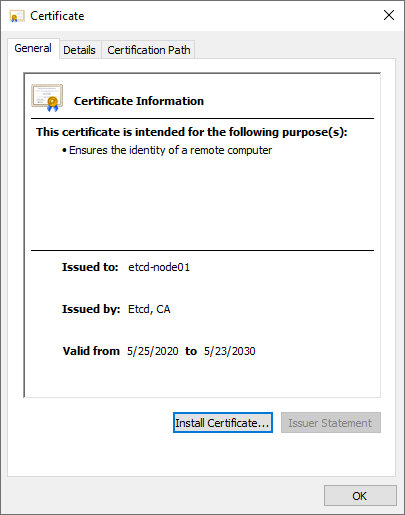

# How to create the external CA Infrastructure (under construction)

## Certificates and requirements

Kubernetes requires PKI certificates for authentication over TLS. If you install Kubernetes with kubeadm, the certificates that your cluster requires are automatically generated. You can also generate your own certificates – for example, to keep your private keys more secure by not storing them on the API server. This page explains how to generate and install your own certificates.

> Full referenced here: https://kubernetes.io/docs/setup/best-practices/certificates/

## Root and Intermediates CA

<p align="center">
  
</p>

### What is the purpose of the Intermediate CA certificate (resume to our words)

To improve the security of the root certificate, we have created two intermediate certificates from which SSL certificates are signed and issued.

An intermediate certificate is a subordinate certificate issued by the trusted root specifically for issuing server certificates from the final subject. The result is a chain of certificates that starts at the trusted root CA, up to the middleman and ends with the SSL certificate issued to you. These certificates are called chained root certificates.

Creating certificates directly from the root certificate of the CA increases the risk of compromising the root certificate, and if the root certificate is compromised, the entire trust infrastructure created by the SSL provider will fail. The use of intermediate certificates to issue SSL certificates to final entities, therefore, provides an additional level of security. You must install the intermediate certificate on your server together with the issued SSL certificate to complete the trusted chain and allow the certificate to be effective.

The use of intermediate certificates does not cause installation, performance or compatibility problems.

<p align="center">
  
  
</p>

## OpenSSL

<p align="center">
  
</p>

*OpenSSL is a software library for applications that secure communications over computer networks against eavesdropping or need to identify the party at the other end. It is widely used by Internet servers, including the majority of HTTPS websites.*

*OpenSSL contains an open-source implementation of the SSL and TLS protocols. The core library, written in the C programming language, implements basic cryptographic functions and provides various utility functions. Wrappers allowing the use of the OpenSSL library in a variety of computer languages are available.*

*The OpenSSL Software Foundation (OSF) represents the OpenSSL project in most legal capacities including contributor license agreements, managing donations, and so on. OpenSSL Software Services (OSS) also represents the OpenSSL project, for Support Contracts.*

*OpenSSL is available for most Unix-like operating systems (including Linux, macOS, and BSD) and Microsoft Windows.*

> Full reference here: https://www.openssl.org/

## Creating certificates

1. Create the certificate template

    > This sample was created for Ubuntu and Debian distribution  

    ```console
    debian@busybox:~$ mkdir certificates
    ```

    ```console
    debian@busybox:~$ cd certificates
    ```

    > Reference: man 5 config  
    > Reference: man 1 req  
    > Reference: man 1 ca  
    > Reference: man 1 x509

    ```console
    debian@busybox:~/certificates$ cat <<EOF > config.conf
    [ req ]
    default_bits            = 2048
    default_md              = sha256
    distinguished_name      = dn
    prompt                  = no

    [ dn ]
    C                       = BR
    ST                      = SP
    L                       = Campinas
    O                       = Kubernetes, Labs
    OU                      = Labs
    CN                      = \${ENV::CN}

    [ root ]
    basicConstraints        = critical,CA:TRUE
    subjectKeyIdentifier    = hash
    authorityKeyIdentifier  = keyid:always,issuer
    keyUsage                = critical,digitalSignature,keyEncipherment,keyCertSign,cRLSign

    [ ca ]
    basicConstraints        = critical,CA:TRUE,pathlen:0
    subjectKeyIdentifier    = hash
    authorityKeyIdentifier  = keyid:always,issuer:always
    keyUsage                = critical,digitalSignature,keyEncipherment,keyCertSign,cRLSign

    [ server ]
    subjectKeyIdentifier    = hash
    basicConstraints        = critical,CA:FALSE
    extendedKeyUsage        = serverAuth
    keyUsage                = critical,keyEncipherment,dataEncipherment
    authorityKeyIdentifier  = keyid,issuer:always
    subjectAltName          = DNS:localhost,\${ENV::SAN},IP:127.0.0.1,IP:127.0.1.1

    [ peer ]
    subjectKeyIdentifier    = hash
    basicConstraints        = critical,CA:FALSE
    extendedKeyUsage        = serverAuth,clientAuth
    keyUsage                = critical,keyEncipherment,dataEncipherment
    authorityKeyIdentifier  = keyid,issuer:always
    subjectAltName          = DNS:localhost,\${ENV::SAN},IP:127.0.0.1,IP:127.0.1.1

    [ user ]
    subjectKeyIdentifier    = hash
    basicConstraints        = critical,CA:FALSE
    extendedKeyUsage        = clientAuth
    keyUsage                = critical,keyEncipherment,dataEncipherment
    authorityKeyIdentifier  = keyid,issuer:always
    EOF
    ```

2. Create Root the CA certificate

    ```console
    debian@busybox:~/certificates$ CN="Root, CA" SAN= \
        openssl req -x509 -newkey rsa:2048 -nodes \
            -keyout root-key.pem \
            -days 3650 \
            -config config.conf \
            -extensions root \
            -out root-cert.pem
    ```

    Expected output:

    ```text
    Generating a RSA private key
    ...........................................................+++++
    ...............+++++
    writing new private key to 'root-cert.pem'
    -----
    ```

3. Create request intermediate `kubernetes-ca` the CA certificate

    ```console
    debian@busybox:~/certificates$ CN="Kubernetes, CA" SAN= \
        openssl req -newkey rsa:2048 -nodes \
            -keyout ca-kubernetes-key.pem \
            -config config.conf \
            -out ca-kubernetes-cert.csr
    ```

    Expected output:

    ```text
    Generating a RSA private key
    ..........+++++
    ......................................................................................+++++
    writing new private key to 'ca-kubernetes-key.pem'
    -----
    ```

4. Create request intermediate `kubernetes-front-proxy-ca` the CA certificate

    ```console
    debian@busybox:~/certificates$ CN="Kubernetes front proxy, CA" SAN= \
        openssl req -newkey rsa:2048 -nodes \
            -keyout ca-kubernetes-front-proxy-key.pem \
            -config config.conf \
            -out ca-kubernetes-front-proxy-cert.csr
    ```

    Expected output:

    ```text
    Generating a RSA private key
    ..........+++++
    ......................................................................................+++++
    writing new private key to 'ca-kubernetes-front-proxy-key.pem'
    -----
    ```

5. Create request intermediate `etcd-ca` the CA certificate

    ```console
    debian@busybox:~/certificates$ CN="Etcd, CA" SAN= \
        openssl req -newkey rsa:2048 -nodes \
            -keyout ca-etcd-key.pem \
            -config config.conf \
            -out ca-etcd-cert.csr
    ```

    Expected output:

    ```text
    Generating a RSA private key
    ..........+++++
    ......................................................................................+++++
    writing new private key to 'ca-etcd-key.pem'
    -----
    ```

6. Sing intermediate `kubernetes-ca` CA certificate with root CA

    ```console
    debian@busybox:~/certificates$ CN="Kubernetes, CA" SAN= \
        openssl x509 -req \
            -extfile config.conf \
            -extensions ca \
            -in ca-kubernetes-cert.csr \
            -CA root-cert.pem \
            -CAkey root-key.pem \
            -CAcreateserial \
            -out ca-kubernetes-cert.pem \
            -days 3650 -sha256
    ```

    Expected output:

    ```text
    Signature ok
    subject=C = BR, ST = SP, L = Campinas, O = "Kubernetes, Labs", OU = Labs, CN = "Kubernetes, CA"
    Getting CA Private Key
    ```

    Create chain intermediate certificate `kubernetes-ca` CA

    ```console
    debian@busybox:~/certificates$ cat ca-kubernetes-cert.pem root-cert.pem > ca-kubernetes-chain-cert.pem
    ```

7. Sing intermediate `kubernetes-front-proxy-ca` CA certificate with root CA

    ```console
    debian@busybox:~/certificates$ CN="Kubernetes front proxy, CA" SAN= \
        openssl x509 -req \
            -extfile config.conf \
            -extensions ca \
            -in ca-kubernetes-front-proxy-cert.csr \
            -CA root-cert.pem \
            -CAkey root-key.pem \
            -CAcreateserial \
            -out ca-kubernetes-front-proxy-cert.pem \
            -days 3650 -sha256
    ```

    Expected output:

    ```text
    Signature ok
    subject=C = BR, ST = SP, L = Campinas, O = "Kubernetes, Labs", OU = Labs, CN = "Kubernetes front proxy, CA"
    Getting CA Private Key
    ```

    Create chain intermediate certificate `kubernetes-front-proxy-ca` CA

    ```console
    debian@busybox:~/certificates$ cat ca-kubernetes-front-proxy-cert.pem root-cert.pem > ca-kubernetes-front-proxy-chain-cert.pem
    ```

8. Sing intermediate `etcd-ca` CA certificate with root CA

    ```console
    debian@busybox:~/certificates$ CN="Etcd, CA" SAN= \
        openssl x509 -req \
            -extfile config.conf \
            -extensions ca \
            -in ca-etcd-cert.csr \
            -CA root-cert.pem \
            -CAkey root-key.pem \
            -CAcreateserial \
            -out ca-etcd-cert.pem \
            -days 3650 -sha256
    ```

    Expected output:

    ```text
    Signature ok
    subject=C = BR, ST = SP, L = Campinas, O = "Kubernetes, Labs", OU = Labs, CN = "Etcd, CA"
    Getting CA Private Key
    ```

    Create chain intermediate certificate `etcd-ca` CA

    ```console
    debian@busybox:~/certificates$ cat ca-etcd-cert.pem root-cert.pem > ca-etcd-chain-cert.pem
    ```

9. Verify the signatures

    ```console
    debian@busybox:~/certificates$ for instance in ca-kubernetes ca-kubernetes-front-proxy ca-etcd ; do
        openssl verify -CAfile root-cert.pem ${instance}-cert.pem
    done
    ```

    Expected output:

    ```text
    ca-kubernetes-cert.pem: OK
    ca-kubernetes-front-proxy-cert.pem: OK
    ca-etcd-cert.pem: OK
    ```
