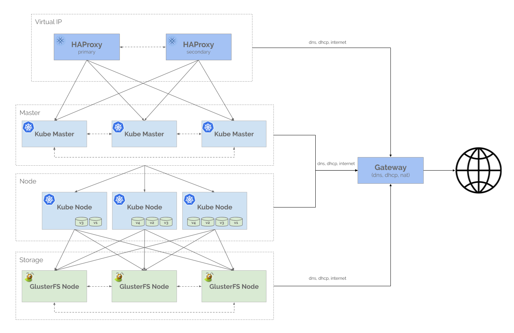
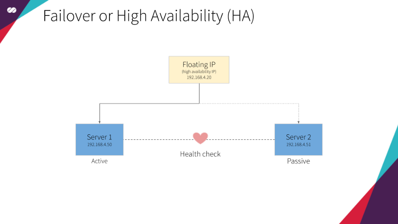
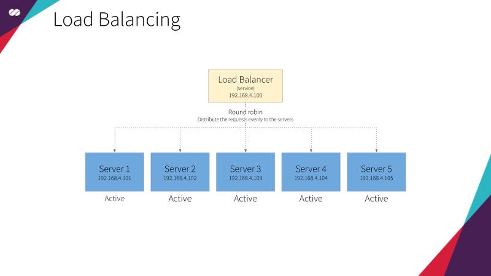
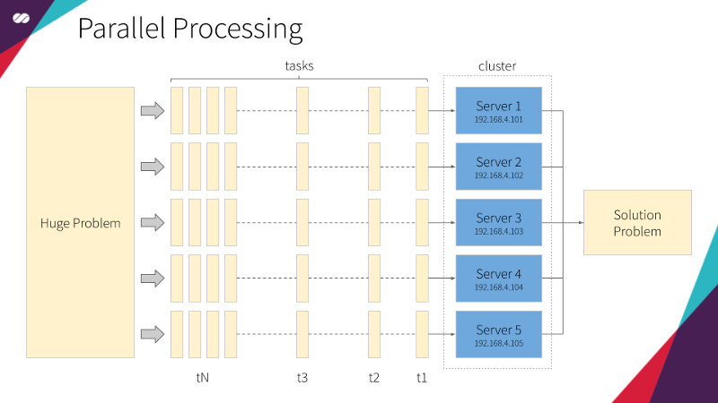

## Architecture Diagram

  

## HAProxy cluster

High Availability **HAProxy** load balancer supported by a **Floating IP** and the [Corosync](https://clusterlabs.org/corosync.html)/[Pacemaker](https://clusterlabs.org/pacemaker/) cluster stack.

**Floating IPs** are also known as “shared” or “virtual” IP addresses. A **Floating IP** is a normal IP address assigned to a node that may eventually fail. For failover, a node with similar characteristics (Passive) runs alongside with the main (Active) node in an Active/Passive mode. If a failure occurs, this **Floating IP** will be assigned to the Passive node automatically and transparently, making it the active one, avoiding downtime.

Each of the **HAProxy** load balancers will be configured to split traffic between backend application servers. If the primary load balancer goes down, the **Floating IP** will be moved to the second load balancer automatically, allowing it continue serving without downtime.

  

## Kubernetes cluster

[Kubernetes](https://kubernetes.io/docs/tutorials/kubernetes-basics/create-cluster/cluster-intro/) coordinates a highly available cluster of computers that are connected to work as a single unit. The abstractions in Kubernetes allow you to deploy containerized applications to a cluster without tying them specifically to individual machines. To make use of this new model of deployment, applications need to be packaged in a way that decouples them from individual hosts: they need to be containerized. Containerized applications are more flexible and available than in past deployment models, where applications were installed directly onto specific machines as packages deeply integrated into the host. Kubernetes automates the distribution and scheduling of application containers across a cluster in a more efficient way.

Kubernetes is an open-source platform and is production-ready.

## Gluster

[GlusterFS](https://docs.gluster.org/en/latest/Administrator%20Guide/GlusterFS%20Introduction/) is a scalable network filesystem suitable for data-intensive tasks such as cloud storage and media streaming. GlusterFS is free and open source software and can utilize common off-the-shelf hardware. The main purpose of **Gluster** here is to provide volumes to Kubernetes Pods. It will be managed and [orchestrated like any other app](https://github.com/gluster/gluster-kubernetes) in Kubernetes. This is a convenient way to unlock the power of dynamically provisioned, persistent GlusterFS volumes in Kubernetes.

  

## Cluster Definition

Cluster is an English term meaning “agglomerate” or “agglomeration” and can be applied in various contexts. In the context of computing, the term defines a system architecture capable of combining several computers to work together.

Each station is called a “node” and, in combination, forms the cluster. In some cases, it is possible to see references such as “supercomputers” or “cluster computing” for the same scenario, representing the hardware used or the software specially developed to be able to combine these equipments.

Reference: https://en.wikipedia.org/wiki/Computer_cluster

## How are clusters formed?

It may seem very simple to aggregate multiple computers together to perform tasks, but it is not. Efforts to efficiently build this kind of use began at IBM in 1960 and are constant evolving. The objective is always to increase the efficiency of the fusion, that is, to optimize the full use of the resources of all nodes and dynamically evolve the cluster.

## Are all clusters the same?

No. There are different types of clusters that are focused on different benefits of merging and hence are more suitable for certain tasks and markets. See below the four main types of clusters:

### Failover or High Availability (HA)

As its name suggests, this type of cluster is developed with a focus to keep the application always active and responsive. Regardless of what happens at each node, it is essential that the system remains online. For this, several nodes work on a redundancy schema that is invisible to the user. To illustrate this concept, imagine a basketball game where a substitute player who has exactly the same characteristics as a starting one — practically a clone of the original — is always warm and standing on the edge of the court. If the starting player needs to leave for any reason, the substitute player immediately takes action, without the referee, the public nor the teammates realizing it. This is a type of cluster commonly used in services such as email, where getting out-of-service is simply not acceptable.

  

### Load Balancing

In this type of architecture, all nodes are responsible for performing tasks. Be it to respond to incoming traffic requests or to provide resources, the tasks are always distributed to the machines that compose the system. It’s literally a “all for one” approach. The simplest to the most complex tasks are performed with the computing power resulting from the union of all the available resources. In this model, performance is the priority and if any of the nodes fails it is removed from the system and the task is redistributed among the remaining ones.

  

### Parallel Processing

In this type of cluster, large tasks are divided between less complex activities, distributed by the system and executed in parallel by the various nodes that compose the cluster. Therefore, this type of cluster is well suited for very complex computational tasks. Roughly speaking, it would be like splitting a jigsaw puzzle of five thousand pieces between ten friends, having each friend responsible for assembling a chunk containing five hundred pieces. After each friend finishes its part, the chunks are them combined to solve the main puzzle (MapReduce anyone?)

  

### Combined Models

In some cases, it is not possible to prioritize performance over stability or vice versa. MTA servers or email servers, for example, need both features with the same priority. Therefore, these companies use clusters that are able to combine load-balancing and high-availability. This results in a system that is able to combine the power of the different machines while having an internal network of redundancy nodes to avoid outages.

### In what category does Kubernetes fall into?

Kubernetes uses a combined approach. Failover and High Availability, so it’s able to (re)schedule PODs to run on different nodes, keeping the application up even if one (or more) of the PODs fail. And Load Balancing, so it’s able to distribute requests to PODs running on different nodes, avoiding that a specific node becomes a hotspot and eventually impacts the performance of applications.
