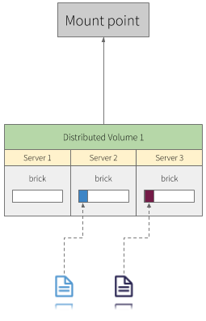
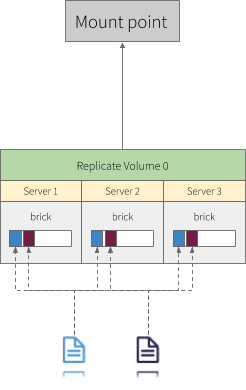
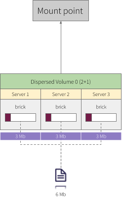

# How to setup storage GlusterFS

GlusterFS is a scalable network filesystem suitable for data-intensive tasks such as cloud storage and media streaming. GlusterFS is free and open source software and can utilize common off-the-shelf hardware.
> Reference: https://docs.gluster.org/en/latest/Administrator%20Guide/GlusterFS%20Introduction/

## Volume Types

### Distributed

Distributed volumes distribute files across the bricks in the volume. You can use distributed volumes where the requirement is to scale storage and the redundancy is either not important or is provided by other hardware/software layers.

<p align="center">
  
</p>

### Replicated

Replicated volumes replicate files across bricks in the volume. You can use replicated volumes in environments where high-availability and high-reliability are critical.

<p align="center">
  
</p>

### Dispersed

Dispersed volumes are based on erasure codes, providing space-efficient protection against disk or server failures. It stores an encoded fragment of the original file to each brick in a way that only a subset of the fragments is needed to recover the original file (EC). The number of bricks that can be missing without losing access to data is configured by the administrator on volume creation time.

<p align="center">
  
</p>

#### Erasure coding (EC)

It is a data protection and storage process through which a data object is separated into smaller components/fragments and each of those fragments is encoded with redundant data padding. EC transforms data object fragments into larger fragments and uses the primary data object identifier to recover each fragment.

Erasure coding is also known as **forward error correction** (FEC).

Erasure coding is primarily used in applications that have a low tolerance for data errors. This includes most data backup services and technologies including disk arrays, object-based cloud storage, archival storage and distributed data applications.

> Reference: https://en.wikipedia.org/wiki/Erasure_code

#### Overview

<p align="center">
  
</p>

## How does this fit into Kubernetes

*On-disk files in a Container are ephemeral, which presents some problems for non-trivial applications when running in Containers. First, when a Container crashes, kubelet will restart it, but the files will be lost - the Container starts with a clean state. Second, when running Containers together in a Pod it is often necessary to share files between those Containers. The Kubernetes Volume abstraction solves both of these problems.*

### Volumes

* **Filesystem**: In Kubernetes, each container can read and write in its own filesystem.
But the data written into this filesystem is destroyed when the container is restarted or removed.

* **Volume**: Kubernetes has volumes. Volumes that are in a POD will exist as long as the POD exists. Volumes can be shared among the same POD containers. When a POD is restarted or removed the volume is destroyed.

* **Persistent Volume**: The Kubernetes has persistent volumes. Persistent volumes are long-term stores within the Kubernetes cluster. Persistent volumes go beyond containers, PODs, and nodes, they exist as long as the Kubernetes cluster exists. A POD claims the use of a persistent volume for reading or writing or for reading and writing.

| Type              | How long?          |
|-------------------|--------------------|
| Filesystem        | Container lifetime |
| Volume            | Pod lifetime       |
| Persistent Volume | Cluster lifetime   |

### Configure the cluster

#### Print the `Join` Command

1. Run the following commands to print the `join` command master replicas on cluster:

   ```console
   debian@busybox:~$ ssh kube-mast01

   debian@kube-mast01:~$ sudo kubeadm token create --print-join-command
   ```

   Expected output:

   ```console
   kubeadm join 192.168.4.20:6443 --token y5uii4.5myd468ieaavd0g6 --discovery-token-ca-cert-hash sha256:d4990d904f85ad8fb2d2bbb2e56b35a8cd0714092b40e3778209a0f1d4fa38b9
   ```

### Running Commands in Parallel with tmux

#### Split panes horizontally

To split a pane horizontally, press **ctrl+b** and **'** (single quotation mark). Let's go!

```console
debian@busybox:~$ tmux
```

```console
debian@busybox:~$ ssh debian@glus-node01
```

> `ctrl+b` `"`

```console
debian@busybox:~$ ssh debian@glus-node02
```

> `ctrl+b` `"`

```console
debian@busybox:~$ ssh debian@glus-node03
```

> `ctrl+b` `"`

#### Send commands to all panes

Press **ctrl+b** and **shit+:**, type the following command and hit ENTER:

`setw synchronize-panes`

1. Run the following command to join the Gluster nodes in the cluster using the join command printed in the previous section:

    ```console
    debian@busybox:~$ ssh kube-node01

    debian@kube-node01:~$ sudo kubeadm join 192.168.4.20:6443 \
        --token y5uii4.5myd468ieaavd0g6 \
        --discovery-token-ca-cert-hash sha256:d4990d904f85ad8fb2d2bbb2e56b35a8cd0714092b40e3778209a0f1d4fa38b9
    ```

2. verify

    ```console
    debian@busybox:~$ kubectl get nodes -o wide
    ```

    Expected output:

    ```console
    NAME          STATUS   ROLES    AGE     VERSION   INTERNAL-IP     EXTERNAL-IP   OS-IMAGE                       KERNEL-VERSION   CONTAINER-RUNTIME
    glus-node01   Ready    <none>   6m20s   v1.15.6   192.168.3.87    <none>        Debian GNU/Linux 9 (stretch)   4.9.0-12-amd64   docker://18.6.0
    glus-node02   Ready    <none>   6m7s    v1.15.6   192.168.3.217   <none>        Debian GNU/Linux 9 (stretch)   4.9.0-12-amd64   docker://18.6.0
    glus-node03   Ready    <none>   6m20s   v1.15.6   192.168.3.240   <none>        Debian GNU/Linux 9 (stretch)   4.9.0-12-amd64   docker://18.6.0
    kube-mast01   Ready    master   29m     v1.15.6   192.168.1.199   <none>        Debian GNU/Linux 9 (stretch)   4.9.0-12-amd64   docker://18.6.0
    kube-mast02   Ready    master   22m     v1.15.6   192.168.1.214   <none>        Debian GNU/Linux 9 (stretch)   4.9.0-12-amd64   docker://18.6.0
    kube-mast03   Ready    master   22m     v1.15.6   192.168.1.207   <none>        Debian GNU/Linux 9 (stretch)   4.9.0-12-amd64   docker://18.6.0
    kube-node01   Ready    <none>   18m     v1.15.6   192.168.2.211   <none>        Debian GNU/Linux 9 (stretch)   4.9.0-12-amd64   docker://18.6.0
    kube-node02   Ready    <none>   18m     v1.15.6   192.168.2.144   <none>        Debian GNU/Linux 9 (stretch)   4.9.0-12-amd64   docker://18.6.0
    kube-node03   Ready    <none>   18m     v1.15.6   192.168.2.251   <none>        Debian GNU/Linux 9 (stretch)   4.9.0-12-amd64   docker://18.6.0
    ```

### Configuring Gluster store

1. Label K8 nodes

    ```console
    debian@busybox:~$ kubectl label nodes glus-node01 glus-node02 glus-node03 storagenode=glusterfs
    ```

    Expected output:

    ```console
    node/glus-node01 labeled
    node/glus-node02 labeled
    node/glus-node03 labeled
    ```

2. Deploy glusterfs

    ```console
    debian@busybox:~$ kubectl create -f deploy/glusterfs-daemonset.yaml
    ```

    Expected output:

    ```console
    daemonset.extensions/glusterfs created
    ```

3. Get pod IPs and peer probe glusterfs nodes

    ```console
    debian@busybox:~$ kubectl get pods -l glusterfs-node=pod -o wide
    ```

    Expected output:

    ```console
    NAME              READY   STATUS    RESTARTS   AGE     IP              NODE          NOMINATED NODE   READINESS GATES
    glusterfs-4kkz5   1/1     Running   0          4m47s   192.168.3.87    glus-node01   <none>           <none>
    glusterfs-6blrz   1/1     Running   0          4m47s   192.168.3.217   glus-node02   <none>           <none>
    glusterfs-jdqt9   1/1     Running   0          4m47s   192.168.3.240   glus-node03   <none>           <none>
    ```

    ```console
    debian@busybox:~$ kubectl exec -it glusterfs-4kkz5 -- gluster peer probe glus-node02.kube.demo
    peer probe: success.

    debian@busybox:~$ kubectl exec -it glusterfs-4kkz5 -- gluster peer probe glus-node03.kube.demo
    peer probe: success.
    ```

4. Verify

    ```console
    debian@busybox:~$ kubectl exec -it glusterfs-4kkz5 -- gluster peer status
    ```

    Expected output:

    ```console
    Number of Peers: 2

    Hostname: glus-node02.kube.demo
    Uuid: 2ec26a67-8688-4313-8bcc-2ab03e9d4d2a
    State: Peer in Cluster (Connected)

    Hostname: glus-node03.kube.demo
    Uuid: b2f632f6-0c4f-4116-8f82-fcfcadba1170
    State: Peer in Cluster (Connected)
    ```

5. Create storage-class.yaml and deploy via kubectl

    ```console
    debian@busybox:~$ kubectl create -f deploy/storage-class.yaml
    ```

    Expected output:

    ```console
    storageclass.storage.k8s.io/glusterfs-simple created
    ```

6. Verify

    ```console
    debian@busybox:~$ kubectl get storageclass
    ```

    Expected output:

    ```console
    NAME               PROVISIONER                    AGE
    glusterfs-simple   gluster.org/glusterfs-simple   65s
    ```

7. Apply role based access control

    ```console
    debian@busybox:~$ kubectl create -f deploy/rbac.yaml
    ```

    Expected output:

    ```console
    serviceaccount/glfs-provisioner created
    clusterrole.rbac.authorization.k8s.io/glfs-provisioner-runner created
    clusterrolebinding.rbac.authorization.k8s.io/run-glfs-provisioner created
    ```

8. Deploy Gluster provisioner

    ```console
    debian@busybox:~$ kubectl create -f deploy/provisioner.yaml
    ```

    Expected output:

    ```console
    deployment.extensions/glusterfs-simple-provisioner created
    ```

9. Mark a Nodes unschedulable

    ```console
    debian@busybox:~$ kubectl cordon glus-node01 glus-node02 glus-node03
    ```

    Expected output:

    ```console
    node/glus-node01 cordoned
    node/glus-node02 cordoned
    node/glus-node03 cordoned
    ```

    Verify:

    ```console
    debian@busybox:~$ kubectl get nodes -l storagenode=glusterfs -o wide
    ```

    Expected output:

    ```console
    NAME          STATUS                     ROLES    AGE   VERSION   INTERNAL-IP     EXTERNAL-IP   OS-IMAGE                       KERNEL-VERSION   CONTAINER-RUNTIME
    glus-node01   Ready,SchedulingDisabled   <none>   31m   v1.15.6   192.168.3.87    <none>        Debian GNU/Linux 9 (stretch)   4.9.0-12-amd64   docker://18.6.0
    glus-node02   Ready,SchedulingDisabled   <none>   31m   v1.15.6   192.168.3.217   <none>        Debian GNU/Linux 9 (stretch)   4.9.0-12-amd64   docker://18.6.0
    glus-node03   Ready,SchedulingDisabled   <none>   31m   v1.15.6   192.168.3.240   <none>        Debian GNU/Linux 9 (stretch)   4.9.0-12-amd64   docker://18.6.0
    ```

10. Testing, create persistent volume claim

    ```console
    debian@busybox:~$ cat <<EOF | kubectl apply -f -
    kind: PersistentVolumeClaim
    apiVersion: v1
    metadata:
      name: gluster-simple-claim
      annotations:
        volume.beta.kubernetes.io/storage-class: "glusterfs-simple"
    spec:
      accessModes:
        - ReadWriteMany
      resources:
        requests:
          storage: 10Gi
    EOF
    ```

    Expected output:

    ```console
    persistentvolumeclaim/gluster-simple-claim created
    ```

    Verify

    ```console
    debian@busybox:~$ kubectl get pvc,pv
    ```

    Expected output:

    ```console
    NAME                                         STATUS   VOLUME                                     CAPACITY   ACCESS MODES   STORAGECLASS       AGE
    persistentvolumeclaim/gluster-simple-claim   Bound    pvc-48a419ff-299c-402b-88c0-9ac16342d321   10Gi       RWX            glusterfs-simple   7s

    NAME                                                        CAPACITY   ACCESS MODES   RECLAIM POLICY   STATUS   CLAIM                          STORAGECLASS       REASON   AGE
    persistentvolume/pvc-48a419ff-299c-402b-88c0-9ac16342d321   10Gi       RWX            Delete           Bound    default/gluster-simple-claim   glusterfs-simple            2s
    ```

    Clean up

    ```console
    debian@busybox:~$ kubectl delete pvc gluster-simple-claim
    ```

    Expected output:

    ```console
    persistentvolumeclaim "gluster-simple-claim" deleted
    ```

    Check

    ```console
    debian@busybox:~$ kubectl get pvc,pv
    ```

    Expected output:

    ```console
    No resources found.
    ```
