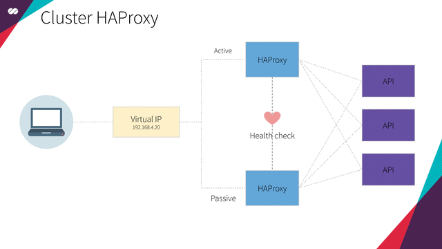
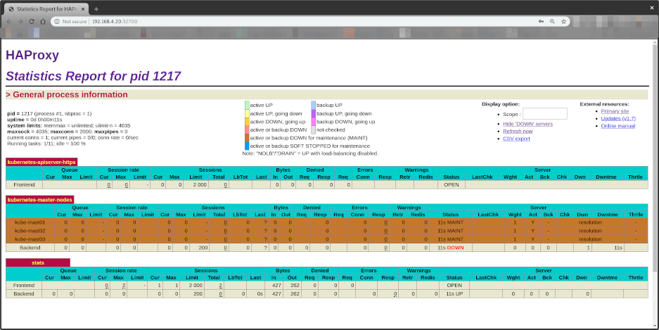

# How to setup the HAProxy Cluster with high availability

This section shows how to setup a highly available **HAProxy** load balancer supported by a **Floating IP** and the [Corosync](https://clusterlabs.org/corosync.html)/[Pacemaker](https://clusterlabs.org/pacemaker/) cluster stack.

**Floating IPs** are also known as “shared” or “virtual” IP addresses. A **Floating IP** is a normal IP address assigned to a node that may eventually fail. For failover, a node with similar characteristics (Passive) runs alongside with the main (Active) node in an Active/Passive mode. If a failure occurs, this **Floating IP** will be assigned to the Passive node automatically and transparently, making it the active one and avoiding downtime.

Each of the **HAProxy** load balancers will be configured to split traffic between backend application servers. If the primary load balancer goes down, the **Floating IP** will be moved to the second load balancer automatically, allowing it continue serving without downtime.
<p align="center">
  
</p>

## HAProxy

HAProxy is a free, very fast and reliable solution offering high availability, load balancing, and proxying for TCP and HTTP-based applications. It is particularly suited for very high traffic web sites and powers quite a number of the world's most visited ones. Over the years it has become the de-facto standard opensource load balancer, is now shipped with most mainstream Linux distributions, and is often deployed by default in cloud platforms. Since it does not advertise itself, we only know it's used when the admins report it :-)

> Full explanation in our [Technology Stack](technologies.md#HAProxy).

## Corosync

The Corosync Cluster Engine is a Group Communication System with additional features for implementing high availability within applications. The project provides four C Application Programming Interface features:

* A closed process group communication model with extended virtual synchrony guarantees for creating replicated state machines.
* A simple availability manager that restarts the application process when it has failed.
* A configuration and statistics in-memory database that provide the ability to set, retrieve, and receive change notifications of information.
* A quorum system that notifies applications when quorum is achieved or lost.

> Full explanation in our [Technology Stack](technologies.md#Corosync).

## Pacemaker

Pacemaker is an advanced, scalable high-availability cluster resource manager.

It supports "N-node" clusters with significant capabilities for managing resources and dependencies.

It will run scripts at initialization, when machines go up or down, when related resources fail and can be configured to periodically check resource health.

> Full explanation in our [Technology Stack](technologies.md#Pacemaker).

### Resource Agents

Resource agents are the abstraction that allows Pacemaker to manage services it knows nothing about. They contain the logic for what to do when the cluster wishes to start, stop or check the health of a service.

#### `ocf:heartbeat:IPaddr2`

This Linux-specific resource manages IP alias IP addresses. It can add an IP alias, or remove one. In addition, it can implement Cluster Alias IP functionality if invoked as a clone resource.

> More info http://linux-ha.org/doc/man-pages/re-ra-IPaddr2.html

#### `ocf:heartbeat:haproxy`

Manages haproxy daemon as an OCF resource in an High Availability setup.

> More info https://raw.githubusercontent.com/russki/cluster-agents/master/haproxy

## Create the VMs

To initialize and configure our instances using cloud-init, we'll use the configuration files versioned at the data directory from our repository.

Notice we also make use of our `create-image.sh` helper script, passing some files from inside the `data/hapx/` directory as parameters.

* **Create the HAProxy Cluster**

  ```shell
  for instance in hapx-node01 hapx-node02; do
      ./create-image.sh \
          -k ~/.ssh/id_rsa.pub \
          -u hapx/user-data \
          -n hapx/network-config \
          -i hapx/post-config-interfaces \
          -r hapx/post-config-resources \
          -o ${instance} \
          -l debian \
          -b debian-base-image
  done
  ```

### Parameters

* **`-k`** is used to copy the **public key** from your host to the newly created VM.
* **`-u`** is used to specify the **user-data** file that will be passed as a parameter to the command that creates the cloud-init ISO file we mentioned before (check the source code of the script for a better understanding of how it's used). Default is **`/data/user-data`**.
* **`-m`** is used to specify the **meta-data** file that will be passed as a parameter to the command that creates the cloud-init ISO file we mentioned before (check the source code of the script for a better understanding of how it's used). Default is **`/data/meta-data`**.
* **`-n`** is used to pass a configuration file that will be used by cloud-init to configure the **network** for the instance.
* **`-i`** is used to pass a configuration file that our script will use to modify the **network interface** managed by **VirtualBox** that is attached to the instance that will be created from this image.
* **`-r`** is used to pass a configuration file that our script will use to configure the **number of processors and amount of memory** that is allocated to our instance by **VirtualBox**.
* **`-o`** is used to pass the **hostname** that will be assigned to our instance. This will also be the name used by **VirtualBox** to reference our instance.
* **`-l`** is used to inform which Linux distribution (**debian** or **ubuntu**) configuration files we want to use (notice this is used to specify which folder under data is referenced). Default is **`debian`**.
* **`-b`** is used to specify which **base image** should be used. This is the image name that was created on **VirtualBox** when we executed the installation steps from our [linux image](create-linux-image.md).
* **`-s`** is used to pass a configuration file that our script will use to configure **virtual disks** on **VirtualBox**. You'll notice this is used only on the **Gluster** configuration step.
* **`-a`** whether or not our instance **should be initialized** after it's created. Default is **`true`**.

### Configure your local routing

You need to add a route to your local machine to access the internal network of **Virtualbox**.

```shell
sudo ip route add 192.168.4.0/27 via 192.168.4.30 dev vboxnet0
sudo ip route add 192.168.4.32/27 via 192.168.4.62 dev vboxnet0
```

### Access the BusyBox

We need to get the **BusyBox IP** to access it via ssh

```shell
vboxmanage guestproperty get busybox "/VirtualBox/GuestInfo/Net/0/V4/IP"
```

The responses should look similar to this:

```shell
Value: 192.168.4.57
```

Use the returned value to access.

```shell
ssh debian@192.168.4.57
```

The responses should look similar to this:

```text
Linux busybox 4.9.0-11-amd64 #1 SMP Debian 4.9.189-3+deb9u2 (2019-11-11) x86_64
The programs included with the Debian GNU/Linux system are free software;
the exact distribution terms for each program are described in the
individual files in /usr/share/doc/*/copyright.
Debian GNU/Linux comes with ABSOLUTELY NO WARRANTY, to the extent
permitted by applicable law.
```

### Access the HAProxy Node

After having accessed the BusyBox and being inside a ssh session, just access the instances by name, in our case we want to access hapx-node01.

```shell
ssh debian@hapx-node01
```

### Configure Pacemaker

Here we define our Virtual IP as 192.168.4.20. This will be the IP address of our K8S cluster (Control Plane EndPoint).

The cloud-init HAProxy configuration file can be found [here](/data/debian/hapx/user-data). This sets up a Load Balance for the Kube Master Nodes.

At this point, we will configure the features of our HAProxy Cluster using the [crmsh](https://crmsh.github.io/) tool. crmsh is a cluster management shell for the Pacemaker High Availability stack.

#### `crm configure`

The following step can be run on any (one) Node, because right now corosync should keep the Cluster Configuration in Sync.

**Note:** each line below represents a command that should be entered separately in the command line.

```bash
sudo crm configure

property stonith-enabled=no
property no-quorum-policy=ignore
property default-resource-stickiness=100
primitive virtual-ip-resource ocf:heartbeat:IPaddr2 params ip="192.168.4.20" broadcast=192.168.4.31 nic=enp0s3.41 cidr_netmask=27 meta migration-threshold=2 op monitor interval=20 timeout=60 on-fail=restart
primitive haproxy-resource ocf:heartbeat:haproxy op monitor interval=20 timeout=60 on-fail=restart
colocation loc inf: virtual-ip-resource haproxy-resource
order ord inf: virtual-ip-resource haproxy-resource
commit
bye
```

#### Parameters TL;TD

* `property stonith-enabled=no`

  `stonith-enabled` (Shoot The Other Node In The Head) parameter indicates that failed nodes and nodes with resources that cannot be stopped should be fenced. Since we are only managing a floating IP address and a service (HAProxy). The goal of this functionnality is to avoid split-brain and isolate the corrupt node. This will completely physically shutdown the server (shutdown or restart) or shutdown the power. This is applicable for a 3 nodes configuration.

* `property no-quorum-policy=ignore`

  `no-quorum-policy` parameter defines the actions to take when the cluster does not have a quorum. One of the most common ways to deploy Pacemaker is in a 2-node configuration. However quorum as a concept makes no sense in this scenario (because you only have it when more than half the nodes are available), so we'll disable it too. When you create a cluster, there is ideally 3 nodes for the high-availability purpose but it’s not mandatory. Three nodes are needed for a good communication between the nodes, for checking the healthstate of the others nodes and eventually taking the lead or managing the membership. Usually the quorum value is the name of the node, in our setup we only have 2 nodes, if one node goes down (the one the quorum policy/checksum), the whole cluster will fall. At the end, the quorum policy manages the node coordination, we need 3 nodes minimum.

* `property default-resource-stickiness=100`

  In order to prevent constent failover and failback, we often choose to disable the recovery and the failback of the resource. For instance, if the primary node goes down, the resource will be move on the secondary node. We went to prevent node from moving after recovery for this we gave it a major cost (weight). In fact moving a resource requires a little down time, this is why we will definitly use this option.

* `primitive virtual-ip-resource ocf:heartbeat:IPaddr2 params ip="192.168.4.20" broadcast=192.168.4.31 nic=enp0s3.41 cidr_netmask=27 meta migration-threshold=2 op monitor interval=20 timeout=60 on-fail=restart`

  Lorem ip sum

* `primitive haproxy-resource ocf:heartbeat:haproxy op monitor interval=20 timeout=60 on-fail=restart`

  Lorem ip sum

* `colocation loc inf: virtual-ip-resource haproxy-resource`

  Lorem ip sum

* `order ord inf: virtual-ip-resource haproxy-resource`

  Lorem ip sum

### View HAProxy stats page

Now that everything is set up, you can access the HAProxy stats through the Virtual IP we just configured.

Open your browser at [http://192.168.4.20:32700](http://192.168.4.20:32700)

User: admin
Password: admin

It will show:


Notice all Control Plane EndPoints are *DOWN*

* kube-mast01:6443
* kube-mast02:6443
* kube-mast03:6443

This will be fixed once we setup our Kubernetes Master nodes.

### Test High Availability

Shutdown one of the two VMs (hapx-node01 or hapx-node02) and press F5 in the browser where you have opened the HAProxy statistics. No difference or error should be noticed. :)
