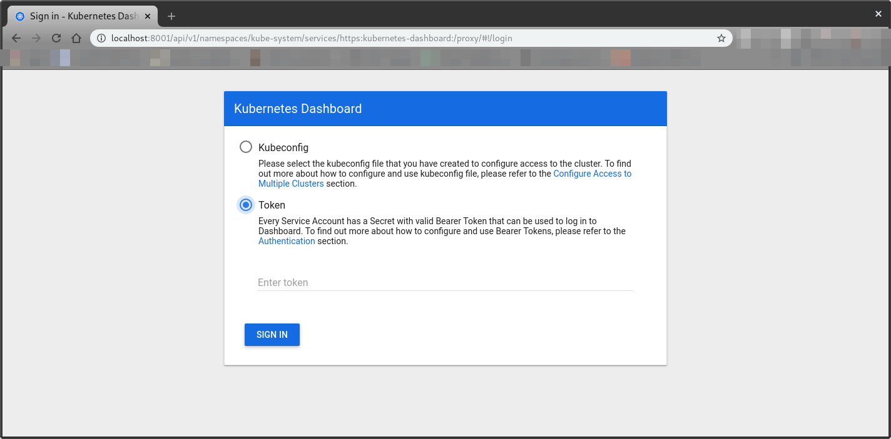
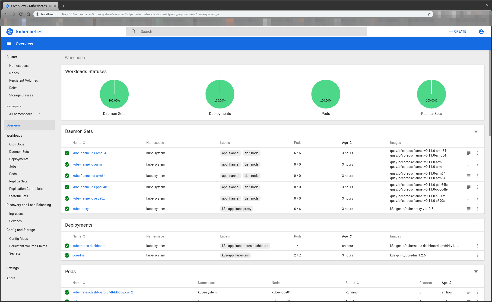

# Kubernetes Dashboard

Dashboard is a web-based Kubernetes user interface. You can use Dashboard to deploy containerized applications to a Kubernetes cluster, troubleshoot your containerized application, and manage the cluster resources. You can use Dashboard to get an overview of applications running on your cluster, as well as for creating or modifying individual Kubernetes resources (such as Deployments, Jobs, DaemonSets, etc). For example, you can scale a Deployment, initiate a rolling update, restart a pod or deploy new applications using a deploy wizard.

Dashboard also provides information on the state of Kubernetes resources in your cluster and on any errors that may have occurred.

<p align="center">
  
</p>

### Configure your local routing

You need to add a route to your local machine to access the internal network of **Virtualbox**.

```shell
sudo ip route add 192.168.4.0/27 via 192.168.4.30 dev vboxnet0
sudo ip route add 192.168.4.32/27 via 192.168.4.62 dev vboxnet0
```

### Access the BusyBox

We need to get the **BusyBox IP** to access it via ssh:

```shell
vboxmanage guestproperty get busybox "/VirtualBox/GuestInfo/Net/0/V4/IP"
```

Expected output:

```shell
Value: 192.168.4.57
```

Use the returned value to access the BusyBox:

```console
~$ ssh debian@192.168.4.57
```

Expected output:

```console
Linux busybox 4.19.0-18-amd64 #1 SMP Debian 4.9.258-1 (2021-03-08) x86_64

The programs included with the Debian GNU/Linux system are free software;
the exact distribution terms for each program are described in the
individual files in /usr/share/doc/*/copyright.

Debian GNU/Linux comes with ABSOLUTELY NO WARRANTY, to the extent
permitted by applicable law.
```

## Deploy

1. Configure `kubectl` in the BusyXox. To do so, copy the configuration from the master node:

   ```console
   debian@busybox:~$ mkdir ~/.kube

   debian@busybox:~$ ssh kube-mast01 'sudo cat /etc/kubernetes/admin.conf' > ~/.kube/config
   ```

2. Install the Dashboard by applying the `kubernetes-dashboard.yaml` file:

   ```console
   debian@busybox:~$ kubectl apply -f https://raw.githubusercontent.com/kubernetes/dashboard/v2.5.0/aio/deploy/recommended.yaml
   ```

   Expected output:

   ```text
   namespace/kubernetes-dashboard created
   serviceaccount/kubernetes-dashboard created
   service/kubernetes-dashboard created
   secret/kubernetes-dashboard-certs created
   secret/kubernetes-dashboard-csrf created
   secret/kubernetes-dashboard-key-holder created
   configmap/kubernetes-dashboard-settings created
   role.rbac.authorization.k8s.io/kubernetes-dashboard created
   clusterrole.rbac.authorization.k8s.io/kubernetes-dashboard created
   rolebinding.rbac.authorization.k8s.io/kubernetes-dashboard created
   clusterrolebinding.rbac.authorization.k8s.io/kubernetes-dashboard created
   deployment.apps/kubernetes-dashboard created
   service/dashboard-metrics-scraper created
   deployment.apps/dashboard-metrics-scraper created
   ```

3. Check the state of the pods after the Dashboard deployed:

   ```console
   debian@busybox:~$ kubectl get pods -o wide -n kubernetes-dashboard
   ```

   Expected output:

   ```text
   NAME                                         READY   STATUS    RESTARTS   AGE   IP           NODE          NOMINATED NODE   READINESS GATES
   dashboard-metrics-scraper-5b8896d7fc-2v4kp   1/1     Running   0          21s   10.244.3.2   kube-node01   <none>           <none>
   kubernetes-dashboard-cb988587b-rx828         1/1     Running   0          21s   10.244.4.2   kube-node02   <none>           <none>
   ```

   > Notice we now have a pod named `kubernetes-dashboard-cb988587b-rx828`

## Configure the Dashboard

### `serviceaccount`

We need a service account to access the K8S Dashboard.

1. Create service account

   ```console
   debian@busybox:~$ kubectl create serviceaccount cluster-admin-dashboard -n kubernetes-dashboard

   debian@busybox:~$ kubectl create clusterrolebinding cluster-admin-dashboard \
       --clusterrole=cluster-admin \
       --serviceaccount=kubernetes-dashboard:cluster-admin-dashboard \
       -n kubernetes-dashboard
   ```

   Expected output:

   ```text
   serviceaccount/cluster-admin-dashboard created
   ```

   ```text
   clusterrolebinding.rbac.authorization.k8s.io/cluster-admin-dashboard created
   ```

### Access the Dashboard

#### Bearer Token

To access the Dashboard, we need to have a token from the `cluster-admin-dashboard` service account.

1. Query secrets

   ```console
   debian@busybox:~$ kubectl get secret -n kubernetes-dashboard
   ```

   Expected output:

   ```text
   NAME                                  TYPE                                  DATA   AGE
   cluster-admin-dashboard-token-p2qm9   kubernetes.io/service-account-token   3      18s
   default-token-ptzj7                   kubernetes.io/service-account-token   3      75s
   kubernetes-dashboard-certs            Opaque                                0      75s
   kubernetes-dashboard-csrf             Opaque                                1      75s
   kubernetes-dashboard-key-holder       Opaque                                2      75s
   kubernetes-dashboard-token-59xt6      kubernetes.io/service-account-token   3      75s
   ```

   > We can see the `cluster-admin-dashboard` service account token has a token named `cluster-admin-dashboard-token-p2qm9`

2. To fetch the token, describe the `cluster-admin-dashboard-token-p2qm9` secret:

   ```console
   debian@busybox:~$ kubectl describe secret cluster-admin-dashboard-token-p2qm9 -n kubernetes-dashboard
   ```

   Expected output:

   ```text
   Name:         cluster-admin-dashboard-token-p2qm9
   Namespace:    kubernetes-dashboard
   Labels:       <none>
   Annotations:  kubernetes.io/service-account.name: cluster-admin-dashboard
                 kubernetes.io/service-account.uid: a2cb115c-3d82-42cf-80ac-3fa003e568cf
   
   Type:  kubernetes.io/service-account-token
   
   Data
   ====
   ca.crt:     1025 bytes
   namespace:  20 bytes
   token:      eyJhbGciOiJSUzI1NiIsImtpZCI6ImpTTHVJZ0h6LVpGSnFadzBpaXBUSjYyemVWZFJNZUZ3X29qMjIxRHBQOU0ifQ.   eyJpc3MiOiJrdWJlcm5ldGVzL3NlcnZpY2VhY2NvdW50Iiwia3ViZXJuZXRlcy5pby9zZXJ2aWNlYWNjb3VudC9uYW1lc3BhY2UiOiJrdWJlcm5ldGVzLWRhc2hib2FyZCIsImt1YmVybmV0ZXMuaW8vc2VydmljZWFjY291bnQvc2VjcmV0Lm5hbWUiOiJjbHVzdGVyLWFkbWluLWRhc2hib2FyZC10b2tlbi1qdnpibSIsImt1YmVybmV0ZXMuaW8vc2VydmljZWFjY291bnQvc2VydmljZS1hY2NvdW50Lm5hbWUiOiJjbHVzdGVyLWFkbWluLWRhc2hib2FyZCIsImt1YmVybmV0ZXMuaW8vc2VydmljZWFjY291bnQvc2VydmljZS1hY2NvdW50LnVpZCI6IjE4MWIwZGQ2LTU2MWQtNGRjZi05ZjY2LTU4ZmQxNTRiNWE3ZCIsInN1YiI6InN5c3RlbTpzZXJ2aWNlYWNjb3VudDprdWJlcm5ldGVzLWRhc2hib2FyZDpjbHVzdGVyLWFkbWluLWRhc2hib2FyZCJ9.uibwq9m149OSdWG8FJGYJIxEBQle_QEVTnctBMY_67_HkCVLBA0R9d2brGhcw-bq9_IQWfOkMLRBj3duPr7YBTqKg53i6jXsnKnlh_t_UOCjx543or5Aw5HgcasslfHAVken6CtcEIYin4ya1LOb5DNH7mfHvdGWDFzTsSM3TxXe4FD6rvLfS-S0ICju7RBRLaOsrEptGjoX7z7mRXoQbeO3cFRlMsOQG7uShxgfz9BZDYrYICYw3YjhupQ9FXvWe_guLCA4XD3GNpPVp8bSgX_UayvgMouAleYs93QrlKqdBT0oD72VEFAHr0GeRjnoC9z-XDBixeaM4BFxGuAfqw
   ```

   > We are going to use the `eyJhbGciOiJSUzI1NiIsImtpZCI6ImpTTHVJZ0h6L...72VEFAHr0GeRjnoC9z-XDBixeaM4BFxGuAfqw` token. For shortness, we show only the first and last blocks here, but we must use the full printed value to access the Dashboard.

### View the Dashboard

1. To view the Dashboard, open your browser at [https://192.168.4.20:6443/api/v1/namespaces/kubernetes-dashboard/services/https:kubernetes-dashboard:/proxy/](https://192.168.4.20:6443/api/v1/namespaces/kubernetes-dashboard/services/https:kubernetes-dashboard:/proxy/)

   By now, you should get an `Access Denied` error similar to the following:

   ```json
   {
     "kind": "Status",
     "apiVersion": "v1",
     "metadata": {},
     "status": "Failure",
     "message": "services \"https:kubernetes-dashboard:\" is forbidden: User \"system:anonymous\" cannot get resource \"services/proxy\" in API group \"\" in the namespace \"kubernetes-dashboard\"",
     "reason": "Forbidden",
     "details": {
       "name": "https:kubernetes-dashboard:",
       "kind": "services"
     },
     "code": 403
   }
   ```

2. To solve this issue, create a role to access `kubernetes-dashboard` resources. The yaml block below is just for clarity. The important part is the console command right after that:

   ```yaml
   kind: ClusterRole
   apiVersion: rbac.authorization.k8s.io/v1
   metadata:
     name: kubernetes-dashboard-anonymous
   rules:
     - apiGroups: [""]
       resources: ["services/proxy"]
       resourceNames: ["https:kubernetes-dashboard:"]
       verbs: ["get", "list", "watch", "create", "update", "patch", "delete"]
     - nonResourceURLs:
         [
           "/ui",
           "/ui/*",
           "/api/v1/namespaces/kube-system/services/https:kubernetes-dashboard:/proxy/*",
         ]
       verbs: ["get", "list", "watch", "create", "update", "patch", "delete"]
   ```

   ```console
   debian@busybox:~$ cat <<EOF | kubectl apply -f -
   kind: ClusterRole
   apiVersion: rbac.authorization.k8s.io/v1
   metadata:
     name: kubernetes-dashboard-anonymous
   rules:
   - apiGroups: [""]
     resources: ["services/proxy"]
     resourceNames: ["https:kubernetes-dashboard:"]
     verbs: ["get", "list", "watch", "create", "update", "patch", "delete"]
   - nonResourceURLs: ["/ui", "/ui/*", "/api/v1/namespaces/kube-system/services/https:kubernetes-dashboard:/proxy/*"]
     verbs: ["get", "list", "watch", "create", "update", "patch", "delete"]
   EOF
   ```

   Expected output:

   ```text
   clusterrole.rbac.authorization.k8s.io/kubernetes-dashboard-anonymous created
   ```

3. Create the role binding for anonymous access (`system:anonymous`) - again, the yaml block below is just for clarity:

   ```yaml
   apiVersion: rbac.authorization.k8s.io/v1
   kind: ClusterRoleBinding
   metadata:
     name: kubernetes-dashboard-anonymous
   roleRef:
     apiGroup: rbac.authorization.k8s.io
     kind: ClusterRole
     name: kubernetes-dashboard-anonymous
   subjects:
     - kind: User
       name: system:anonymous
   ```

   ```console
   debian@busybox:~$ cat <<EOF | kubectl apply -f -
   apiVersion: rbac.authorization.k8s.io/v1
   kind: ClusterRoleBinding
   metadata:
     name: kubernetes-dashboard-anonymous
   roleRef:
     apiGroup: rbac.authorization.k8s.io
     kind: ClusterRole
     name: kubernetes-dashboard-anonymous
   subjects:
   - kind: User
     name: system:anonymous
   EOF
   ```

   Expected output:

   ```text
   clusterrolebinding.rbac.authorization.k8s.io/kubernetes-dashboard-anonymous created
   ```

4. Now, copy and paste the [token](#bearer-token) when prompted for it in the log in screen:

   <p align="center">
      
   </p>

5. Click the Sign In button and that's it. You are now logged in as an admin:

   <p align="center">
      
   </p>
