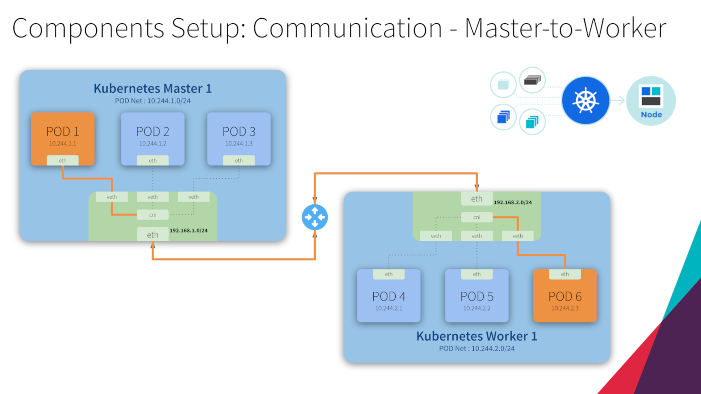
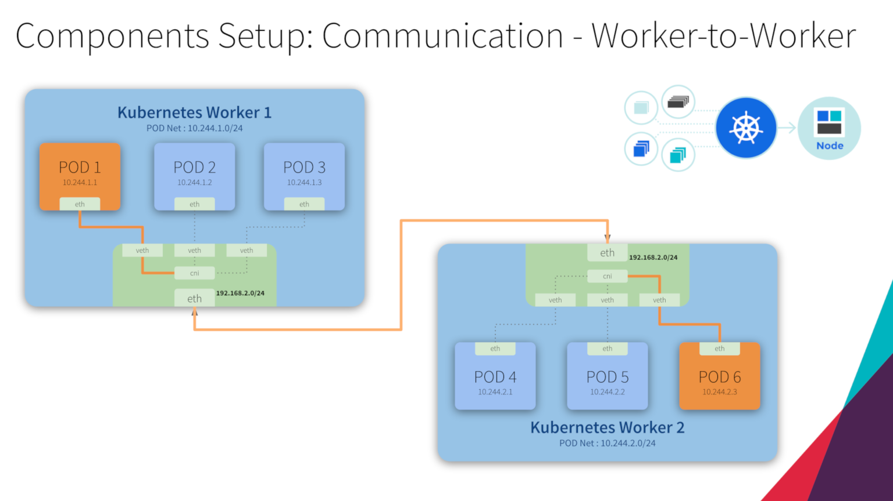
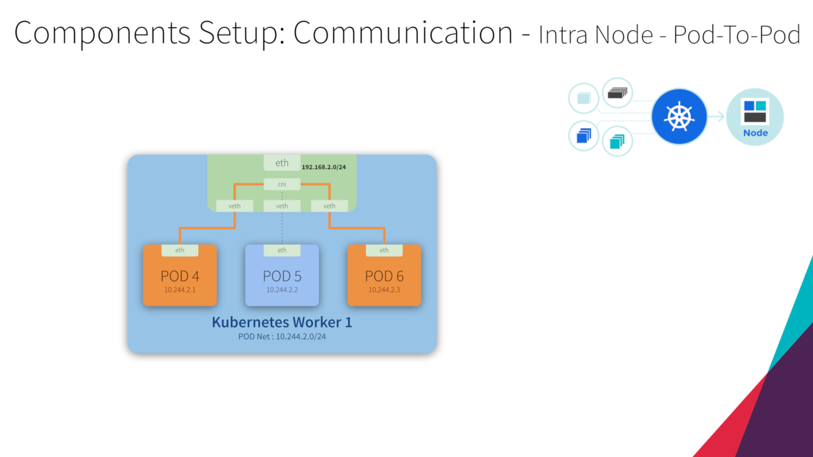
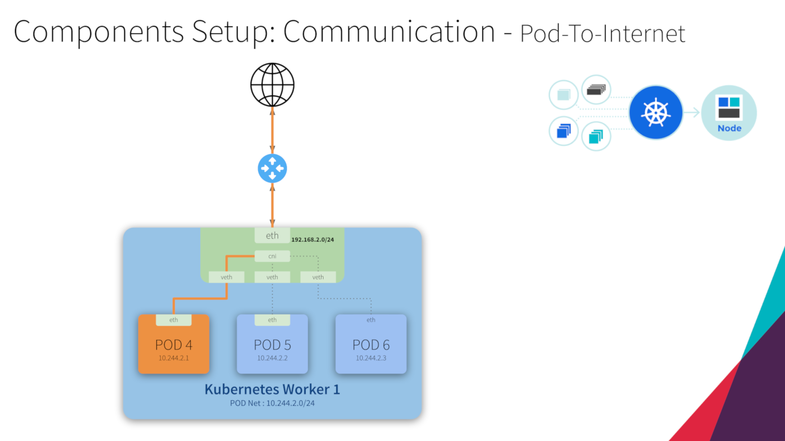

## Kubernetes Network Model

### Assumptions
* Pods are all able to communicate with one another without the need to use network address translation (NAT).
* Nodes are the machines that run the Kubernetes cluster. These can be either virtual or physical machines, or indeed anything else that is able to run Kubernetes. These nodes are also able to communicate with all the Pods, without the need for NAT.
* Each Pod will see itself with the same IP that other Pods see it as having.

## Overview

  

## Flannel
*“Flannel is a simple and easy way to configure a layer 3 network fabric designed for Kubernetes.*
*Flannel runs a small, single binary agent called flanneld on each host, and is responsible for allocating a subnet lease to each host out of a larger, preconfigured address space. Flannel uses either the Kubernetes API or etcd directly to store the network configuration, the allocated subnets, and any auxiliary data (such as the host's public IP). Packets are forwarded using one of several backend mechanisms including VXLAN and various cloud integrations.”*
>Reference: https://github.com/coreos/flannel

### Master to Worker

### Worker to Worker

### Intra Node - Pod to Pod

### Pod to Internet
