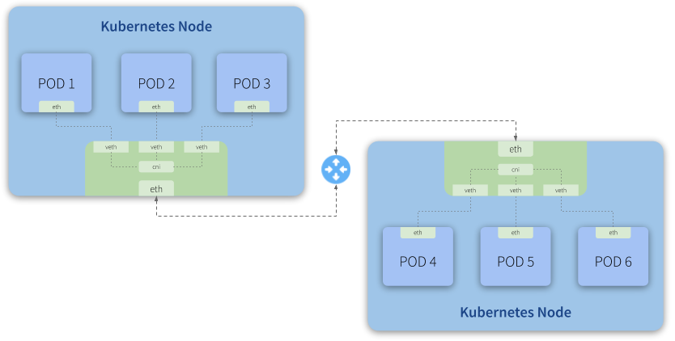
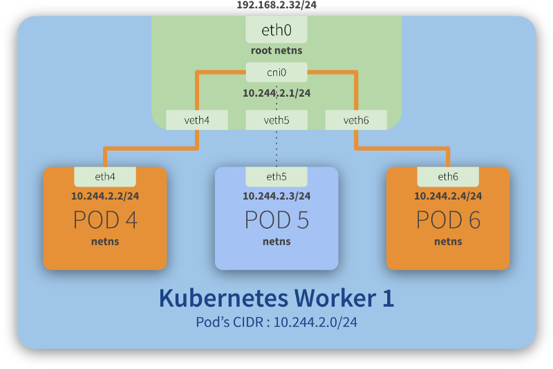
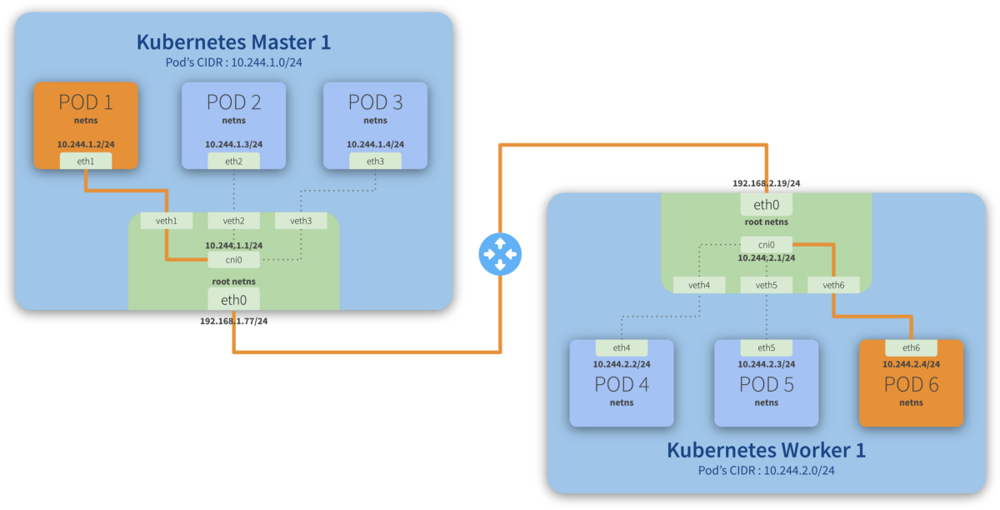

# Flannel

## Cluster Networking

*"Networking is a central part of Kubernetes, but it can be challenging to understand exactly how it is expected to work."*

> Reference: https://kubernetes.io/docs/concepts/cluster-administration/networking/

Before we talk about **flannel** and how it fits here it is important to understand the network characteristics of a cluster.

In this section, we will focus primarily on understanding how **Pod-to-Pod** communication works.

There are a few basic assumptions that the **Kubernetes Network Model** follows. The [official documentation](https://kubernetes.io/docs/concepts/cluster-administration/networking/#the-kubernetes-network-model) says the **Kubernetes Network Model** requires that:

* *Pods are all able to communicate with one another without the need to make use of Network Address Translation (NAT).*

* *Nodes - the machines that run the Kubernetes cluster. These can be either virtual or physical machines, or indeed anything else that is able to run Kubernetes - are also able to communicate with all the Pods, without the need for NAT.*

* *Each Pod will see itself with the same IP that other Pods see it as having.*

## Kubernetes Network Model

<p align="center">
  
</p>

Every Kubernetes node (a Master or Worker) is a Linux machine (VM or Bare Metal) that has a Network Namespace - **netns** - having a network interface as its main interface. This is illustrated as **eth0** in the image above.

Looking closely, we can see that each Pod also has its own **eth** interface, meaning each Pod has its own network configuration (IP, Route, etc). This also means each Pod has its own **netns** and thus we have a Network Namespace segregated by network interfaces.

To illustrate this, imagine you go to a conference in Vegas with your coworkers. Your company is sponsoring your participation in this conference, so you'll all stay in the same hotel (a Kubernetes node). Each room (a Pod) in this hotel is equipped with a guest room phone (a network interface).

You make use of the guest room phone to communicate with your family, who is out of the hotel. There's no free lunch, so the hotel will obviously charge you for any external calls you make using the guest room phone. To do so, all external calls go through a central (the **eth0**) that will register them and then redirect the calls to the outside world. The link between your guest room phone and this central is analogous to the role that virtual interfaces (**veth**) play in a network.

*"The veth devices are virtual Ethernet devices. They can act as tunnels between network namespaces to create a bridge to a physical network device in another namespace, but can also be used as standalone network devices.
veth devices are always created in interconnected pairs."*

> Reference: http://man7.org/linux/man-pages/man4/veth.4.html

Now, you and your colleagues want to let each other know when you are leaving for the conference or to have dinner, for example. You want to save some money, so you decide to use the guest room phone to talk to each other, instead of using your mobile phones. When you checked-in at the hotel, the concierge explained that you could call each other, from room to room, by simply typing **#\<room number\>**. There is an internal central that allows this communication to happen. This is analogous to the role that the **cni0** (shown in the image above) plays, acting as a bridge that allows Pod-to-Pod communication.

It happens that this hotel has multiple buildings and some of your colleagues are hosted in a second building. Still, the concierge explained there is no problem at all. To communicate with them, you simply need to add the building number in front of the room number: **#\<building\>\<room number\>**. The internal central (**cni**) will notice this address is not internal to its own building, will redirect the call to the central (the **eth0**) which will them once again redirect the call to the other building (another Kubernetes node) central (similar to **eth0**), which in turn will pass the call to its own internal central, making the call to be finally completed with the target room. For a more technical explanation of this scenario, check the Routing traffic across different hosts section below.

On Kubernetes, all this configuration and management is made through a CNI (Container Networking Interface) plugin.

## What is CNI?

**CNI** is short for **Container Networking Interface**, which is basically an external software (module) that implements an [interface well defined by a specification](https://github.com/containernetworking/cni/blob/master/SPEC.md#container-network-interface-specification), which allows **Kubernetes** to perform actions to provide network functionality.

*"Each CNI plugin must be implemented as an executable that is invoked by the container management system (e.g. rkt or Kubernetes).
A CNI plugin is responsible for inserting a network interface into the container network namespace (e.g. one end of a veth pair) and making any necessary changes on the host (e.g. attaching the other end of the veth into a bridge). It should then assign the IP to the interface and setup the routes consistent with the IP Address Management section by invoking appropriate IPAM plugin."*

> Reference: https://github.com/containernetworking/cni/blob/master/SPEC.md#cni-plugin

## Kubernetes Traffic Routing

There are two scenarios that we'll go into more detail to explain how traffic gets routed between Pods.

### Routing traffic on the same host

<p align="center">
  
</p>

Step-by-step communication from **Pod 4** to **Pod 6**:

1. Package leaves **Pod 4 netns** through the **eth4** interface and reaches the **root netns** through the virtual interface **veth4**;
2. Package leaves **veth4** and reaches **cni0**, looking for **Pod 6**'s address;
3. Package leaves **cni0** and is redirected to **veth6**;
4. Package leaves the **root netns** through **veth6** and reaches the **Pod 6 netns** through the **eth6** interface;

### Routing traffic across different hosts

<p align="center">
  
</p>

Step-by-step communication from **Pod 1** to **Pod 6**:

1. Package leaves **Pod 1 netns** through the **eth1** interface and reaches the **root netns** through the virtual interface **veth1**;
2. Package leaves **veth1** and reaches **cni0**, looking for **Pod 6**'s address;
3. Package leaves **cni0** and is redirected to **eth0**;
4. Package leaves **eth0** from **Master 1** and reaches the **gateway**;
5. Package leaves the **gateway** and reaches the **root netns** through the **eth0** interface on **Worker 1**;
6. Package leaves **eth0** and reaches **cni0**, looking for **Pod 6**'s address;
7. Package leaves **cni0** and is redirected to the **veth6** virtual interface;
8. Package leaves the **root netns** through **veth6** and reaches the **Pod 6 netns** though the **eth6** interface;

## .

<p align="center">
  
</p>

*"Flannel is a simple and easy way to configure a layer 3 network fabric designed for Kubernetes.
Flannel runs a small, single binary agent called **flanneld** on each host, and is responsible for allocating a subnet lease to each host out of a larger, preconfigured address space. Flannel uses either the Kubernetes API or **etcd** directly to store the network configuration, the allocated subnets, and any auxiliary data (such as the host's public IP). Packets are forwarded using one of several backend mechanisms including VXLAN and various cloud integrations."*

> Reference: https://github.com/coreos/flannel

## Backends

*"Flannel may be paired with several different backends. Once set, the backend should not be changed at runtime.
[VXLAN](https://github.com/coreos/flannel/blob/master/Documentation/backends.md#vxlan) is the recommended choice. [host-gw](https://github.com/coreos/flannel/blob/master/Documentation/backends.md#host-gw) is recommended for more experienced users who want the performance improvement and whose infrastructure support it (typically it can't be used in cloud environments). [UDP](https://github.com/coreos/flannel/blob/master/Documentation/backends.md#udp) is suggested for debugging only or for very old kernels that don't support VXLAN."*

> Reference: https://github.com/coreos/flannel/blob/master/Documentation/backends.md

In this article, we will discuss a bit about the internals of **VXLAN** mode that we will use in our solution.

<p align="center">
  
</p>

## Flannel Networking Space

By default, flannel uses CIDR **10.244.0.0/16** to allocate smaller subnets with **10.244.X.0/24** mask to each node, and Pods will use IP addresses from one of these subnets allocated to a given node.

In simple terms, this means that each node can have up to 254 active Pods, where each Pod will have a distinct IP from this allocated subnet.

You can see this specification in [**`kube-flannel.yml`**](https://github.com/coreos/flannel/blob/master/Documentation/kube-flannel.yml) manifest, in the definition of **`net-conf.json`**. (official flannel repository at the link below)

```yaml
kind: ConfigMap
apiVersion: v1
metadata:
  name: kube-flannel-cfg
  namespace: kube-system
  labels:
    tier: node
    app: flannel
data:
  cni-conf.json: |
    {
      "name": "cbr0",
      "plugins": [
        {
          "type": "flannel",
          "delegate": {
            "hairpinMode": true,
            "isDefaultGateway": true
          }
        },
        {
          "type": "portmap",
          "capabilities": {
            "portMappings": true
          }
        }
      ]
    }
  net-conf.json: |
    {
      "Network": "10.244.0.0/16",
      "Backend": {
        "Type": "vxlan"
      }
    }
```

## Virtual Ethernet Devices - veth

*"The veth devices are virtual Ethernet devices. They can act as tunnels between network namespaces to create a bridge to a physical network device in another namespace, but can also be used as standalone network devices."*

> Reference: http://man7.org/linux/man-pages/man4/veth.4.html

## Bridge - cni0

**cni0** is a Linux network bridge device, all **veth** devices will connect to this bridge, so all Pods on the same node can communicate with each other, as explained in **Kubernetes Network Model** and the hotel analogy above.

## VXLAN Device - flannel.\<vni\>

*"Virtual Extensible LAN (VXLAN) is a [network virtualization](https://en.wikipedia.org/wiki/Network_virtualization) technology that attempts to address the [scalability](https://en.wikipedia.org/wiki/Scalability) problems associated with large [cloud computing](https://en.wikipedia.org/wiki/Cloud_computing) deployments. It uses a [VLAN](https://en.wikipedia.org/wiki/Virtual_LAN)-like encapsulation technique to encapsulate [OSI](https://en.wikipedia.org/wiki/OSI_model) [layer 2](https://en.wikipedia.org/wiki/Data_link_layer) [Ethernet frames](https://en.wikipedia.org/wiki/Ethernet_frame) within [layer 4](https://en.wikipedia.org/wiki/Transport_layer) [UDP](https://en.wikipedia.org/wiki/User_Datagram_Protocol) datagrams, using 4789 as the default [IANA](https://en.wikipedia.org/wiki/Internet_Assigned_Numbers_Authority)-assigned destination UDP port number. VXLAN endpoints, which terminate VXLAN tunnels and may be either virtual or physical [switch ports](https://en.wikipedia.org/wiki/Network_switch), are known as VXLAN tunnel endpoints (VTEPs)."*

> Reference: https://en.wikipedia.org/wiki/Virtual_Extensible_LAN

The main function of this interface (flannel.1, in our diagram) is to guarantee one of the premises of communication between Pods and their networks (remember each node has a subnet and each Pod has an IP of this subnet), through an overlay of layer2.

With VXLAN, it is possible to connect two or more networks by having them operating as if they were connected in the same network, that is, each is part of their own network, but "inside" the same domain.

In the previously used analogy, the VXLAN would be the (physical) phone lines connecting one building to the other, allowing the communication of one room (Pod 1) of the building you are in (Node 1) to communicate with rooms (Pod 4) in another building (Node 2) where some of your colleagues are hosted.

## flanneld

**flanneld** is a daemon responsible for keeping the routes between the nodes (and their contained Pods) up-to-date.

In our analogy above, it would be like having an employee from the hotel responsible for updating the central every time new rooms were made available (if a new building with rooms was built by the hotel, for example) or when rooms became unavailable (if they were under maintenance, for example).