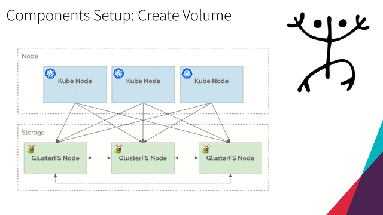
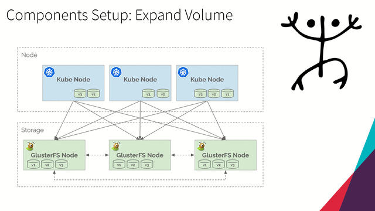

## Heketi

*Heketi provides a RESTful management interface which can be used to manage the life cycle of GlusterFS volumes. With Heketi, cloud services like OpenStack Manila, Kubernetes, and OpenShift can dynamically provision GlusterFS volumes with any of the supported durability types. Heketi will automatically determine the location for bricks across the cluster, making sure to place bricks and its replicas across different failure domains. Heketi also supports any number of GlusterFS clusters, allowing cloud services to provide network file storage without being limited to a single GlusterFS cluster.”*
> Reference: https://github.com/heketi/heketi

### Overview

#### Create Volume

<p align="center">
  
</p>

#### Expand Volume

<p align="center">
  
</p>

### Install
> Full reference: https://github.com/gluster/gluster-kubernetes

#### Deploy
1. Run
   ```
   git clone git@github.com:gluster/gluster-kubernetes.git
   ```

   The response should be:
   ```
   Cloning into 'gluster-kubernetes'...
   remote: Enumerating objects: 16, done.
   remote: Counting objects: 100% (16/16), done.
   remote: Compressing objects: 100% (11/11), done.
   remote: Total 2515 (delta 5), reused 14 (delta 5), pack-reused 2499
   Receiving objects: 100% (2515/2515), 1.08 MiB | 1.72 MiB/s, done.
   Resolving deltas: 100% (1334/1334), done.
   ```

2. Edit config

   This takes the form of a topology file, which describes the nodes present in the GlusterFS cluster and the block devices attached to them for use by heketi. A sample topology file is provided. When creating your own    topology file:
   
   * Make sure the topology file only lists block devices intended for heketi's use. heketi needs access to whole block devices (e.g. /dev/sdb, /dev/vdb) which it will partition and format.
   
   * The hostnames array is a bit misleading. manage should be a list of hostnames for the node, but storage should be a list of IP addresses on the node for backend storage communications.

   1. Create a topology file:
      ```
      cd gluster-kubernetes/deploy
      
      cp topology.json.sample topology.json
      ```
   
   2. Resolv hostnames of Gluster Nodes:
      ```
      host glus-node01.kube.local
   
      host glus-node02.kube.local
   
      host glus-node03.kube.local
      ```
      
      The responses should be:
      ```
      glus-node01.kube.local has address 192.168.3.182
      ```
      ```
      glus-node02.kube.local has address 192.168.3.96
      ```
      ```
      glus-node03.kube.local has address 192.168.3.103
      ```

   3. Change copy file `topology.json` like that:
      ```
      {
        "clusters": [
          {
            "nodes": [
              {
                "node": {
                  "hostnames": {
                    "manage": [
                      "glus-node01.kube.local"
                    ],
                    "storage": [
                      "192.168.3.182"
                    ]
                  },
                  "zone": 1
                },
                "devices": [
                  "/dev/sdb"
                ]
              },
              {
                "node": {
                  "hostnames": {
                    "manage": [
                      "glus-node02.kube.local"
                    ],
                    "storage": [
                      "192.168.3.96"
                    ]
                  },
                  "zone": 1
                },
                "devices": [
                  "/dev/sdb"
                ]
              },
              {
                "node": {
                  "hostnames": {
                    "manage": [
                      "glus-node03.kube.local"
                    ],
                    "storage": [
                      "192.168.3.103"
                    ]
                  },
                  "zone": 1
                },
                "devices": [
                  "/dev/sdb"
                ]
              }
            ]
          }
        ]
      }
      ```

3. Create namespace `glusterfs`
   ```
   kubectl create namespace glusterfs
   ```

   The response should be:
   ```
   namespace/glusterfs created
   ```

4. Deploy
   Next, run the gk-deploy script from a machine with administrative access to your Kubernetes cluster. You should familiarize yourself with the script's options by running gk-deploy -h. Some things to note when running the script:

   * By default it expects the topology file to be in the same directory as itself. You can specify a different location as the first non-option argument on the command-line.
   * By default it expects to have access to Kubernetes template files in a subdirectory called kube-templates. Specify their location otherwise with -t.
   * By default it will NOT deploy GlusterFS, allowing you to use heketi with any existing GlusterFS cluster. If you specify the -g option, it will deploy a GlusterFS DaemonSet onto your Kubernetes cluster by treating the nodes listed in the topology file as hyper-converged nodes with both Kubernetes and storage devices on them.
   * If you use a pre-existing GlusterFS cluster, please note that any pre-existing volumes will not be detected by heketi, and thus not be under heketi's management.

   Run:
   ```
   ./gk-deploy \
       --ssh-keyfile ~/.ssh/id_rsa \
       --ssh-user root --cli kubectl \
       --no-object \
       --templates_dir ./kube-templates --namespace glusterfs \
       topology.json
   ```

   Confirm question `Y`

   The response should be:
   ```
   Using Kubernetes CLI.
   Using namespace "glusterfs".
   Checking for pre-existing resources...
     GlusterFS pods ... not found.
     deploy-heketi pod ... not found.
     heketi pod ... not found.
     gluster-s3 pod ... not found.
   Creating initial resources ... serviceaccount/heketi-service-account created
   clusterrolebinding.rbac.authorization.k8s.io/heketi-sa-view created
   clusterrolebinding.rbac.authorization.k8s.io/heketi-sa-view labeled
   OK
   secret/heketi-config-secret created
   secret/heketi-config-secret labeled
   service/deploy-heketi created
   deployment.extensions/deploy-heketi created
   Waiting for deploy-heketi pod to start ... OK
   Creating cluster ... ID: d266913187b2c860384a45c701ac16f4
   Allowing file volumes on cluster.
   Allowing block volumes on cluster.
   Creating node glus-node01.kube.local ... ID: 90d62b5813ec436a06a55369179afbc4
   Adding device /dev/sdb ... OK
   Creating node glus-node02.kube.local ... ID: 54459c9f00d63b3f7c7b498e1230092c
   Adding device /dev/sdb ... OK
   Creating node glus-node03.kube.local ... ID: 22b73b9fc98664bf5c4308274b919e71
   Adding device /dev/sdb ... OK
   heketi topology loaded.
   Saving /tmp/heketi-storage.json
   secret/heketi-storage-secret created
   endpoints/heketi-storage-endpoints created
   service/heketi-storage-endpoints created
   job.batch/heketi-storage-copy-job created
   service/heketi-storage-endpoints labeled
   pod "deploy-heketi-577fd694cb-42t9m" deleted
   service "deploy-heketi" deleted
   deployment.apps "deploy-heketi" deleted
   replicaset.apps "deploy-heketi-577fd694cb" deleted
   job.batch "heketi-storage-copy-job" deleted
   secret "heketi-storage-secret" deleted
   service/heketi created
   deployment.extensions/heketi created
   Waiting for heketi pod to start ... OK

   heketi is now running and accessible via http://10.244.5.9:8080 . To run
   administrative commands you can install 'heketi-cli' and use it as follows:
   
     # heketi-cli -s http://10.244.5.9:8080 --user admin --secret '<ADMIN_KEY>' cluster list
   
   You can find it at https://github.com/heketi/heketi/releases . Alternatively,
   use it from within the heketi pod:
   
     # kubectl -n glusterfs exec -i heketi-74ddc88bd6-mv65m -- heketi-cli -s http://localhost:8080 --user admin --secret '<ADMIN_KEY>' cluster list
   
   For dynamic provisioning, create a StorageClass similar to this:
   
   ---
   apiVersion: storage.k8s.io/v1beta1
   kind: StorageClass
   metadata:
     name: glusterfs-storage
   provisioner: kubernetes.io/glusterfs
   parameters:
     resturl: "http://10.244.5.9:8080"
   
   
   Deployment complete!   
   ```

5. Query
   ```
   kubectl -n glusterfs exec -i heketi-74ddc88bd6-mv65m -- heketi-cli -s http://localhost:8080 cluster list

   kubectl get pods -n glusterfs
   ```

   The responses should be:
   ```
   Clusters:
   Id:f9a5eaedce718d176f74e2bb7e3455c0 [file][block]
   ```
   ```
   NAME                      READY   STATUS    RESTARTS   AGE
   heketi-74ddc88bd6-mv65m   1/1     Running   0          3m37
   ```

#### Configure Storage Class

StorageClass manifest:

```
apiVersion: storage.k8s.io/v1
kind: StorageClass
metadata:
  name: glusterfs-storage
provisioner: kubernetes.io/glusterfs
allowVolumeExpansion: true
reclaimPolicy: Retain
parameters:
  resturl: "http://10.244.5.9:8080"
  volumetype: "replicate:3"
```

1. Run
   ```
   cat <<EOF > glusterfs-storageclass.yaml
   apiVersion: storage.k8s.io/v1
   kind: StorageClass
   metadata:
     name: glusterfs-storage
   provisioner: kubernetes.io/glusterfs
   allowVolumeExpansion: true
   reclaimPolicy: Retain
   parameters:
     resturl: "http://10.244.5.9:8080"
     volumetype: "replicate:3"
   EOF

   kubectl create -f glusterfs-storageclass.yaml
   ```

   The response should be:
   ```
   storageclass.storage.k8s.io/glusterfs-storage created
   ```

2. Query:
   ```
   kubectl get storageclass
   ```

   The response should be:
   ```
   NAME                PROVISIONER               AGE
   glusterfs-storage   kubernetes.io/glusterfs   17s
   ```

#### Create Volume

PersistentVolumeClaim manifest:
```
apiVersion: v1
kind: PersistentVolumeClaim
metadata:
  name: persistent-volume-0001
  annotations:
    volume.beta.kubernetes.io/storage-class: glusterfs-storage
spec:
  accessModes:
  - ReadWriteMany
  resources:
    requests:
      storage: 2Gi
```

1. Run
   ```
   kubectl create -f https://raw.githubusercontent.com/mvallim/kubernetes-under-the-hood/master/heketi/persistent-volume-claim.yaml
   ```

   The response should be:
   ```
   persistentvolumeclaim/persistent-volume-0001 created
   ```

2. Query:
   ```
   kubectl get persistentvolume

   kubectl get persistentvolumeclaim
   ```

   The responses should be:
   ```
   NAME                                       CAPACITY   ACCESS MODES   RECLAIM POLICY   STATUS   CLAIM                            STORAGECLASS        REASON   AGE
   pvc-8dc0ce07-6e08-11e9-b6f1-0800276f613b   2Gi        RWX            Retain           Bound    default/persistent-volume-0001   glusterfs-storage            31s
   ```
   ```
   NAME                     STATUS   VOLUME                                     CAPACITY   ACCESS MODES   STORAGECLASS        AGE
   persistent-volume-0001   Bound    pvc-8dc0ce07-6e08-11e9-b6f1-0800276f613b   2Gi        RWX            glusterfs-storage   31s
   ```

#### Expand Volume
1. Run:
   ```
   kubectl get persistentvolumeclaim persistent-volume-0001 -o yaml > persistent-volume-claim.yaml
   ```

   persistent-volume-claim.yaml
   ```
   apiVersion: v1
   kind: PersistentVolumeClaim
   metadata:
     annotations:
       pv.kubernetes.io/bind-completed: "yes"
       pv.kubernetes.io/bound-by-controller: "yes"
       volume.beta.kubernetes.io/storage-class: glusterfs-storage
       volume.beta.kubernetes.io/storage-provisioner: kubernetes.io/glusterfs
     creationTimestamp: "2019-05-04T01:04:22Z"
     finalizers:
     - kubernetes.io/pvc-protection
     name: persistent-volume-0001
     namespace: default
     resourceVersion: "67990"
     selfLink: /api/v1/namespaces/default/persistentvolumeclaims/persistent-volume-0001
     uid: 8dc0ce07-6e08-11e9-b6f1-0800276f613b
   spec:
     accessModes:
     - ReadWriteMany
     dataSource: null
     resources:
       requests:
         storage: 2Gi
     volumeMode: Filesystem
     volumeName: pvc-8dc0ce07-6e08-11e9-b6f1-0800276f613b
   status:
     accessModes:
     - ReadWriteMany
     capacity:
       storage: 2Gi
     phase: Bound
   ```

2. Edit file and change `spec` resource storage to `10Gi`:
   ```
   kubectl apply -f persistent-volume-claim.yaml
   ```

   The response should be:
   ```
   Warning: kubectl apply should be used on resource created by either kubectl create --save-config or kubectl apply
   persistentvolumeclaim/persistent-volume-0001 configured
   ```

3. Query:
   ```
   kubectl get persistentvolume

   kubectl get persistentvolumeclaim
   ```
   
   The responses should be:
   ```
   NAME                                       CAPACITY   ACCESS MODES   RECLAIM POLICY   STATUS   CLAIM                            STORAGECLASS        REASON   AGE
   pvc-8dc0ce07-6e08-11e9-b6f1-0800276f613b   10Gi       RWX            Retain           Bound    default/persistent-volume-0001   glusterfs-storage            5m6s
   ```   
   ```
   NAME                     STATUS   VOLUME                                     CAPACITY   ACCESS MODES   STORAGECLASS        AGE
   persistent-volume-0001   Bound    pvc-8dc0ce07-6e08-11e9-b6f1-0800276f613b   10Gi       RWX            glusterfs-storage   4m2s
   ```

#### Cleaning up
1. Run:
   ```
   kubectl delete persistentvolumeclaim persistent-volume-0001

   kubectl delete persistentvolume pvc-8dc0ce07-6e08-11e9-b6f1-0800276f613b
   ```

   The responses should be:
   ```
   persistentvolumeclaim "persistent-volume-0001" deleted
   ```
   ```
   persistentvolume "pvc-8dc0ce07-6e08-11e9-b6f1-0800276f613b" deleted
   ```

2. Query:
   ```
   kubectl get persistentvolume

   kubectl get persistentvolumeclaim
   ```
   
   The responses should be:
   ```
   No resources found.
   ```
   ```
   No resources found.
   ```
