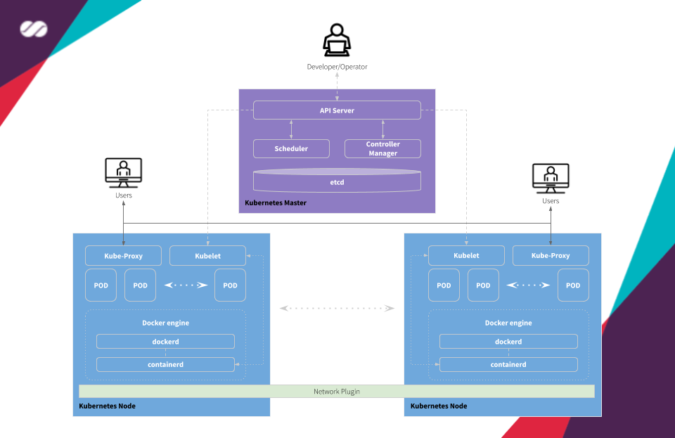

# Masters and Workers

## Master
Masters are responsible for orchestrating all activities related to the containers that run on the worker nodes. It is responsible for scheduling and deploying clustered applications and collecting information about worker nodes and Pods, among many other activities.

###  Some approaches for configuring Master nodes

  

### Stacked control plane and etcd nodes

>> In this approach, the services run as containers and are automatically set up by kubeadm.

A stacked HA cluster is a topology (see the image below) where the distributed data storage cluster provided by etcd is stacked on top of the cluster formed by the nodes managed by **kubeadm** that run control plane components.

Each control plane node runs an instance of the **api-server**, **scheduler**, and **controller-manager**. The **api-server** is exposed to worker nodes using a load balancer (([we'll be using HA Proxy in our solution]()). It also creates a local etcd member and this etcd member communicates only with the **api-server** running on this same node. The same applies to the local **controller-manager** and **scheduler** instances.

This topology couples the control planes and etcd members on the same node where they run. It is simpler to set up than a cluster with external etcd nodes, and simpler to manage for replication.

However, a stacked cluster runs into the risk of failed coupling. If one node goes down, both an etcd member and a control plane instance are lost, and redundancy is compromised. You can mitigate this risk by adding more control plane nodes.

You should therefore run a minimum of three stacked control plane nodes for an HA cluster.

   
  kubeadm HA topology - stacked etcd

> Reference: https://kubernetes.io/docs/setup/production-environment/tools/kubeadm/ha-topology/

### Stacked control plane and external etcd nodes

> In this approach, the services run as containers and are partially configured by kubeadm.

An HA cluster with external etcd nodes is a topology (see the image below) where the distributed data storage cluster provided by etcd is external to the cluster formed by the nodes that run control plane components.

Like in the stacked etcd topology, each control plane node in an external etcd topology runs an instance of the **api-server**, **scheduler**, and **controller-manager**. And the **api-server** is exposed to worker nodes using a load balancer. However, etcd members run on separate hosts, and each etcd host communicates with the **api-server** of each control plane node.

This topology decouples the control plane and etcd member. It therefore provides an HA setup where losing a control plane instance or an etcd member has less impact and does not affect the cluster redundancy as much as the stacked HA topology.

However, this topology requires twice the number of hosts as the stacked HA topology. A minimum of three hosts for control plane nodes and three hosts for etcd nodes are required for an HA cluster with this topology.

   
  kubeadm HA topology - external etcd

> Reference: https://kubernetes.io/docs/setup/production-environment/tools/kubeadm/ha-topology/

### Control plane services and external etcd nodes

> In this approach, the services run as standalone processes and should be manually configured, without using kubeadm. It provides more flexibility but also demands more work to be done by the person setting up the cluster.

An HA cluster Control Plane with external etcd nodes is a topology (see the image below) where the distributed data storage cluster provided by etcd is external to the cluster formed by the nodes that run control plane components.

Like in the stacked control plane and external etcd nodes topology, each control plane node in an external etcd topology runs an instance of the **api-server**, **scheduler**, and **controller-manager**. And the **api-server** is exposed to worker nodes using a load balancer. **etcd** members run on separate hosts, and each etcd host communicates with all **api-server** of the control plane nodes.

This topology runs api-server, controller-manager and scheduler as standalone services in the same node, while etcd is ran on its own node. It therefore provides an HA setup where losing a control plane instance or an etcd member has less impact and does not affect the cluster redundancy as much as in the stacked HA topology.

However, this topology requires twice the number of hosts as the stacked HA topology. A minimum of three hosts for control plane nodes and three hosts for etcd nodes are required for an HA cluster with this topology. **Also, you must install and configure the services one-by-one**.

   
  Kubernetes Control Plane Services external etcd

### Which one will we use?
***Stacked control plane and etcd nodes**, because doing so will require us to do less configuration and require fewer instances to be used.*

### Components
* **kubeadm**: A tool for quickly installing **Kubernetes** and setting up a secure cluster. You can use **kubeadm** to install both the control plane and the worker node components.
* **kubelet**: A service ran on the worker nodes that reads Pod manifests and ensures that their defined containers have been started and are running.
* **etcd**: Consistent and highly-available key-value store used as Kubernetes' backing store for all cluster data. If your **Kubernetes** cluster uses **etcd** as its backing store, [make sure you have a back up plan for those data](https://kubernetes.io/docs/tasks/administer-cluster/configure-upgrade-etcd/#backing-up-an-etcd-cluster).
* **containerd**: A container runtime with an emphasis on simplicity, robustness and portability. **containerd** is a container runtime that runs as a daemon on Linux or Windows. **containerd** takes care of fetching and storing container images, executing containers, providing network access, and more. (In our solution we'll use **Docker** for this purpose)
* **api-server**: Component on the master that exposes the Kubernetes API. It is the front-end for the Kubernetes control plane. It is designed to scale horizontally - that is, it scales by deploying more instances.
* **controller-manager**: Component on the master that runs controllers. Logically, each controller is a separate process but, to reduce complexity, they are all compiled into a single binary and run in a single process.
* **scheduler**: Component on the master that watches newly created Pods that have no worker node assigned, and selects a worker node for them to run into. Factors taken into account for scheduling decisions include individual and collective resource requirements, hardware/software/policy constraints, affinity and anti-affinity specifications, data locality, inter-workload interference and deadlines.

   
  Pod creation flow ([heptio.com](https://heptio.com))

* **kube-proxy**: It is a network proxy that runs on each worker node in the cluster. **kube-proxy** is responsible for request forwarding. **kube-proxy** allows TCP and UDP stream forwarding or round-robin TCP and UDP forwarding across a set of backend functions.

* **DNS cluster add-on**: Kubernetes DNS schedules a DNS Pod and Service on the cluster, and configures the kubelets to tell individual containers to use the DNS Service's IP to resolve DNS names.

Every Service defined in the cluster (including the DNS server itself) is assigned a DNS name. By default, a client Pod's DNS search list will include the Pod's own namespace and the cluster's default domain. This is best illustrated by example:

Assume a Service named **foo** in the Kubernetes namespace **bar**. A Pod running in namespace **bar** can look up this service by simply doing a DNS query for **foo**. A Pod running in namespace **quux** can look up this service by doing a DNS query for **foo.bar**.

* **cni-plugins**: This plugin is a type of Network plugin that adheres to the appc/CNI specification. This is what enables connecting Pods running on different nodes and flexibility to integrate different kind of network solutions (overlays, pure L3, etc).
  - For information on Kubernetes and CNI refer to [this](https://kubernetes.io/docs/concepts/extend-kubernetes/compute-storage-net/network-plugins/#cni).
  - For information on Kubernetes and CNI, see "[Network plugins](https://kubernetes.io/docs/concepts/extend-kubernetes/compute-storage-net/network-plugins/#cni)".

> References
> https://kubernetes.io/docs/reference/glossary/?fundamental=true
> https://kubernetes.io/docs/concepts/services-networking/dns-pod-service/#introduction

## Worker
Workers are the machines (nodes, which can be physical or VMs) where the containers managed by **Kubernetes** effectively run. In order for worker nodes to be managed by **Kubernetes**, they must have **Kubelet** agents installed on them. It is through this agent that all communication with the master happens and, as a consequence, the cluster operations are performed.

### Some approaches for configuring Worker nodes

  

### Stacked worker nodes

> In this approach, the services run as containers and are automatically set up by kubeadm.

A stacked worker is a topology (see image above) where each node runs an instance of **kubelet**, **kube-proxy**, **cni-plugins**, and **containerd**.

It is simpler to configure a worker in this topology. It is necessary to have only **kubeadm**, **kubelet** and **containerd** installed. The other components (**kube-proxy** and **cni-plugins**) will be initialized when the worker joins the cluster when the **kubeadm join** command is executed.

This approach runs **kube-proxy** and **cni-plugins** as containers.

### Woker services

> In this approach, the services run as standalone processes and should be manually configured, without using kubeadm. It provides more flexibility but also demands more work to be done by the person setting up the cluster.

A worker service is a topology (see image above) where each node runs an instance of **kubelet**, **kube-proxy**, **cni-plugins**, and **containerd**. **Also you must install and configure the services one-by-one**.

This approach runs **kube-proxy** and **cni-plugins** as standalone services.

### Which one will we use?
***Stacked worker nodes**, because doing so will require us to do less configuration.*

### Components
Components **kubelet**, **kube-proxy**, **cni-plugins** and **containerd** work the same on Master and Worker nodes. Check their definitions above.