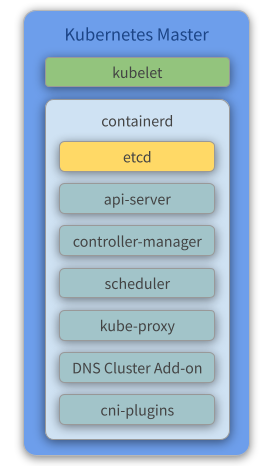

# How to setup the Masters using `kubeadm` bootstrap

Master components provide the cluster’s control plane. Master components make global decisions about the cluster (for example, scheduling), and detecting and responding to cluster events (starting up a new pod when a replication controller’s ‘replicas’ field is unsatisfied, for example).

Master components can be run on any machine in the cluster. However, for simplicity, setup scripts typically start all master components on the same machine, and do not run user containers on this machine.

## Overview

<p align="center">
  
</p>

## Components

- **Kubelet** - Kubelet gets the configuration of a pod from the API Server and ensures that the described containers are up and running.
- **Docker** - Takes care of downloading the images and starting the containers.
- **etcd** - Reliably stores the configuration data of the Kubernetes cluster, representing the state of the cluster (what nodes exist in the cluster, what pods should be running, which nodes they are running on, and a whole lot more) at any given point in time.
- **API Server** - Validates and configures data for the API objects, which include pods, services, replication controllers, and others. The API Server services REST operations and provides the frontend to the cluster’s shared state through which all other components interact.
- **Controller Manager** - Watches the state of the cluster through the API Server **watch** feature and, when notified, makes the necessary changes to the cluster, attempting to move the current state towards the desired state.
- **Scheduler** - Watches for unscheduled pods and binds them to nodes via the binding pod subresource API, according to the availability of the requested resources, quality of service requirements, affinity and anti-affinity specifications, and other constraints. Once the pod has a node assigned, the regular behavior of the Kubelet is triggered and the pod and its containers are created.
- **Kube Proxy** - Acts as a network proxy and a load balancer for a service on a single worker node. It takes care of the network routing for TCP and UDP packets.
- **Flannel** - A layer 3 network fabric designed for Kubernetes. Check our [previous topic about flannel](kube-flannel.md) for more information.
- **CoreDNS** - The DNS Server of the Kubernetes cluster. For more information, check the [CoreDNS official repository](https://github.com/coredns/coredns).

## Create the VMs

To initialize and configure our instances using cloud-init, we'll use the configuration files versioned at the data directory from our repository.

Notice we also make use of our [`create-image.sh`](../create-image.sh) helper script, passing some files from inside the `data/kube/` directory as parameters.

- **Create the Masters**

  ```console
  ~/kubernetes-under-the-hood$ for instance in kube-mast01 kube-mast02 kube-mast03; do
      ./create-image.sh \
          -k ~/.ssh/id_rsa.pub \
          -u kube/user-data \
          -n kube-mast/network-config \
          -i kube-mast/post-config-interfaces \
          -r kube-mast/post-config-resources \
          -o ${instance} \
          -l debian \
          -b debian-base-image
  done
  ```

  Expected output:

  ```console
  Total translation table size: 0
  Total rockridge attributes bytes: 417
  Total directory bytes: 0
  Path table size(bytes): 10
  Max brk space used 0
  186 extents written (0 MB)
  0%...10%...20%...30%...40%...50%...60%...70%...80%...90%...100%
  Machine has been successfully cloned as "kube-mast01"
  Waiting for VM "kube-mast01" to power on...
  VM "kube-mast01" has been successfully started.
  Total translation table size: 0
  Total rockridge attributes bytes: 417
  Total directory bytes: 0
  Path table size(bytes): 10
  Max brk space used 0
  186 extents written (0 MB)
  0%...10%...20%...30%...40%...50%...60%...70%...80%...90%...100%
  Machine has been successfully cloned as "kube-mast02"
  Waiting for VM "kube-mast02" to power on...
  VM "kube-mast02" has been successfully started.
  Total translation table size: 0
  Total rockridge attributes bytes: 417
  Total directory bytes: 0
  Path table size(bytes): 10
  Max brk space used 0
  186 extents written (0 MB)
  0%...10%...20%...30%...40%...50%...60%...70%...80%...90%...100%
  Machine has been successfully cloned as "kube-mast03"
  Waiting for VM "kube-mast03" to power on...
  VM "kube-mast03" has been successfully started.
  ```

  **Parameters:**

  - **`-k`** is used to copy the **public key** from your host to the newly created VM.
  - **`-u`** is used to specify the **user-data** file that will be passed as a parameter to the command that creates the cloud-init ISO file we mentioned before (check the source code of the script for a better understanding of how it's used). Default is **`/data/user-data`**.
  - **`-m`** is used to specify the **meta-data** file that will be passed as a parameter to the command that creates the cloud-init ISO file we mentioned before (check the source code of the script for a better understanding of how it's used). Default is **`/data/meta-data`**.
  - **`-n`** is used to pass a configuration file that will be used by cloud-init to configure the **network** for the instance.
  - **`-i`** is used to pass a configuration file that our script will use to modify the **network interface** managed by **VirtualBox** that is attached to the instance that will be created from this image.
  - **`-r`** is used to pass a configuration file that our script will use to configure the **number of processors and amount of memory** that is allocated to our instance by **VirtualBox**.
  - **`-o`** is used to pass the **hostname** that will be assigned to our instance. This will also be the name used by **VirtualBox** to reference our instance.
  - **`-l`** is used to inform which Linux distribution (**debian** or **ubuntu**) configuration files we want to use (notice this is used to specify which folder under data is referenced). Default is **`debian`**.
  - **`-b`** is used to specify which **base image** should be used. This is the image name that was created on **VirtualBox** when we executed the installation steps from our [linux image](create-linux-image.md).
  - **`-s`** is used to pass a configuration file that our script will use to configure **virtual disks** on **VirtualBox**. You'll notice this is used only on the **Gluster** configuration step.
  - **`-a`** whether or not our instance **should be initialized** after it's created. Default is **`true`**.

### Understading the user-data file

The cloud-init kube-master configuration file can be found [here](/data/debian/kube/user-data). This configures and installs Docker and Kubernetes binaries (kubeadm, kubectl, kublet).

Below you can find the same file commented for a better understanding:

```yaml
#cloud-config
write_files:
  # CA ssh pub certificate
  - path: /etc/ssh/ca.pub
    permissions: "0644"
    encoding: b64
    content: |
      c3NoLXJzYSBBQUFBQjNOemFDMXljMkVBQUFBREFRQUJBQUFDQVFERGozaTNSODZvQzNzZ0N3ZVRh
      R1dHZVZHRFpLbFdiOHM4QWVJVE9hOTB3NHl5UndSUWtBTWNGaWFNWGx5OEVOSDd0MHNpM0tFYnRZ
      M1B1ekpTNVMwTHY0MVFkaHlYMHJhUGxobTZpNnVDV3BvYWsycEF6K1ZFazhLbW1kZjdqMm5OTHlG
      Y3NQeVg0b0t0SlQrajh6R2QxWHRBWDBuS0JWOXFkOGNTTFFBZGpQVkdNZGxYdTNCZzdsNml3OHhK
      Ti9ld1l1Qm5DODZ5TlNiWFlDVVpLOE1oQUNLV2FMVWVnOSt0dXNyNTBSbGVRcGI0a2NKRE45LzFa
      MjhneUtORTRCVENYanEyTzVqRE1MRDlDU3hqNXJoNXRPUUlKREFvblIrMnljUlVnZTltc2hIQ05D
      VWU2WG16OFVJUFJ2UVpPNERFaHpHZ2N0cFJnWlhQajRoMGJoeGVMekUxcFROMHI2Q29GMDVpOFB0
      QXd1czl1K0tjUHVoQlgrVm9UbW1JNmRBTStUQkxRUnJ3SUorNnhtM29nWEMwYVpjdkdCVUVTcVll
      QjUyU0xjZEwyNnBKUlBrVjZYQ0Qyc3RleG5uOFREUEdjYnlZelFnaGNlYUYrb0psdWE4UDZDSzV2
      VStkNlBGK2o1aEE2NGdHbDQrWmw0TUNBcXdNcnBySEhpd2E3bzF0MC9JTmdoYlFvUUdSU3haQXMz
      UHdYcklMQ0xUeGN6V29UWHZIWUxuRXRTWW42MVh3SElldWJrTVhJamJBSysreStKWCswcm02aHRN
      N2h2R2QzS0ZvU1N4aDlFY1FONTNXWEhMYXBHQ0o0NGVFU3NqbVgzN1NwWElUYUhEOHJQRXBia0E0
      WWJzaVVoTXZPZ0VCLy9MZ1d0R2kvRVRxalVSUFkvWGRTVTR5dFE9PSBjYUBrdWJlLmRlbW8K

  # The bridge-netfilter code enables the following functionality:
  #  - {Ip,Ip6,Arp}tables can filter bridged IPv4/IPv6/ARP packets, even when
  # encapsulated in an 802.1Q VLAN or PPPoE header. This enables the functionality
  # of a stateful transparent firewall.
  #  - All filtering, logging and NAT features of the 3 tools can therefore be used
  # on bridged frames.
  #  - Combined with ebtables, the bridge-nf code therefore makes Linux a very
  # powerful transparent firewall.
  #  - This enables, f.e., the creation of a transparent masquerading machine (i.e.
  # all local hosts think they are directly connected to the Internet).
  - path: /etc/modules-load.d/bridge.conf
    permissions: "0644"
    content: |
      br_netfilter

  # Besides providing the NetworkPlugin interface to configure and clean up pod networking,
  # the plugin may also need specific support for kube-proxy. The iptables proxy obviously
  # depends on iptables, and the plugin may need to ensure that container traffic is made
  # available to iptables. For example, if the plugin connects containers to a Linux bridge,
  # the plugin must set the net/bridge/bridge-nf-call-iptables sysctl to 1 to ensure that
  # the iptables proxy functions correctly. If the plugin does not use a Linux bridge
  # (but instead something like Open vSwitch or some other mechanism) it should ensure
  # container traffic is appropriately routed for the proxy.
  #
  # For more details : https://kubernetes.io/docs/concepts/extend-kubernetes/compute-storage-net/network-plugins/#network-plugin-requirements
  #
  # As a requirement for your Linux Node’s iptables to correctly see bridged traffic
  - path: /etc/sysctl.d/10-kubernetes.conf
    permissions: "0644"
    content: |
      net.ipv4.ip_forward=1
      net.bridge.bridge-nf-call-iptables=1
      net.bridge.bridge-nf-call-arptables=1

  # Set up the Docker daemon
  - path: /etc/docker/daemon.json
    permissions: "0644"
    content: |
      {
        "exec-opts": ["native.cgroupdriver=systemd"],
        "log-driver": "json-file",
        "storage-driver": "overlay2",
        "log-opts": {
          "max-size": "100m"
        }
      }

apt:
  sources_list: |
    deb http://deb.debian.org/debian/ $RELEASE main contrib non-free
    deb-src http://deb.debian.org/debian/ $RELEASE main contrib non-free

    deb http://deb.debian.org/debian/ $RELEASE-updates main contrib non-free
    deb-src http://deb.debian.org/debian/ $RELEASE-updates main contrib non-free

    deb http://deb.debian.org/debian-security $RELEASE/updates main
    deb-src http://deb.debian.org/debian-security $RELEASE/updates main
  conf: |
    APT {
      Get {
        Assume-Yes "true";
        Fix-Broken "true";
      };
    };

packages:
  - apt-transport-https
  - ca-certificates
  - gnupg2
  - software-properties-common
  - glusterfs-client
  - bridge-utils
  - curl

runcmd:
  - [modprobe, br_netfilter]
  - [sysctl, --system]
  - curl -s https://download.docker.com/linux/debian/gpg | apt-key add -
  - curl -s https://packages.cloud.google.com/apt/doc/apt-key.gpg | apt-key add -
  - [apt-key, fingerprint, "0EBFCD88"]
  - echo 'deb [arch=amd64] https://download.docker.com/linux/debian stretch stable' > /etc/apt/sources.list.d/docker-ce.list
  - echo 'deb https://apt.kubernetes.io/ kubernetes-xenial main' > /etc/apt/sources.list.d/kubernetes.list
  - [apt-get, update]
  - [apt-get, install, -y, "docker-ce=18.06.0~ce~3-0~debian", containerd.io]
  - [
      apt-get,
      install,
      -y,
      "kubelet=1.16.15-00",
      "kubectl=1.16.15-00",
      "kubeadm=1.16.15-00",
    ]
  - [apt-mark, hold, kubelet, kubectl, kubeadm, docker-ce, containerd.io]
  - [chown, -R, "debian:debian", "/home/debian"]
    # SSH server to trust the CA
  - echo '\nTrustedUserCAKeys /etc/ssh/ca.pub' | tee -a /etc/ssh/sshd_config

users:
  - name: debian
    gecos: Debian User
    sudo: ALL=(ALL) NOPASSWD:ALL
    shell: /bin/bash
    lock_passwd: true
  - name: root
    lock_passwd: true

locale: en_US.UTF-8

timezone: UTC

ssh_deletekeys: 1

package_upgrade: true

ssh_pwauth: true

manage_etc_hosts: true

fqdn: #HOSTNAME#.kube.demo

hostname: #HOSTNAME#

power_state:
  mode: reboot
  timeout: 30
  condition: true
```

### Configure your local routing

You need to add a route to your local machine to access the internal network of **Virtualbox**.

```console
~$ sudo ip route add 192.168.4.0/27 via 192.168.4.30 dev vboxnet0
~$ sudo ip route add 192.168.4.32/27 via 192.168.4.62 dev vboxnet0
```

### Access the BusyBox

We need to get the **BusyBox IP** to access it via ssh:

```console
~$ vboxmanage guestproperty get busybox "/VirtualBox/GuestInfo/Net/0/V4/IP"
```

Expected output:

```console
Value: 192.168.4.57
```

Use the returned value to access the BusyBox:

```cosole
~$ ssh debian@192.168.4.57
```

Expected output:

```console
Linux busybox 4.9.0-15-amd64 #1 SMP Debian 4.9.258-1 (2021-03-08) x86_64

The programs included with the Debian GNU/Linux system are free software;
the exact distribution terms for each program are described in the
individual files in /usr/share/doc/*/copyright.

Debian GNU/Linux comes with ABSOLUTELY NO WARRANTY, to the extent
permitted by applicable law.
```

### Configure the cluster

#### `kubeadm-config`

At this point, we need to set up our K8S cluster with its initial configuration.

The **SAN**, **Plane Control EndPoint** and **POD Subnet** information is required.

- The **Control Plane EndPoint** address was defined in the HAProxy Cluster (192.168.4.20) ([here](/documentation/haproxy-cluster.md)).
- The **SAN address** will be the same as the Control Plane EndPoint.
- The CIDR of the PODs will be the range recommended by the Flannel configuration (search for `net-conf.json` [here](https://github.com/coreos/flannel/blob/master/Documentation/kube-flannel.yml)).

Based on the above information, we will have a [`kubeadm-config.yml`](../master/kubeadm-config.yaml) that looks like this:

```yaml
apiVersion: kubeadm.k8s.io/v1beta2
kind: ClusterConfiguration
kubernetesVersion: stable-1.18
apiServer:
  certSANs:
  - "192.168.4.20"
controlPlaneEndpoint: "192.168.4.20:6443"
networking:
  podSubnet: 10.244.0.0/16
```

#### `kubeadm init`

The kubeadm tool is good if you need:

- A simple way for you to try out Kubernetes, possibly for the first time.
- A way for existing users to automate setting up a cluster and test their application.
- A building block in other ecosystem and/or installer tools with a larger scope.

> Reference: <https://kubernetes.io/docs/setup/production-environment/tools/kubeadm/create-cluster-kubeadm/>

This approach requires less infrastructure. The etcd members and control plane nodes are co-located.

1. Run the following commands to init the master node:

   ```console
   debian@busybox:~$ ssh kube-mast01

   debian@kube-mast01:~$ curl --progress-bar https://raw.githubusercontent.com/mvallim/kubernetes-under-the-hood/master/master/kubeadm-config.yaml -o kubeadm-config.yaml

   debian@kube-mast01:~$ sudo kubeadm init --config=kubeadm-config.yaml --upload-certs
   ```

   Expected output:

   ```console
   [init] Using Kubernetes version: v1.18.17
   [preflight] Running pre-flight checks
   [preflight] Pulling images required for setting up a Kubernetes cluster
   [preflight] This might take a minute or two, depending on the speed of your internet connection
   [preflight] You can also perform this action in beforehand using 'kubeadm config images pull'
   [kubelet-start] Writing kubelet environment file with flags to file "/var/lib/kubelet/kubeadm-flags.env"
   [kubelet-start] Writing kubelet configuration to file "/var/lib/kubelet/config.yaml"
   [kubelet-start] Starting the kubelet
   [certs] Using certificateDir folder "/etc/kubernetes/pki"
   [certs] Generating "ca" certificate and key
   [certs] Generating "apiserver" certificate and key
   [certs] apiserver serving cert is signed for DNS names [kube-mast01 kubernetes kubernetes.default kubernetes.default.svc kubernetes.default.svc.cluster.local] and IPs    [10.96.0.1 192.168.1.85 192.168.4.20 192.168.4.20]
   [certs] Generating "apiserver-kubelet-client" certificate and key
   [certs] Generating "front-proxy-ca" certificate and key
   [certs] Generating "front-proxy-client" certificate and key
   [certs] Generating "etcd/ca" certificate and key
   [certs] Generating "etcd/server" certificate and key
   [certs] etcd/server serving cert is signed for DNS names [kube-mast01 localhost] and IPs [192.168.1.85 127.0.0.1 ::1]
   [certs] Generating "etcd/peer" certificate and key
   [certs] etcd/peer serving cert is signed for DNS names [kube-mast01 localhost] and IPs [192.168.1.85 127.0.0.1 ::1]
   [certs] Generating "etcd/healthcheck-client" certificate and key
   [certs] Generating "apiserver-etcd-client" certificate and key
   [certs] Generating "sa" key and public key
   [kubeconfig] Using kubeconfig folder "/etc/kubernetes"
   [kubeconfig] Writing "admin.conf" kubeconfig file
   [kubeconfig] Writing "kubelet.conf" kubeconfig file
   [kubeconfig] Writing "controller-manager.conf" kubeconfig file
   [kubeconfig] Writing "scheduler.conf" kubeconfig file
   [control-plane] Using manifest folder "/etc/kubernetes/manifests"
   [control-plane] Creating static Pod manifest for "kube-apiserver"
   [control-plane] Creating static Pod manifest for "kube-controller-manager"
   W0322 02:09:46.724302    2200 manifests.go:225] the default kube-apiserver authorization-mode is "Node,RBAC"; using "Node,RBAC"
   [control-plane] Creating static Pod manifest for "kube-scheduler"
   W0322 02:09:46.725850    2200 manifests.go:225] the default kube-apiserver authorization-mode is "Node,RBAC"; using "Node,RBAC"
   [etcd] Creating static Pod manifest for local etcd in "/etc/kubernetes/manifests"
   [wait-control-plane] Waiting for the kubelet to boot up the control plane as static Pods from directory "/etc/kubernetes/manifests". This can take up to 4m0s
   [kubelet-check] Initial timeout of 40s passed.
   [apiclient] All control plane components are healthy after 71.351995 seconds
   [upload-config] Storing the configuration used in ConfigMap "kubeadm-config" in the "kube-system" Namespace
   [kubelet] Creating a ConfigMap "kubelet-config-1.18" in namespace kube-system with the configuration for the kubelets in the cluster
   [upload-certs] Storing the certificates in Secret "kubeadm-certs" in the "kube-system" Namespace
   [upload-certs] Using certificate key:
   65871091a50e1cc136db5c07f4ef13359f388966408246601eff108b7deb3d28
   [mark-control-plane] Marking the node kube-mast01 as control-plane by adding the label "node-role.kubernetes.io/master=''"
   [mark-control-plane] Marking the node kube-mast01 as control-plane by adding the taints [node-role.kubernetes.io/master:NoSchedule]
   [bootstrap-token] Using token: b32c61.k4fbbalk0iksu50l
   [bootstrap-token] Configuring bootstrap tokens, cluster-info ConfigMap, RBAC Roles
   [bootstrap-token] configured RBAC rules to allow Node Bootstrap tokens to get nodes
   [bootstrap-token] configured RBAC rules to allow Node Bootstrap tokens to post CSRs in order for nodes to get long term certificate credentials
   [bootstrap-token] configured RBAC rules to allow the csrapprover controller automatically approve CSRs from a Node Bootstrap Token
   [bootstrap-token] configured RBAC rules to allow certificate rotation for all node client certificates in the cluster
   [bootstrap-token] Creating the "cluster-info" ConfigMap in the "kube-public" namespace
   [kubelet-finalize] Updating "/etc/kubernetes/kubelet.conf" to point to a rotatable kubelet client certificate and key
   [addons] Applied essential addon: CoreDNS
   [addons] Applied essential addon: kube-proxy
   
   Your Kubernetes control-plane has initialized successfully!
   
   To start using your cluster, you need to run the following as a regular user:
   
     mkdir -p $HOME/.kube
     sudo cp -i /etc/kubernetes/admin.conf $HOME/.kube/config
     sudo chown $(id -u):$(id -g) $HOME/.kube/config
   
   You should now deploy a pod network to the cluster.
   Run "kubectl apply -f [podnetwork].yaml" with one of the options listed at:
     https://kubernetes.io/docs/concepts/cluster-administration/addons/
   
   You can now join any number of the control-plane node running the following command on each as root:
   
     kubeadm join 192.168.4.20:6443 --token b32c61.k4fbbalk0iksu50l \
       --discovery-token-ca-cert-hash sha256:8bd014db0451542d6ddd479fa7bf7fd6cfc5d0090a096bb89ae481be8e6bdd56 \
       --control-plane --certificate-key 65871091a50e1cc136db5c07f4ef13359f388966408246601eff108b7deb3d28
   
   Please note that the certificate-key gives access to cluster sensitive data, keep it secret!
   As a safeguard, uploaded-certs will be deleted in two hours; If necessary, you can use
   "kubeadm init phase upload-certs --upload-certs" to reload certs afterward.
   
   Then you can join any number of worker nodes by running the following on each as root:
   
   kubeadm join 192.168.4.20:6443 --token b32c61.k4fbbalk0iksu50l \
       --discovery-token-ca-cert-hash sha256:8bd014db0451542d6ddd479fa7bf7fd6cfc5d0090a096bb89ae481be8e6bdd56
   ```

2. Finish configuring the cluster and query the state of nodes and pods

   ```console
   debian@kube-mast01:~$ mkdir -p $HOME/.kube

   debian@kube-mast01:~$ sudo cp -i /etc/kubernetes/admin.conf $HOME/.kube/config

   debian@kube-mast01:~$ sudo chown $(id -u):$(id -g) $HOME/.kube/config

   debian@kube-mast01:~$ kubectl get nodes -o wide

   debian@kube-mast01:~$ kubectl get pods -o wide --all-namespaces
   ```

   Expected output:

   ```console
   NAME          STATUS     ROLES    AGE    VERSION    INTERNAL-IP    EXTERNAL-IP   OS-IMAGE                       KERNEL-VERSION   CONTAINER-RUNTIME
   kube-mast01   NotReady   master   2m1s   v1.18.17   192.168.1.85   <none>        Debian GNU/Linux 9 (stretch)   4.9.0-15-amd64   docker://18.6.0
   ```

   ```console
   NAMESPACE     NAME                                  READY   STATUS    RESTARTS   AGE     IP             NODE          NOMINATED NODE   READINESS GATES
   kube-system   coredns-66bff467f8-knr9q              0/1     Pending   0          2m12s   <none>         <none>        <none>           <none>
   kube-system   coredns-66bff467f8-w7j7w              0/1     Pending   0          2m12s   <none>         <none>        <none>           <none>
   kube-system   etcd-kube-mast01                      1/1     Running   0          2m37s   192.168.1.85   kube-mast01   <none>           <none>
   kube-system   kube-apiserver-kube-mast01            1/1     Running   0          2m36s   192.168.1.85   kube-mast01   <none>           <none>
   kube-system   kube-controller-manager-kube-mast01   1/1     Running   0          2m29s   192.168.1.85   kube-mast01   <none>           <none>
   kube-system   kube-proxy-wl6lt                      1/1     Running   0          2m11s   192.168.1.85   kube-mast01   <none>           <none>
   kube-system   kube-scheduler-kube-mast01            1/1     Running   0          2m36s   192.168.1.85   kube-mast01   <none>           <none>
   ```

> If you look at the status on the `kube-mast01` node, it says it is **NotReady** and the `coredns` pods are in the **Pending** state. This is because, up to this point, we do not have a network component configured in our K8S cluster. Remember, as explained before, **Flannel** will be used for this matter.

#### Deploy flannel

1. Run the following commands to init the flannel network component:

   ```console
   debian@kube-mast01:~$ kubectl apply -f https://raw.githubusercontent.com/coreos/flannel/v0.13.0/Documentation/kube-flannel.yml
   ```

   Expected output:

   ```console
   podsecuritypolicy.policy/psp.flannel.unprivileged created
   clusterrole.rbac.authorization.k8s.io/flannel created
   clusterrolebinding.rbac.authorization.k8s.io/flannel created
   serviceaccount/flannel created
   configmap/kube-flannel-cfg created
   daemonset.apps/kube-flannel-ds created
   ```

2. Query the state of the nodes and pods after flannel is deployed:

   ```console
   debian@kube-mast01:~$ kubectl get nodes -o wide

   debian@kube-mast01:~$ kubectl get pods -o wide --all-namespaces
   ```

   Expected output:

   ```console
   NAME          STATUS   ROLES    AGE    VERSION    INTERNAL-IP    EXTERNAL-IP   OS-IMAGE                       KERNEL-VERSION   CONTAINER-RUNTIME
   kube-mast01   Ready    master   5m1s   v1.18.17   192.168.1.85   <none>        Debian GNU/Linux 9 (stretch)   4.9.0-15-amd64   docker://18.6.0
   ```

   ```console
   NAMESPACE     NAME                                  READY   STATUS    RESTARTS   AGE     IP             NODE          NOMINATED NODE   READINESS GATES
   kube-system   coredns-66bff467f8-knr9q              1/1     Running   0          4m27s   10.244.0.3     kube-mast01   <none>           <none>
   kube-system   coredns-66bff467f8-w7j7w              1/1     Running   0          4m27s   10.244.0.2     kube-mast01   <none>           <none>
   kube-system   etcd-kube-mast01                      1/1     Running   0          4m52s   192.168.1.85   kube-mast01   <none>           <none>
   kube-system   kube-apiserver-kube-mast01            1/1     Running   0          4m51s   192.168.1.85   kube-mast01   <none>           <none>
   kube-system   kube-controller-manager-kube-mast01   1/1     Running   0          4m44s   192.168.1.85   kube-mast01   <none>           <none>
   kube-system   kube-flannel-ds-ptlkf                 1/1     Running   0          36s     192.168.1.85   kube-mast01   <none>           <none>
   kube-system   kube-proxy-wl6lt                      1/1     Running   0          4m26s   192.168.1.85   kube-mast01   <none>           <none>
   kube-system   kube-scheduler-kube-mast01            1/1     Running   0          4m51s   192.168.1.85   kube-mast01   <none>           <none>
   ```

> If you look at the status on the `kube-mast01` node, it is now **Ready** and coredns is **Running**. Also, now there is a pod named `kube-flannel-ds-amd64`.

### Join the Master Replicas

Now we need to join the other nodes to our K8S cluster. For this, we need the certificates that were generated in the previous steps.

#### Print the Certificate Key

1. Run the following commands to copy certificates to the master replicas:

   ```console
   debian@kube-mast01:~$ sudo kubeadm init phase upload-certs --upload-certs
   ```

   Expected output:

   ```console
   I0322 02:16:57.663034    4818 version.go:255] remote version is much newer: v1.20.5; falling back to: stable-1.18
   W0322 02:16:58.112358    4818 configset.go:202] WARNING: kubeadm cannot validate component configs for API groups [kubelet.config.k8s.io kubeproxy.config.k8s.io]
   [upload-certs] Storing the certificates in Secret "kubeadm-certs" in the "kube-system" Namespace
   [upload-certs] Using certificate key:
   aeb912d5a51562817f32c1ec5184160f5681d375fae721b6a74d469bbda866a5
   ```

   Now we'll use the certificate key `aeb912d5a51562817f32c1ec5184160f5681d375fae721b6a74d469bbda866a5`

#### Print the `Join` Command

1. Run the following command to print the `join` command. This will be used to join the other master replicas to the cluster:

   ```console
   debian@kube-mast01:~$ sudo kubeadm token create --print-join-command
   ```

   Expected output:

   ```console
   kubeadm join 192.168.4.20:6443 --token 2m0ktp.8gz9uqovnj3uaatd --discovery-token-ca-cert-hash sha256:8bd014db0451542d6ddd479fa7bf7fd6cfc5d0090a096bb89ae481be8e6bdd56
   ```

   > The output command prints the command to you join nodes on cluster. You will use this command to join the other masters in the cluster

#### Join the second Kube Master

1. Run the following commands to join the **second master replica** in the cluster using the join command printed in the previous section:

   ```console
   debian@busybox:~$ ssh kube-mast02

   debian@kube-mast02:~$ sudo kubeadm join 192.168.4.20:6443 \
    --token 6y493f.h5kn2vb9hg7bs70w \
    --discovery-token-ca-cert-hash sha256:8bd014db0451542d6ddd479fa7bf7fd6cfc5d0090a096bb89ae481be8e6bdd56 \
    --certificate-key aeb912d5a51562817f32c1ec5184160f5681d375fae721b6a74d469bbda866a5 \
    --control-plane
   ```

#### Join third Kube Master

1. Run the following commands to join the **third master replica** to the cluster using the join command printed in the previous section:

   ```console
   debian@busybox:~$ ssh kube-mast03

   debian@kube-mast03:~$ sudo kubeadm join 192.168.4.20:6443 \
    --token 6y493f.h5kn2vb9hg7bs70w \
    --discovery-token-ca-cert-hash sha256:8bd014db0451542d6ddd479fa7bf7fd6cfc5d0090a096bb89ae481be8e6bdd56 \
    --certificate-key aeb912d5a51562817f32c1ec5184160f5681d375fae721b6a74d469bbda866a5 \
    --control-plane
   ```

### Check the etcd status

1. Query the etcd state

   At this point we will use `etcd` images with the `etcdctl` cli, using the certificates generated in the previous step, when we initialized the `master-node`.

   **Commands**

   - **`cluster-health`** check the health of the etcd cluster
   - **`member`** member `add`, `remove` and `list` subcommands

   **Glocal Options**  
   **`--endpoints`** a comma-delimited list of machine addresses in the cluster (default: "127.0.0.1:4001,127.0.0.1:2379")  
   **`--cert-file`** identify the HTTPS client using a SSL certificate file  
   **`--key-file`** identify the HTTPS client using a SSL key file  
   **`--ca-file`** verify certificates of HTTPS-enabled servers using a CA bundle

   For more details about the `etcdctl` parameters, see: <http://manpages.org/etcdctl>

   ```console
   debian@busybox:~$ ssh kube-mast01

   debian@kube-mast01:~$ sudo docker run --rm -it \
       --net host \
       -v /etc/kubernetes:/etc/kubernetes quay.io/coreos/etcd:v3.4.3 etcdctl \
       --cert /etc/kubernetes/pki/etcd/peer.crt \
       --key /etc/kubernetes/pki/etcd/peer.key \
       --cacert /etc/kubernetes/pki/etcd/ca.crt \
       --endpoints https://127.0.0.1:2379 endpoint status --cluster -w table

   debian@kube-mast01:~$ sudo docker run --rm -it \
       --net host \
       -v /etc/kubernetes:/etc/kubernetes quay.io/coreos/etcd:v3.4.3 etcdctl \
       --cert /etc/kubernetes/pki/etcd/peer.crt \
       --key /etc/kubernetes/pki/etcd/peer.key \
       --cacert /etc/kubernetes/pki/etcd/ca.crt \
       --endpoints https://127.0.0.1:2379 member list -w table
   ```

   Expected output:

   ```console
   +----------------------------+------------------+---------+---------+-----------+------------+-----------+------------+--------------------+--------+
   |          ENDPOINT          |        ID        | VERSION | DB SIZE | IS LEADER | IS LEARNER | RAFT TERM | RAFT INDEX | RAFT APPLIED INDEX | ERRORS |
   +----------------------------+------------------+---------+---------+-----------+------------+-----------+------------+--------------------+--------+
   |  https://192.168.1.85:2379 |   460232a68b46ce |   3.4.3 |  2.5 MB |      true |      false |         5 |       6155 |               6155 |        |
   | https://192.168.1.212:2379 | 63b3b2aff6628971 |   3.4.3 |  2.4 MB |     false |      false |         5 |       6155 |               6155 |        |
   | https://192.168.1.164:2379 | 8bffae089ad9dd02 |   3.4.3 |  2.4 MB |     false |      false |         5 |       6155 |               6155 |        |
   +----------------------------+------------------+---------+---------+-----------+------------+-----------+------------+--------------------+--------+
   ```

   ```console
   +------------------+---------+-------------+----------------------------+----------------------------+------------+
   |        ID        | STATUS  |    NAME     |         PEER ADDRS         |        CLIENT ADDRS        | IS LEARNER |
   +------------------+---------+-------------+----------------------------+----------------------------+------------+
   |   460232a68b46ce | started | kube-mast01 |  https://192.168.1.85:2380 |  https://192.168.1.85:2379 |      false |
   | 63b3b2aff6628971 | started | kube-mast03 | https://192.168.1.212:2380 | https://192.168.1.212:2379 |      false |
   | 8bffae089ad9dd02 | started | kube-mast02 | https://192.168.1.164:2380 | https://192.168.1.164:2379 |      false |
   +------------------+---------+-------------+----------------------------+----------------------------+------------+
   ```

### Check the K8S Cluster stats

1. Query the state of nodes and pods

   ```console
   debian@busybox:~$ ssh kube-mast01

   debian@kube-mast01:~$ kubectl get nodes -o wide

   debian@kube-mast01:~$ kubectl get pods -o wide --all-namespaces
   ```

   Expected output:

   ```console
   NAME          STATUS   ROLES    AGE     VERSION    INTERNAL-IP     EXTERNAL-IP   OS-IMAGE                       KERNEL-VERSION   CONTAINER-RUNTIME
   kube-mast01   Ready    master   11m     v1.18.17   192.168.1.85    <none>        Debian GNU/Linux 9 (stretch)   4.9.0-15-amd64   docker://18.6.0
   kube-mast02   Ready    master   2m16s   v1.18.17   192.168.1.164   <none>        Debian GNU/Linux 9 (stretch)   4.9.0-15-amd64   docker://18.6.0
   kube-mast03   Ready    master   38s     v1.18.17   192.168.1.212   <none>        Debian GNU/Linux 9 (stretch)   4.9.0-15-amd64   docker://18.6.0
   ```

   > All master nodes are now expected to be in the **Ready** state:

   ```console
   NAMESPACE     NAME                                  READY   STATUS    RESTARTS   AGE     IP              NODE          NOMINATED NODE   READINESS GATES
   kube-system   coredns-66bff467f8-knr9q              1/1     Running   0          11m     10.244.0.3      kube-mast01   <none>           <none>
   kube-system   coredns-66bff467f8-w7j7w              1/1     Running   0          11m     10.244.0.2      kube-mast01   <none>           <none>
   kube-system   etcd-kube-mast01                      1/1     Running   0          12m     192.168.1.85    kube-mast01   <none>           <none>
   kube-system   etcd-kube-mast02                      1/1     Running   0          2m39s   192.168.1.164   kube-mast02   <none>           <none>
   kube-system   etcd-kube-mast03                      1/1     Running   0          66s     192.168.1.212   kube-mast03   <none>           <none>
   kube-system   kube-apiserver-kube-mast01            1/1     Running   0          12m     192.168.1.85    kube-mast01   <none>           <none>
   kube-system   kube-apiserver-kube-mast02            1/1     Running   0          2m44s   192.168.1.164   kube-mast02   <none>           <none>
   kube-system   kube-apiserver-kube-mast03            1/1     Running   0          67s     192.168.1.212   kube-mast03   <none>           <none>
   kube-system   kube-controller-manager-kube-mast01   1/1     Running   1          12m     192.168.1.85    kube-mast01   <none>           <none>
   kube-system   kube-controller-manager-kube-mast02   1/1     Running   0          2m45s   192.168.1.164   kube-mast02   <none>           <none>
   kube-system   kube-controller-manager-kube-mast03   1/1     Running   0          67s     192.168.1.212   kube-mast03   <none>           <none>
   kube-system   kube-flannel-ds-89cr6                 1/1     Running   0          68s     192.168.1.212   kube-mast03   <none>           <none>
   kube-system   kube-flannel-ds-msvqn                 1/1     Running   1          2m46s   192.168.1.164   kube-mast02   <none>           <none>
   kube-system   kube-flannel-ds-ptlkf                 1/1     Running   0          8m3s    192.168.1.85    kube-mast01   <none>           <none>
   kube-system   kube-proxy-8qtzv                      1/1     Running   0          68s     192.168.1.212   kube-mast03   <none>           <none>
   kube-system   kube-proxy-wbrvw                      1/1     Running   0          2m46s   192.168.1.164   kube-mast02   <none>           <none>
   kube-system   kube-proxy-wl6lt                      1/1     Running   0          11m     192.168.1.85    kube-mast01   <none>           <none>
   kube-system   kube-scheduler-kube-mast01            1/1     Running   1          12m     192.168.1.85    kube-mast01   <none>           <none>
   kube-system   kube-scheduler-kube-mast02            1/1     Running   0          2m44s   192.168.1.164   kube-mast02   <none>           <none>
   kube-system   kube-scheduler-kube-mast03            1/1     Running   0          67s     192.168.1.212   kube-mast03   <none>           <none>
   ```

   > All master pods are **Running**

### Check the HAProxy Cluster stats

Open your browser at [http://192.168.4.20:32700](http://192.168.4.20:32700)

User: `admin`  
Password: `admin`

It will show:

<p align="center">
  
</p>

Notice all Control Plane EndPoints are now _UP_

- kube-mast01:6443
- kube-mast02:6443
- kube-mast03:6443
