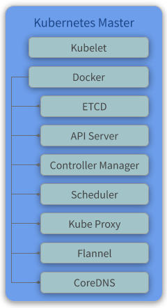
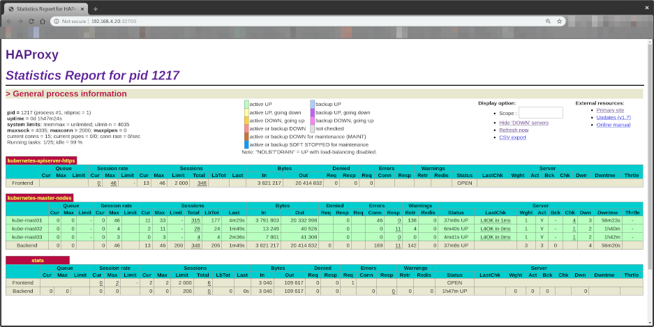

# Kube Master

Master components provide the cluster’s control plane. Master components make global decisions about the cluster (for example, scheduling), and detecting and responding to cluster events (starting up a new pod when a replication controller’s ‘replicas’ field is unsatisfied).

Master components can be run on any machine in the cluster. However, for simplicity, set up scripts typically start all master components on the same machine, and do not run user containers on this machine.

## Overview

<p align="center">
  
</p>

## Components

* **Kubelet** - Kubelet gets the configuration of a pod from the API Server and ensures that the described containers are up and running.
* **Docker** - It takes care of downloading the images and starting the containers.
* **etcd** - The etcd reliably stores the configuration data of the Kubernetes cluster, representing the state of the cluster (what nodes exist in the cluster, what pods should be running, which nodes they are running on, and a whole lot more) at any given point of time.
* **API Server** - The API Server validates and configures data for the api objects which include pods, services, replicationcontrollers, and others. The API Server services REST operations and provides the frontend to the cluster’s shared state through which all other components interact.
* **Controller Manager** - The Controller Manager watches the state of the cluster through the API Server watch feature and, when it gets notified, it makes the necessary changes attempting to move the current state towards the desired state. Besides, the Controller Manager performs lifecycle of as namespace, event, terminated-pod, cascading-deletion, node, etc.
* **Scheduler** - The Scheduler watches for unscheduled pods and binds them to nodes via the binding pod subresource API, according to the availability of the requested resources, quality of service requirements, affinity and anti-affinity specifications, and other constraints. Once the pod has a node assigned, the regular behavior of the Kubelet is triggered and the pod and its containers are created.
* **Kube Proxy** - Kube Proxy acts as a network proxy and a load balancer for a service on a single worker node. It takes care of the network routing for TCP and UDP packets.
* **Flannel** - It is a layer 3 network fabric designed for Kubernetes.
* **CoreDNS** - It is the DNS Server of the Kubernetes cluster.
> * More info about **Flannel**: https://github.com/coreos/flannel
> * More info about **CoreDNS**: https://github.com/coredns/coredns

### Configure

#### `kubeadm-config`

At this point we need to inform the initial configurations in our K8S cluster.

The **SAN**, **Plane Control EndPoint** and **POD Subnet** information is required.

* The Control Plane EndPoint address was defined in the HAProxy Cluster (192.168.4.20) ([here](/documentation/haproxy-cluster.md)).
* The SAN address will be the same as the Control Plane EndPoint.
* The CIDR of the PODs will be the range recommended by the Flannel configuration. ([here](https://github.com/coreos/flannel/blob/master/Documentation/kube-flannel.yml) search for `net-conf.json`)

Based on the above information we will have a [`kubeadm-config.yml`](../master/kubeadm-config.yaml) as below:

```yaml
apiVersion: kubeadm.k8s.io/v1beta1
kind: ClusterConfiguration
kubernetesVersion: stable-1.15
apiServer:
  certSANs:
  - "192.168.4.20"
controlPlaneEndpoint: "192.168.4.20:6443"
networking:
  podSubnet: 10.244.0.0/16
```

#### `kubeadm init`

This approach requires less infrastructure. The etcd members and control plane nodes are co-located.

1. Run the following commands to init master node:

   ```bash
   ssh debian@kube-mast01.kube.demo

   sudo su -

   wget https://raw.githubusercontent.com/mvallim/kubernetes-under-the-hood/master/master/kubeadm-config.yaml -q

   kubeadm init --config=kubeadm-config.yaml
   ```

2. Query the state of node and pods

   ```bash
   mkdir -p $HOME/.kube

   cp -i /etc/kubernetes/admin.conf $HOME/.kube/config

   chown $(id -u):$(id -g) $HOME/.kube/config

   kubectl get nodes -o wide

   kubectl get pods -o wide --all-namespaces
   ```

   The responses should look similar to this:

   ```text
   NAME          STATUS     ROLES    AGE   VERSION   INTERNAL-IP    EXTERNAL-IP   OS-IMAGE                       KERNEL-VERSION   CONTAINER-RUNTIME
   kube-mast01   NotReady   master   53s   v1.15.6   192.168.1.72   <none>        Debian GNU/Linux 9 (stretch)   4.9.0-11-amd64   docker://18.6.0
   ```

   ```text
   NAMESPACE     NAME                                  READY   STATUS    RESTARTS   AGE   IP             NODE          NOMINATED NODE   READINESS GATES
   kube-system   coredns-86c58d9df4-6gzrk              0/1     Pending   0          89s   <none>         <none>        <none>           <none>
   kube-system   coredns-86c58d9df4-fxj5r              0/1     Pending   0          89s   <none>         <none>        <none>           <none>
   kube-system   etcd-kube-mast01                      1/1     Running   0          46s   192.168.1.72   kube-mast01   <none>           <none>
   kube-system   kube-apiserver-kube-mast01            1/1     Running   0          43s   192.168.1.72   kube-mast01   <none>           <none>
   kube-system   kube-controller-manager-kube-mast01   1/1     Running   0          44s   192.168.1.72   kube-mast01   <none>           <none>
   kube-system   kube-proxy-8kb86                      1/1     Running   0          89s   192.168.1.72   kube-mast01   <none>           <none>
   kube-system   kube-scheduler-kube-mast01            1/1     Running   0          27s   192.168.1.72   kube-mast01   <none>           <none>
   ```

> If you look at the status on the `kube-mast01` node it is **NotReady** and pods of coredns is **Pending**, beacause until that point we do not have a network component configured in our K8S cluster, in which case we will use Flannel as previously already planned.

#### Deploy flannel

1. Run the following commands to init flannel network component:

   ```bash
   ssh debian@kube-mast01.kube.demo

   sudo su -

   kubectl apply -f https://raw.githubusercontent.com/coreos/flannel/v0.11.0/Documentation/kube-flannel.yml
   ```

   The response should look similar to this:

   ```text
   clusterrole.rbac.authorization.k8s.io/flannel created
   clusterrolebinding.rbac.authorization.k8s.io/flannel created
   serviceaccount/flannel created
   configmap/kube-flannel-cfg created
   daemonset.extensions/kube-flannel-ds-amd64 created
   daemonset.extensions/kube-flannel-ds-arm64 created
   daemonset.extensions/kube-flannel-ds-arm created
   daemonset.extensions/kube-flannel-ds-ppc64le created
   daemonset.extensions/kube-flannel-ds-s390x created
   ```

2. Query the state of node and pods after flannel deployed

   ```bash
   kubectl get nodes -o wide

   kubectl get pods -o wide --all-namespaces
   ```

   The responses should look similar to this:

   ```text
   NAME          STATUS   ROLES    AGE     VERSION   INTERNAL-IP    EXTERNAL-IP   OS-IMAGE                       KERNEL-VERSION   CONTAINER-RUNTIME
   kube-mast01   Ready    master   4m30s   v1.15.6   192.168.1.72   <none>        Debian GNU/Linux 9 (stretch)   4.9.0-11-amd64   docker://18.6.0
   ```

   ```text
   NAMESPACE     NAME                                  READY   STATUS    RESTARTS   AGE     IP             NODE          NOMINATED NODE   READINESS GATES
   kube-system   coredns-86c58d9df4-6gzrk              1/1     Running   0          6m4s    10.244.0.4     kube-mast01   <none>           <none>
   kube-system   coredns-86c58d9df4-fxj5r              1/1     Running   0          6m4s    10.244.0.5     kube-mast01   <none>           <none>
   kube-system   etcd-kube-mast01                      1/1     Running   0          5m21s   192.168.1.72   kube-mast01   <none>           <none>
   kube-system   kube-apiserver-kube-mast01            1/1     Running   0          5m18s   192.168.1.72   kube-mast01   <none>           <none>
   kube-system   kube-controller-manager-kube-mast01   1/1     Running   0          5m19s   192.168.1.72   kube-mast01   <none>           <none>
   kube-system   kube-flannel-ds-amd64-545vl           1/1     Running   0          24s     192.168.1.72   kube-mast01   <none>           <none>
   kube-system   kube-proxy-8kb86                      1/1     Running   0          6m4s    192.168.1.72   kube-mast01   <none>           <none>
   kube-system   kube-scheduler-kube-mast01            1/1     Running   0          5m2s    192.168.1.72   kube-mast01   <none>           <none>
   ```

> If you look at the status on the `kube-mast01` node it is now **Ready** and coredns is **Running**, and now there is pod `kube-flannel-ds-amd64`.

### Join Master Replicas

Now we need to join the other nodes to our K8S cluster. For this we need the certificates that were generated in the previous steps.

The installation and configuration of these VMs were done through the cloud-init that already makes available ([here](/data/debian/kube/user-data)) a copy and move script of certificates.

The copied certificate is:

* Kubernetes general
  * /etc/kubernetes/pki/ca.crt
  * /etc/kubernetes/pki/ca.key
  * /etc/kubernetes/pki/sa.key
  * /etc/kubernetes/pki/sa.pub

* For the front-end proxy
  * /etc/kubernetes/pki/front-proxy-ca.crt
  * /etc/kubernetes/pki/front-proxy-ca.key

* For all etcd-related functions
  * /etc/kubernetes/pki/etcd/ca.crt
  * /etc/kubernetes/pki/etcd/ca.key

* Admin configuration of cluster
  * /etc/kubernetes/admin.conf

#### Copy certificates

1. Run the following commands to copy certificates to master replicas:

   ```bash
   ssh debian@kube-mast01.kube.demo

   sudo su -

   ssh-keygen -t rsa -b 4096

   ssh-copy-id debian@kube-mast02 #(default password: debian)

   ssh-copy-id debian@kube-mast03 #(default password: debian)

   ~/bin/copy-certificates.sh
   ```

#### Print Join Command

1. Run the following commands to print join command master replicas on cluster:

   ```bash
   ssh debian@kube-mast01.kube.demo

   sudo su -

   kubeadm token create --print-join-command
   ```

   The response should look similar to this:

   ```bash
   kubeadm join 192.168.4.20:6443 --token y5uii4.5myd468ieaavd0g6 --discovery-token-ca-cert-hash sha256:d4990d904f85ad8fb2d2bbb2e56b35a8cd0714092b40e3778209a0f1d4fa38b9
   ```

> The last command print the command to you join nodes on cluster, you will use this command to join master on cluster

#### Join second Kube Master

1. Run the following commands to move certificates of 1° master node to correct place:

   ```bash
   ssh debian@kube-mast02.kube.demo

   sudo su -

   ~/bin/move-certificates.sh
   ```

2. Run the following command to join master replica on cluster using the join command execute on the step [**`Print Join Command`**](#print-join-command):

   ```bash
   kubeadm join 192.168.4.20:6443 \
       --token y5uii4.5myd468ieaavd0g6 \
       --discovery-token-ca-cert-hash sha256:d4990d904f85ad8fb2d2bbb2e56b35a8cd0714092b40e3778209a0f1d4fa38b9 \
       --control-plane
   ```

> Add the `--control-plane` at the end of command

#### Join third Kube Master

1. Run the following commands to move certificates of 1° master node to correct place:

   ```bash
   ssh debian@kube-mast03.kube.demo

   sudo su -

   ~/bin/move-certificates.sh
   ```

2. Run the following command to join master replica on cluster using the join command execute on the step [**`Print Join Command`**](#print-join-command):

   ```bash
   kubeadm join 192.168.4.20:6443 \
       --token y5uii4.5myd468ieaavd0g6 \
       --discovery-token-ca-cert-hash sha256:d4990d904f85ad8fb2d2bbb2e56b35a8cd0714092b40e3778209a0f1d4fa38b9 \
       --control-plane
   ```

> Add the `--control-plane` at the end of command

### View stats of etcd

1. Query the state of etcd

   ```bash
   ssh debian@kube-mast01.kube.demo

   sudo su -

   docker run --rm -it \
       --net host \
       -v /etc/kubernetes:/etc/kubernetes quay.io/coreos/etcd:v3.2.24 etcdctl \
       --cert-file /etc/kubernetes/pki/etcd/peer.crt \
       --key-file /etc/kubernetes/pki/etcd/peer.key \
       --ca-file /etc/kubernetes/pki/etcd/ca.crt \
       --endpoints https://127.0.0.1:2379 cluster-health

   docker run --rm -it \
       --net host \
       -v /etc/kubernetes:/etc/kubernetes quay.io/coreos/etcd:v3.2.24 etcdctl \
       --cert-file /etc/kubernetes/pki/etcd/peer.crt \
       --key-file /etc/kubernetes/pki/etcd/peer.key \
       --ca-file /etc/kubernetes/pki/etcd/ca.crt \
       --endpoints https://127.0.0.1:2379 member list
   ```

   The responses should look similar to this:

   ```text
   member 5c81b5ea448e2eb is healthy: got healthy result from https://192.168.1.72:2379
   member 1d7ec3729980eebe is healthy: got healthy result from https://192.168.1.68:2379
   member ea93a1a33cffaceb is healthy: got healthy result from https://192.168.1.81:2379
   ```

   ```text
   5c81b5ea448e2eb: name=kube-mast01 peerURLs=https://192.168.1.72:2380 clientURLs=https://192.168.1.72:2379 isLeader=false
   1d7ec3729980eebe: name=kube-mast02 peerURLs=https://192.168.1.68:2380 clientURLs=https://192.168.1.68:2379 isLeader=true
   ea93a1a33cffaceb: name=kube-mast03 peerURLs=https://192.168.1.81:2380 clientURLs=https://192.168.1.81:2379 isLeader=false
   ```

### View stats K8S Cluster

1. Query the state of nodes and pods

   ```bash
   ssh debian@kube-mast01.kube.demo

   sudo su -

   kubectl get nodes -o wide

   kubectl get pods -o wide --all-namespaces
   ```

   The responses should look similar to this:

   ```text
   NAME          STATUS   ROLES    AGE     VERSION   INTERNAL-IP    EXTERNAL-IP   OS-IMAGE                       KERNEL-VERSION   CONTAINER-RUNTIME
   kube-mast01   Ready    master   34m     v1.15.6   192.168.1.72   <none>        Debian GNU/Linux 9 (stretch)   4.9.0-11-amd64   docker://18.6.0
   kube-mast02   Ready    master   4m34s   v1.15.6   192.168.1.68   <none>        Debian GNU/Linux 9 (stretch)   4.9.0-11-amd64   docker://18.6.0
   kube-mast03   Ready    master   2m54s   v1.15.6   192.168.1.81   <none>        Debian GNU/Linux 9 (stretch)   4.9.0-11-amd64   docker://18.6.0
   ```

   > All master nodes **Ready**

   ```text
   NAMESPACE     NAME                                  READY   STATUS    RESTARTS   AGE     IP             NODE          NOMINATED NODE   READINESS GATES
   kube-system   coredns-86c58d9df4-6gzrk              1/1     Running   0          34m     10.244.0.4     kube-mast01   <none>           <none>
   kube-system   coredns-86c58d9df4-fxj5r              1/1     Running   0          34m     10.244.0.5     kube-mast01   <none>           <none>
   kube-system   etcd-kube-mast01                      1/1     Running   0          34m     192.168.1.72   kube-mast01   <none>           <none>
   kube-system   etcd-kube-mast02                      1/1     Running   0          5m20s   192.168.1.68   kube-mast02   <none>           <none>
   kube-system   etcd-kube-mast03                      1/1     Running   0          3m40s   192.168.1.81   kube-mast03   <none>           <none>
   kube-system   kube-apiserver-kube-mast01            1/1     Running   0          34m     192.168.1.72   kube-mast01   <none>           <none>
   kube-system   kube-apiserver-kube-mast02            1/1     Running   1          5m22s   192.168.1.68   kube-mast02   <none>           <none>
   kube-system   kube-apiserver-kube-mast03            1/1     Running   0          2m57s   192.168.1.81   kube-mast03   <none>           <none>
   kube-system   kube-controller-manager-kube-mast01   1/1     Running   1          34m     192.168.1.72   kube-mast01   <none>           <none>
   kube-system   kube-controller-manager-kube-mast02   1/1     Running   0          5m22s   192.168.1.68   kube-mast02   <none>           <none>
   kube-system   kube-controller-manager-kube-mast03   1/1     Running   0          3m42s   192.168.1.81   kube-mast03   <none>           <none>
   kube-system   kube-flannel-ds-amd64-545vl           1/1     Running   0          29m     192.168.1.72   kube-mast01   <none>           <none>
   kube-system   kube-flannel-ds-amd64-gnngz           1/1     Running   0          3m42s   192.168.1.81   kube-mast03   <none>           <none>
   kube-system   kube-flannel-ds-amd64-trxc2           1/1     Running   0          5m22s   192.168.1.68   kube-mast02   <none>           <none>
   kube-system   kube-proxy-8kb86                      1/1     Running   0          34m     192.168.1.72   kube-mast01   <none>           <none>
   kube-system   kube-proxy-cpspc                      1/1     Running   0          3m42s   192.168.1.81   kube-mast03   <none>           <none>
   kube-system   kube-proxy-j6sch                      1/1     Running   0          5m22s   192.168.1.68   kube-mast02   <none>           <none>
   kube-system   kube-scheduler-kube-mast01            1/1     Running   1          33m     192.168.1.72   kube-mast01   <none>           <none>
   kube-system   kube-scheduler-kube-mast02            1/1     Running   0          5m22s   192.168.1.68   kube-mast02   <none>           <none>
   kube-system   kube-scheduler-kube-mast03            1/1     Running   0          3m42s   192.168.1.81   kube-mast03   <none>           <none>
   ```

   > All master pods **Running**

### View stats HAProxy Cluster

Open your browser with address [http://192.168.4.20:32700](http://192.168.4.20:32700)

User: admin
Password: admin

It will show:


All Control Plane EndPoints **UP**

* kube-mast01:6443
* kube-mast02:6443
* kube-mast03:6443
