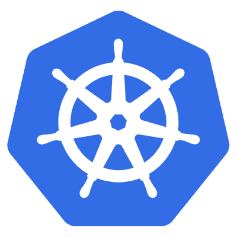
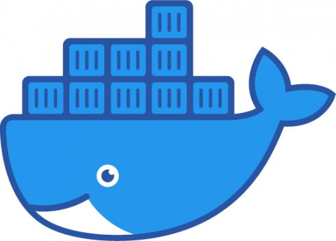
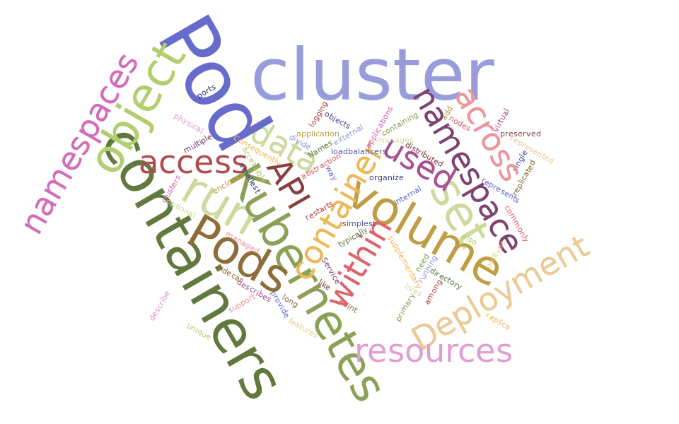
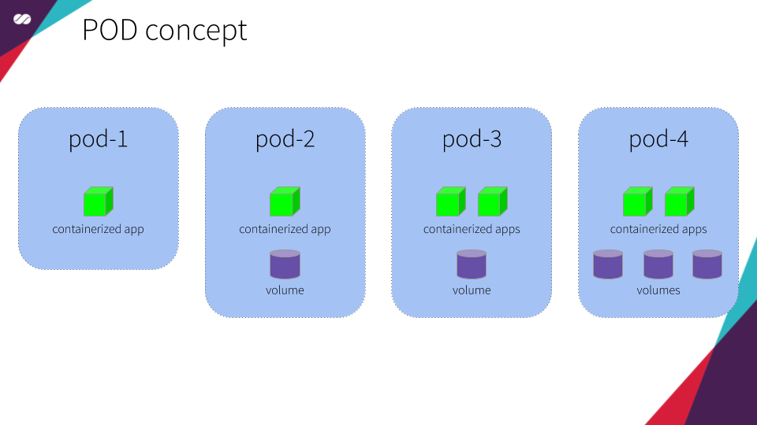
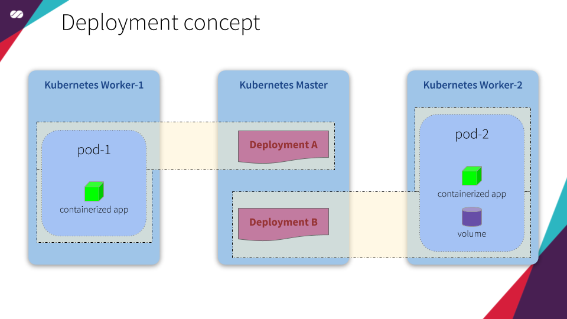
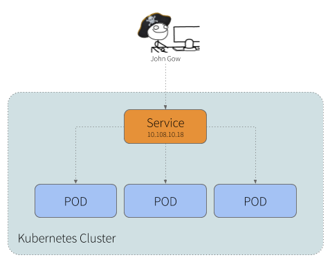
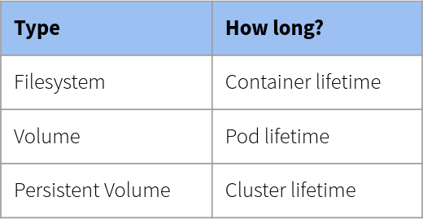
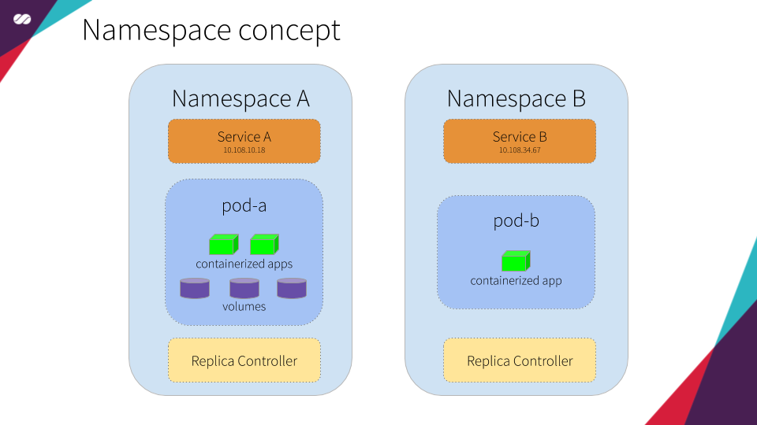

# Kubernetes Overview

   

*"Kubernetes is a portable, extensible open-source platform for managing containerized workloads and services, that facilitates both declarative configuration and automation. It has a large, rapidly growing ecosystem. Kubernetes services, support, and tools are widely available."*

*"Google open-sourced the Kubernetes project in 2014. Kubernetes builds upon a decade and a half of experience that Google has with running production workloads at scale, combined with best-of-breed ideas and practices from the community."*

> Reference: https://kubernetes.io/docs/concepts/overview/what-is-kubernetes/

**Kubernetes** advantages includes:

* **Agile application development and deployment**: Increased ease and efficiency of container image creation compared to VM image use.
* **Continuous development, integration, and deployment**: Provides for reliable and frequent container image build and deployment with quick and easy rollbacks (due to image immutability).
* **Dev and Ops separation of concerns**: Create application container images at build/release time rather than deployment time, thereby decoupling applications from infrastructure.
* **Observability**: Not only surfacing OS-level information and metrics but also application health and other signals.
* **Environmental consistency across development, testing, and production**: Runs the same on a laptop as it does in the cloud.
* **Cloud and OS distribution portability**: Runs on Debian, Ubuntu, CoreOS, on-prem, Google Kubernetes Engine, Amazon Elastic Container Service and anywhere else.
* **Application-centric management**: Raises the level of abstraction from running an OS on virtual hardware to running an application on an OS using logical resources.
* **Loosely coupled, distributed, elastic, liberated micro-services**: Applications are broken into smaller, independent pieces and can be deployed and managed dynamically — not a monolithic stack running on a big single-purpose machine.
* **Resource isolation**: Predictable application performance.
* **Resource utilization**: High efficiency and density.

> Reference: https://kubernetes.io/docs/concepts/overview/what-is-kubernetes/

In order for **Kubernetes** to reach its full capacity, it depends on and makes use of other open source tools. Among them we can include:

* **Registry**, such as the [**Docker Registry**](https://docs.docker.com/registry/).
* **Network**, such as [**Flannel**](https://github.com/coreos/flannel), [**Calico**](https://docs.projectcalico.org/v3.7/getting-started/kubernetes/), [**MetalLB**](https://metallb.universe.tf/), [**CoreDNS**](https://github.com/coredns/coredns), etc.
* **Telemetry**, such as [**Prometheus**](https://prometheus.io/), [**Sysdig**](https://sysdig.com/products/monitor/) and [**Istio**](https://istio.io/docs/concepts/policies-and-telemetry/).
* **Security**, such as [**LDAP**](https://en.wikipedia.org/wiki/Lightweight_Directory_Access_Protocol), [**SELinux**](https://en.wikipedia.org/wiki/Security-Enhanced_Linux), [**RBAC**](https://kubernetes.io/docs/reference/glossary/?security=true#term-rbac) and [**OAuth**](https://oauth.net/) with multi-tier layers.
* **Services**, offered in a varied catalog of previously created content from popular application patterns.

## Kubernetes at a glance

   
  Kubernetes Architecture Diagram

A cluster managed by **Kubernetes** basically has two large operational units: **Master node(s)** and **Worker nodes**.

* **Master**: is the element responsible for orchestrating all activities related to the containers that run on the worker nodes. It is responsible for scheduling and deploying a clustered application and obtaining information about worker nodes and Pods, among many other activities.
* **Worker**: are the machines (nodes, which can be physical or VMs) where the containers managed by **Kubernetes** effectively run. In order for worker nodes to be managed by **Kubernetes**, they must have **Kubelet** agents from **Kubernetes** installed on them. It is through this agent that all communication with the master is performed and, as a consequence, the cluster operations are performed.

**Kubernetes master** receives the commands from the Developer/Operator (DevOps) and passes the instructions to the worker nodes. These instructions are processed and retransmitted by a set of services that automatically decide which worker node is most suitable to process the requested the task. The resources are then allocated and assigned to the selected worker node to satisfy the requested statement.

Container management takes place at a higher and more refined level, without someone needs to actively micromanage containers and worker nodes individually.

### Master and Work components

* **Container network interface (CNI)**: This plugin is a type of Network plugin that adheres to the appc/CNI specification.
  - For information on Kubernetes and CNI refer to [**this**](https://kubernetes.io/docs/concepts/extend-kubernetes/compute-storage-net/network-plugins/#cni).
  - For information on Kubernetes and CNI, see "[**Network plugins**](https://kubernetes.io/docs/concepts/extend-kubernetes/compute-storage-net/network-plugins/#cni)".
* **etcd**: Consistent and highly-available key-value store used as **Kubernetes’** backing store for all cluster data. If your **Kubernetes** cluster uses **etcd** as its backing store, make sure you have a back up plan for those data.
* **API server**: Component on the master that exposes the Kubernetes API. It is the front-end for the Kubernetes control plane. It is designed to scale horizontally — that is, it scales by deploying more instances.
* **Control Plane**: The container orchestration layer that exposes the API and interfaces to define, deploy, and manage the lifecycle of containers.
* **Scheduler**: Component on the master that watches newly created Pods that have no worker node assigned, and selects a worker node for them to run into. Factors taken into account for scheduling decisions include individual and collective resource requirements, hardware/software/policy constraints, affinity and anti-affinity specifications, data locality, inter-workload interference and deadlines.
* **Controller manager**: Component on the master that runs controllers. Logically, each controller is a separate process but, to reduce complexity, they are all compiled into a single binary and run in a single process.
* **kubelet**: A service ran on the worker nodes that reads Pod manifests and ensures that its defined containers have been started and are running.
* **containerd**: A container runtime with an emphasis on simplicity, robustness and portability **containerd** is a container runtime that runs as a daemon on Linux or Windows. **containerd** takes care of fetching and storing container images, executing containers, providing network access, and more. (in our solution we’ll use **Docker** for this purpose)
* **Kube Proxy**: It is a network proxy that runs on each worker node in the cluster. **kube-proxy** is responsible for request forwarding. **kube-proxy** allows TCP and UDP stream forwarding or round-robin TCP and UDP forwarding across a set of backend functions.

> Reference: https://kubernetes.io/docs/reference/glossary/?fundamental=true

### Kubectl

   
  Image from Rising Stack

**kubectl** is a command line tool for communicating with a **Kubernetes API** server. You can use **kubectl** to create, inspect, update, and delete **Kubernetes** objects.

### What about Docker?

   

**Docker** keeps its original function. What changes is that when **Kubernetes** configures a Pod, it sends instructions to the **kubelet** of the selected worker node with instructions for Docker to start (or stop) a container with the given specification. **kubelet**, in turn, continues collecting information from **Docker** and its **containers** and aggregating all this information in the master. The big difference here is that all of this happens in an automated way, without the need of an administrator having to do all this configuration and information gathering manually.

## Kubernetes’ main objects

   

Following is a brief definition of each of the main objects managed by Kubernetes. We’ll get into more detail about them in the next articles in this series:

* **Pod**: The smallest and simplest Kubernetes object. A Pod represents a set of running [**containers**](https://kubernetes.io/docs/concepts/overview/what-is-kubernetes/#why-containers) on your cluster. A Pod is typically set up to run a single primary container. It can also run optional sidecar containers that add supplementary features like logging. Pods are commonly managed by a **Deployment**.

   

* **Deployment**: An API object that manages a replicated application. Each replica is represented by a Pod, and the Pods are distributed among the worker nodes of a cluster.

   

* **Service**: An API object that describes how to access applications, such as a set of [**Pods**](https://kubernetes.io/docs/concepts/workloads/pods/pod-overview/), and can describe ports and load-balancers. The access point can be internal or external to the cluster.

   

* **Volume**: A directory containing data, accessible to the containers in a Pod. A Kubernetes volume lives as long as the Pod that encloses it. Consequently, a volume outlives any containers that run within the Pod, and data is preserved across container restarts. 
  - **Filesystem**: In Kubernetes, each container can read and write in its own filesystem. But the data written into this filesystem is destroyed when the container is restarted or removed.
  - **Volume**: Kubernetes has volumes. Volumes that are in a Pod will exist as long as the Pod exists. Volumes can be shared among the same Pod containers. When a Pod is restarted or removed the volume is destroyed.
  - **Persistent Volume**: The Kubernetes has persistent volumes. Persistent volumes are long-term stores within the Kubernetes cluster. Persistent volumes go beyond containers, Pods, and worker nodes, they exist as long as the Kubernetes cluster exists. A Pod claims the use of a persistent volume for reading or writing or for reading and writing.

   

* **Namespace**: An abstraction used by Kubernetes to support multiple virtual clusters on the same physical cluster. Namespaces are used to organize objects in a cluster and provide a way to divide cluster resources. Resource names need to be unique within a namespace but not across namespaces.

   

> Reference: https://kubernetes.io/docs/reference/glossary/?fundamental=true