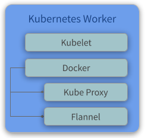

## Kube Workers
A node is a worker machine in Kubernetes, previously known as a minion. A node may be a VM or physical machine, depending on the cluster. Each node contains the services necessary to run pods and is managed by the master components. The services on a node include the container runtime, kubelet and kube-proxy. 

### Components
* **Kubelet** - Kubelet gets the configuration of a pod from the API Server and ensures that the described containers are up and running.
* **Docker** - It takes care of downloading the images and starting the containers.
* **Kube Proxy** - Kube Proxy acts as a network proxy and a load balancer for a service on a single worker node. It takes care of the network routing for TCP and UDP packets.
* **Flannel** - It is a layer 3 network fabric designed for Kubernetes.
> * More info about **Flannel**: https://github.com/coreos/flannel

### Overview
<p align="center">
  
</p>

### Configure

#### Print Join Command
```
ssh debian@kube-mast01.kube.local

sudo su -

kubeadm token create --print-join-command
```

The expected outputs is:
```
kubeadm join 192.168.4.20:6443 --token y5uii4.5myd468ieaavd0g6 --discovery-token-ca-cert-hash sha256:d4990d904f85ad8fb2d2bbb2e56b35a8cd0714092b40e3778209a0f1d4fa38b9
```
> The last command print the command to you join nodes on cluster, you will use this command to join wokers on cluster

#### Join first Kube Worker
```
ssh debian@kube-node01.kube.local

sudo su -

kubeadm join 192.168.4.20:6443 \
    --token y5uii4.5myd468ieaavd0g6 \
    --discovery-token-ca-cert-hash sha256:d4990d904f85ad8fb2d2bbb2e56b35a8cd0714092b40e3778209a0f1d4fa38b9
```

#### Join second Kube Worker
```
ssh debian@kube-node02.kube.local

sudo su -

kubeadm join 192.168.4.20:6443 \
    --token y5uii4.5myd468ieaavd0g6 \
    --discovery-token-ca-cert-hash sha256:d4990d904f85ad8fb2d2bbb2e56b35a8cd0714092b40e3778209a0f1d4fa38b9
```

#### Join third Kube Worker
```
ssh debian@kube-node03.kube.local

sudo su -

kubeadm join 192.168.4.20:6443 \
    --token y5uii4.5myd468ieaavd0g6 \
    --discovery-token-ca-cert-hash sha256:d4990d904f85ad8fb2d2bbb2e56b35a8cd0714092b40e3778209a0f1d4fa38b9
```

### View stats K8S Cluster
```
ssh debian@kube-mast03.kube.local

sudo su -

kubectl get nodes -o wide

kubectl get pods -o wide --all-namespaces
```

The expected outputs is:
```
NAME          STATUS   ROLES    AGE     VERSION   INTERNAL-IP    EXTERNAL-IP   OS-IMAGE                       KERNEL-VERSION   CONTAINER-RUNTIME
kube-mast01   Ready    master   34m     v1.13.5   192.168.1.72   <none>        Debian GNU/Linux 9 (stretch)   4.9.0-9-amd64    docker://18.6.0
kube-mast02   Ready    master   4m34s   v1.13.5   192.168.1.68   <none>        Debian GNU/Linux 9 (stretch)   4.9.0-9-amd64    docker://18.6.0
kube-mast03   Ready    master   2m54s   v1.13.5   192.168.1.81   <none>        Debian GNU/Linux 9 (stretch)   4.9.0-9-amd64    docker://18.6.0
```
All nodes **Ready** 

```
NAMESPACE     NAME                                  READY   STATUS    RESTARTS   AGE     IP             NODE          NOMINATED NODE   READINESS GATES
kube-system   coredns-86c58d9df4-6gzrk              1/1     Running   0          34m     10.244.0.4     kube-mast01   <none>           <none>
kube-system   coredns-86c58d9df4-fxj5r              1/1     Running   0          34m     10.244.0.5     kube-mast01   <none>           <none>
kube-system   etcd-kube-mast01                      1/1     Running   0          34m     192.168.1.72   kube-mast01   <none>           <none>
kube-system   etcd-kube-mast02                      1/1     Running   0          5m20s   192.168.1.68   kube-mast02   <none>           <none>
kube-system   etcd-kube-mast03                      1/1     Running   0          3m40s   192.168.1.81   kube-mast03   <none>           <none>
kube-system   kube-apiserver-kube-mast01            1/1     Running   0          34m     192.168.1.72   kube-mast01   <none>           <none>
kube-system   kube-apiserver-kube-mast02            1/1     Running   1          5m22s   192.168.1.68   kube-mast02   <none>           <none>
kube-system   kube-apiserver-kube-mast03            1/1     Running   0          2m57s   192.168.1.81   kube-mast03   <none>           <none>
kube-system   kube-controller-manager-kube-mast01   1/1     Running   1          34m     192.168.1.72   kube-mast01   <none>           <none>
kube-system   kube-controller-manager-kube-mast02   1/1     Running   0          5m22s   192.168.1.68   kube-mast02   <none>           <none>
kube-system   kube-controller-manager-kube-mast03   1/1     Running   0          3m42s   192.168.1.81   kube-mast03   <none>           <none>
kube-system   kube-flannel-ds-amd64-545vl           1/1     Running   0          29m     192.168.1.72   kube-mast01   <none>           <none>
kube-system   kube-flannel-ds-amd64-gnngz           1/1     Running   0          3m42s   192.168.1.81   kube-mast03   <none>           <none>
kube-system   kube-flannel-ds-amd64-trxc2           1/1     Running   0          5m22s   192.168.1.68   kube-mast02   <none>           <none>
kube-system   kube-proxy-8kb86                      1/1     Running   0          34m     192.168.1.72   kube-mast01   <none>           <none>
kube-system   kube-proxy-cpspc                      1/1     Running   0          3m42s   192.168.1.81   kube-mast03   <none>           <none>
kube-system   kube-proxy-j6sch                      1/1     Running   0          5m22s   192.168.1.68   kube-mast02   <none>           <none>
kube-system   kube-scheduler-kube-mast01            1/1     Running   1          33m     192.168.1.72   kube-mast01   <none>           <none>
kube-system   kube-scheduler-kube-mast02            1/1     Running   0          5m22s   192.168.1.68   kube-mast02   <none>           <none>
kube-system   kube-scheduler-kube-mast03            1/1     Running   0          3m42s   192.168.1.81   kube-mast03   <none>           <none>
```
All pods **Running** 