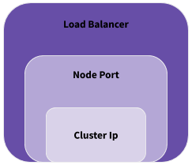
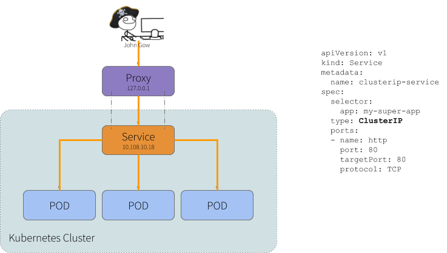
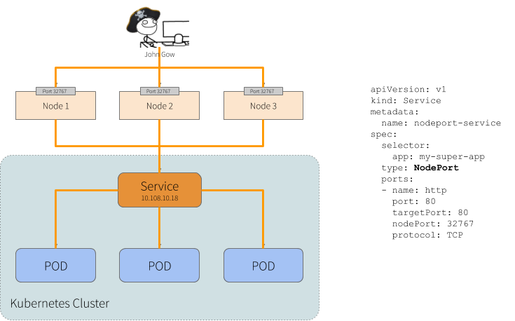
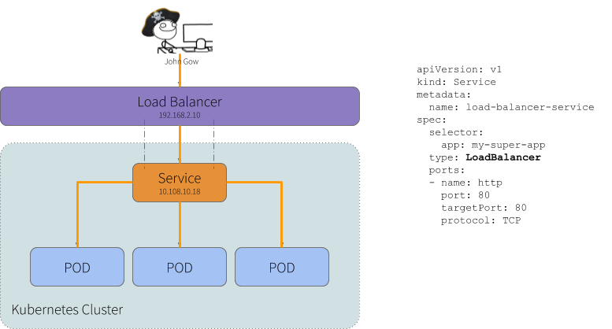

## Kubernetes
*"Kubernetes is a portable, extensible open-source platform for managing containerized workloads and services, that facilitates both declarative configuration and automation. It has a large, rapidly growing ecosystem. Kubernetes services, support, and tools are widely available."*

*"Google open-sourced the Kubernetes project in 2014. Kubernetes builds upon a decade and a half of experience that Google has with running production workloads at scale, combined with best-of-breed ideas and practices from the community."*
> Reference: https://kubernetes.io/docs/concepts/overview/what-is-kubernetes/

### History
*"Kubernetes (κυβερνήτης, Greek for "governor", "helmsman" or "captain") was founded by Joe Beda, Brendan Burns and Craig McLuckie, who were quickly joined by other Google engineers including Brian Grant and Tim Hockin, and was first announced by Google in mid-2014. Its development and design are heavily influenced by Google's Borg system, and many of the top contributors to the project previously worked on Borg. The original codename for Kubernetes within Google was Project Seven of Nine, a reference to a Star Trek character that is a "friendlier" Borg. The seven spokes on the wheel of the Kubernetes logo are a reference to that codename. The original Borg project was written entirely in C++, but the rewritten Kubernetes system is implemented in Go."*

*"Kubernetes v1.0 was released on July 21, 2015. Along with the Kubernetes v1.0 release, Google partnered with the Linux Foundation to form the Cloud Native Computing Foundation (CNCF) and offered Kubernetes as a seed technology. On March 6, 2018, Kubernetes Project reached ninth place in commits at GitHub, and second place in authors and issues to the Linux kernel."*

## Objects

### Pods
It is the smallest unit within a cluster, nothing more than containers running within its Kubernetes cluster. It can be a container running any application. Ex. nginx, jetty, redis, memcached, etc

### Service

  

#### **ClusterIP**
Exposes the service on a cluster-internal IP. Choosing this value makes the service only reachable from within the cluster. This is the default ServiceType.

  

#### **NodePort**
Exposes the service on each Node’s IP at a static port (the NodePort). A ClusterIP service, to which the NodePort service will route, is automatically created. You’ll be able to contact the NodePort service, from outside the cluster, by requesting `<NodeIP>:<NodePort>`.

  

#### **LoadBalancer**
Exposes the service externally using a cloud provider’s load balancer. NodePort and ClusterIP services, to which the external load balancer will route, are automatically created.

  

### Volumes
* **Filesystem**: In Kubernetes, each container can read and write in its own filesystem.
But the data written into this filesystem is destroyed when the container is restarted or removed.

* **Volume**: Kubernetes has volumes. Volumes that are in a POD will exist as long as the POD exists. Volumes can be shared among the same POD containers. When a POD is restarted or removed the volume is destroyed.

* **Persistent Volume**: The Kubernetes has persistent volumes. Persistent volumes are long-term stores within the Kubernetes cluster. Persistent volumes go beyond containers, PODs, and nodes, they exist as long as the Kubernetes cluster exists. A POD claims the use of a persistent volume for reading or writing or for reading and writing.

| Type              | How long?          |
|-------------------|--------------------|
| Filesystem        | Container lifetime |
| Volume            | Pod lifetime       |
| Persistent Volume | Cluster lifetime   |

### Namespaces
The namespace you can segregate your K8S Cluster in different environments, and you can limit the computational resources for each of them.

Ex. Production, User Acceptance Test (UAT)
