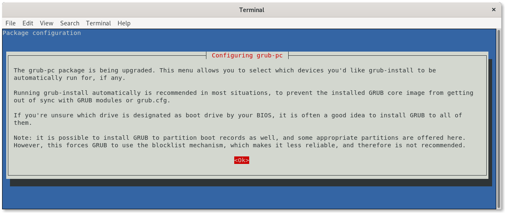
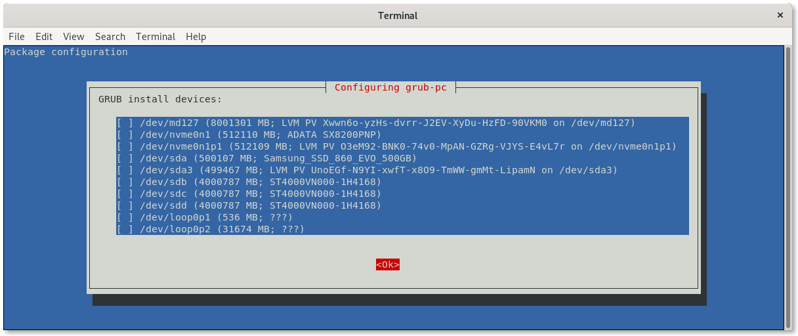
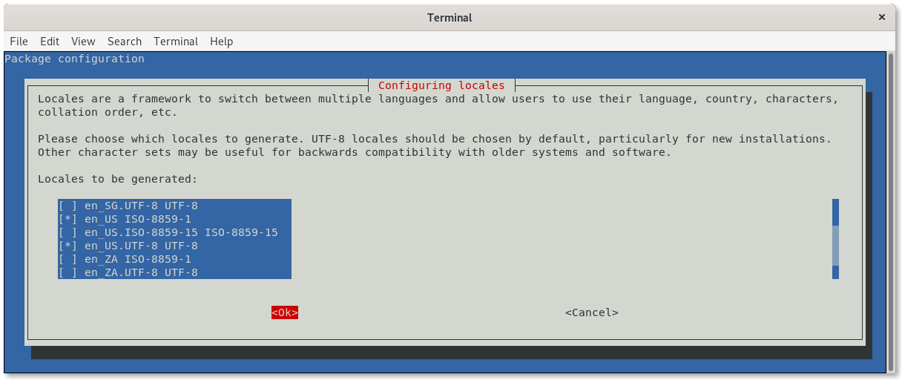
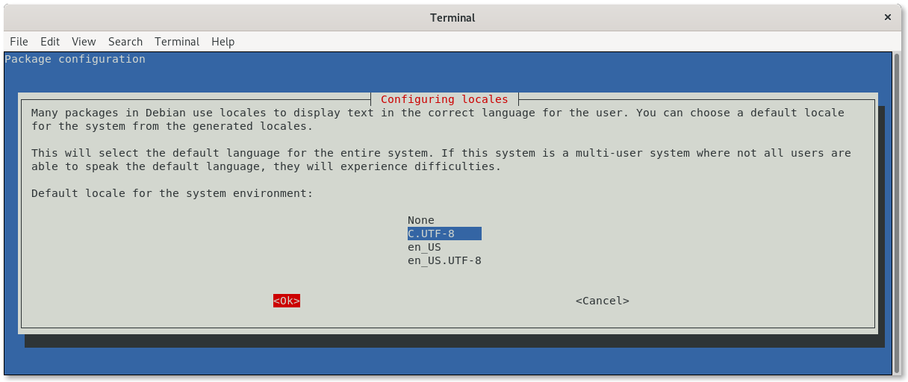
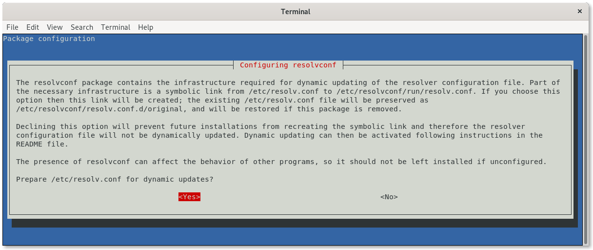
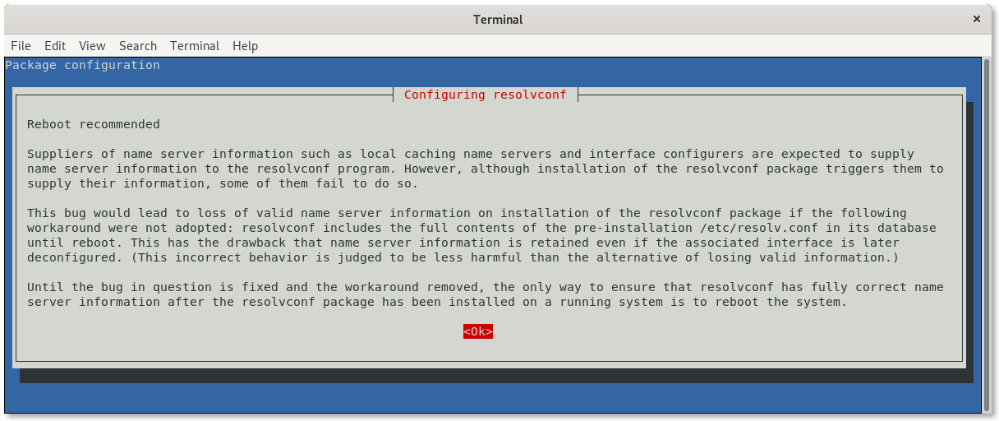

# How to setup the Debian Linux image from scratch

This procedure shows how to create a cloud image Ubuntu from scratch to run on Cloud environments (EC2, GCE, Azure, OpenStack, QEMU and VirtualBox).

## Prerequisites (GNU/Linux Debian/Ubuntu)

* Install applications we need to build the environment.

```bash
~$ sudo apt-get install debootstrap
```

```bash
~$ mkdir $HOME/debian-image-from-scratch
```

## Create loop device

1. Create empty virtual hard drive file (`30Gb`)

   ```bash
   ~$ dd if=/dev/zero of=~/debian-image-from-scratch/debian-image.raw bs=1 count=0 seek=32212254720 status=progress
   ```

2. Create partitions on file

   ```bash
   ~$ sed -e 's/\s*\([\+0-9a-zA-Z]*\).*/\1/' << EOF | sudo fdisk ~/debian-image-from-scratch/debian-image.raw
   o # clear the in memory partition table
   n # new partition
   p # primary partition
   1 # partition number 1 
       # default - start at beginning of disk
   +512M # 512 MB boot parttion
   n # new partition
   p # primary partition
   2 # partion number 2
       # default, start immediately after preceding partition
       # default, extend partition to end of disk
   a # make a partition bootable
   1 # bootable partition is partition 1 -- /dev/loop0p1
   p # print the in-memory partition table
   w # write the partition table
   q # and we're done
   EOF
   ```

3. Start loop device

   ```bash
   ~$ sudo losetup -fP ~/debian-image-from-scratch/debian-image.raw
   ```

   Check loop device

   ```bash
   ~$ sudo losetup -a
   ```

   Output

   ```console
   /dev/loop0: [64775]:26084892 (/home/mvallim/debian-image-from-scratch/debian-image.raw)
   ```

4. Check partitions on loop device

   ```bash
   ~$ sudo fdisk -l /dev/loop0
   ```

   Output

   ```console
   Disk /dev/loop0: 30 GiB, 32212254720 bytes, 62914560 sectors
   Units: sectors of 1 * 512 = 512 bytes
   Sector size (logical/physical): 512 bytes / 512 bytes
   I/O size (minimum/optimal): 512 bytes / 512 bytes
   Disklabel type: dos
   Disk identifier: 0xf4e11bd3

   Device       Boot   Start      End  Sectors  Size Id Type
   /dev/loop0p1 *       2048  1050623  1048576  512M 83 Linux
   /dev/loop0p2      1050624 62914559 61863936 29.5G 83 Linux
   ```

## Format partitions loop device

   1. Format device loop0p1 (/boot)

      ```bash
      ~$ sudo mkfs.ext4 /dev/loop0p1
      ```

      Output

      ```console
      mke2fs 1.44.5 (15-Dec-2018)
      Discarding device blocks: done
      Creating filesystem with 131072 4k blocks and 32768 inodes
      Filesystem UUID: 4d426158-5c62-4b8c-8dcb-52c47e83df3e
      Superblock backups stored on blocks:
            32768, 98304

      Allocating group tables: done
      Writing inode tables: done
      Creating journal (4096 blocks): done
      Writing superblocks and filesystem accounting information: done
      ```

   2. Format device loop0p2 (/)

      ```bash
      ~$ sudo mkfs.ext4 /dev/loop0p2
      ```

      Output

      ```console
      mke2fs 1.44.5 (15-Dec-2018)
      Discarding device blocks: done
      Creating filesystem with 7732992 4k blocks and 1933312 inodes
      Filesystem UUID: 88086414-602f-4099-a112-c94a1c6a13f5
      Superblock backups stored on blocks:
            32768, 98304, 163840, 229376, 294912, 819200, 884736, 1605632, 2654208,
            4096000

      Allocating group tables: done
      Writing inode tables: done
      Creating journal (32768 blocks): done
      Writing superblocks and filesystem accounting information: done
      ```

## Mount loop devices

1. Create `chroot` directory

   ```bash
   ~$ mkdir ~/debian-image-from-scratch/chroot
   ```

2. Mount `root` partition

   ```bash
   ~$ sudo mount /dev/loop0p2 ~/debian-image-from-scratch/chroot/
   ```

3. Mount `boot` partition

   First you need create directory...

   ```bash
   ~$ sudo mkdir ~/debian-image-from-scratch/chroot/boot
   ```

   ... and mount `boot` partition

   ```bash
   ~$ sudo mount /dev/loop0p1 ~/debian-image-from-scratch/chroot/boot
   ```

## Bootstrap and Configure Debian

* Checkout bootstrap

  ```bash
  ~$ sudo debootstrap \
     --arch=amd64 \
     --variant=minbase \
     --components "main" \
     --include "ca-certificates,cron,iptables,isc-dhcp-client,libnss-myhostname,ntp,ntpdate,rsyslog,ssh,sudo,dialog,whiptail,man-db,curl,dosfstools,e2fsck-static" \
     stretch \
     $HOME/debian-image-from-scratch/chroot \
     http://deb.debian.org/debian/
  ```

  > **debootstrap** is used to create a Debian base system from scratch, without requiring the availability of **dpkg** or **apt**. It does this by downloading .deb files from a mirror site, and carefully unpacking them into a directory which can eventually be **chrooted** into.

* Configure external mount points

  ```bash
  ~$ sudo mount --bind /dev $HOME/debian-image-from-scratch/chroot/dev
  
  ~$ sudo mount --bind /run $HOME/debian-image-from-scratch/chroot/run
  ```

  As we will be updating and installing packages (grub among them), these mount points are necessary inside the chroot environment, so we are able to finish the installation without errors.

## Define chroot environment

*A chroot on Unix operating systems is an operation that changes the apparent root directory for the current running process and its children. A program that is run in such a modified environment cannot name (and therefore normally cannot access) files outside the designated directory tree. The term "chroot" may refer to the chroot system call or the chroot wrapper program. The modified environment is called a chroot jail.*

> Reference: https://en.wikipedia.org/wiki/Chroot

1. **Access chroot environment**

   ```bash
   ~$ sudo chroot $HOME/debian-image-from-scratch/chroot
   ```

2. **Configure mount points, home and locale**

   ```bash
   mount none -t proc /proc

   mount none -t sysfs /sys

   mount none -t devpts /dev/pts

   export HOME=/root

   export LC_ALL=C
   ```

   These mount points are necessary inside the chroot environment, so we are able to finish the installation without errors.

3. **Set a custom hostname**

   ```bash
   echo "debian-image" > /etc/hostname
   ```

4. **Configure apt sources.list**

   ```bash
   cat <<EOF > /etc/apt/sources.list
   deb http://deb.debian.org/debian/ stretch main contrib non-free
   deb-src http://deb.debian.org/debian/ stretch main contrib non-free

   deb http://deb.debian.org/debian/ stretch-updates main contrib non-free
   deb-src http://deb.debian.org/debian/ stretch-updates main contrib non-free

   deb http://deb.debian.org/debian-security stretch/updates main
   deb-src http://deb.debian.org/debian-security stretch/updates main
   EOF
   ```

5. **Configure `fstab`**

   ```bash
   cat <<EOF > /etc/fstab
   # /etc/fstab: static file system information.
   #
   # Use 'blkid' to print the universally unique identifier for a
   # device; this may be used with UUID= as a more robust way to name devices
   # that works even if disks are added and removed. See fstab(5).
   #
   # <file system>         <mount point>   <type>  <options>                       <dump>  <pass>
   /dev/sda2               /               ext4    errors=remount-ro               0       1
   /dev/sda1               /boot           ext4    defaults                        0       2
   EOF
   ```

6. **Update indexes packages**

   ```bash
   apt-get update
   ```

7. **Install systemd**

   ```bash
   apt-get install -y systemd-sysv
   ```

   > **systemd** is a system and service manager for Linux. It provides aggressive parallelization capabilities, uses socket and D-Bus activation for starting services, offers on-demand starting of daemons, keeps track of processes using Linux control groups, maintains mount and automount points and implements an elaborate transactional dependency-based service control logic.

8. **Configure machine-id and divert**

   ```bash
   dbus-uuidgen > /etc/machine-id

   ln -fs /etc/machine-id /var/lib/dbus/machine-id
   ```

   > The `/etc/machine-id` file contains the unique machine ID of the local system that is set during installation or boot. The machine ID is a single newline-terminated, hexadecimal, 32-character, lowercase ID. When decoded from hexadecimal, this corresponds to a 16-byte/128-bit value. This ID may not be all zeros.

   ```bash
   dpkg-divert --local --rename --add /sbin/initctl

   ln -s /bin/true /sbin/initctl
   ```

   > **dpkg-divert** is the utility used to set up and update the list of diversions.

9. **Install packages needed for system**

   ```bash
   apt-get install -y \
       os-prober \
       ifupdown \
       network-manager \
       resolvconf \
       locales \
       build-essential \
       module-assistant \
       cloud-init \
       grub-pc \
       grub2 \
       linux-image-amd64 \
       linux-headers-amd64
   ```

   The next steps will appear, as a result of the packages that will be installed from the previous step, this will happen without anything having to be informed or executed.

   1. Configure grub
      <p align="center">
        
      </p>

   2. Don’t select any options
      <p align="center">
        
      </p>

   3. Only confirm “Yes”
      <p align="center">
        
      </p>

10. **Configure `interfaces`**

    ```bash
    cat <<EOF > /etc/network/interfaces
    # This file describes the network interfaces available on your system
    # and how to activate them. For more information, see interfaces(5).

    source /etc/network/interfaces.d/*

    # The loopback network interface
    auto lo
    iface lo inet loopback
    EOF
    ```

11. **Reconfigure packages**

    1. Generate locales

       ```bash
       dpkg-reconfigure locales
       ```

       1. *Select locales*
          <p align="center">
            
          </p>

       2. *Select default locale*
          <p align="center">
            
          </p>   

    2. Reconfigure resolvconf

       ```bash
       dpkg-reconfigure resolvconf
       ```

       1. *Confirm changes*
          <p align="center">
            
          </p>

          <p align="center">
            
          </p>

          <p align="center">
            
          </p>

    3. Configure network-manager

       ```bash
       cat <<EOF > /etc/NetworkManager/NetworkManager.conf
       [main]
       rc-manager=resolvconf
       plugins=ifupdown,keyfile
       dns=default

       [ifupdown]
       managed=false
       EOF
       ```

    4. Reconfigure network-manager

       ```bash
       dpkg-reconfigure network-manager
       ```

12. **Install `grub`**

    1. Install

       ```bash
       grub-install /dev/loop0
       ```

       Output

       ```console
       Installing for i386-pc platform.
       Installation finished. No error reported.
       ```

    2. Update grub configuration

       ```bash
       update-grub
       ```

       Output

       ```console
       Generating grub configuration file ...
       Found linux image: /boot/vmlinuz-4.9.0-11-amd64
       Found initrd image: /boot/initrd.img-4.9.0-11-amd64
       Adding boot menu entry for EFI firmware configuration
       done
       ```

## VirtualBox

If you plan to use this image in **VirtualBox**, install **VirtualBox Guest Additions**

   1. Download VirtualBox Guest Additions

       ```bash
       curl --progress-bar https://download.virtualbox.org/virtualbox/6.0.6/VBoxGuestAdditions_6.0.6.iso -o VBoxGuestAdditions_6.0.6.iso
       ```

   2. Mount ISO

       ```bash
       mount -o loop VBoxGuestAdditions_6.0.6.iso /mnt
       ```

   3. Install

       ```bash
       /mnt/VBoxLinuxAdditions.run
       ```

       Output like this

       ```console
       Verifying archive integrity... All good.
       Uncompressing VirtualBox 6.0.6 Guest Additions for Linux........
       VirtualBox Guest Additions installer
       Copying additional installer modules ...
       Installing additional modules ...
       depmod: ERROR: could not open directory /lib/modules/4.19.0-6-amd64: No such file or directory
       depmod: FATAL: could not search modules: No such file or directory
       VirtualBox Guest Additions: Starting.
       VirtualBox Guest Additions: Building the VirtualBox Guest Additions kernel
       modules.  This may take a while.
       VirtualBox Guest Additions: To build modules for other installed kernels, run
       VirtualBox Guest Additions:   /sbin/rcvboxadd quicksetup <version>
       VirtualBox Guest Additions: or
       VirtualBox Guest Additions:   /sbin/rcvboxadd quicksetup all
       VirtualBox Guest Additions: Kernel headers not found for target kernel
       4.19.0-6-amd64. Please install them and execute
         /sbin/rcvboxadd setup
       modprobe vboxguest failed
       The log file /var/log/vboxadd-setup.log may contain further information.
       Running in chroot, ignoring request.
       ```

   4. Generate modules inside `chroot` environment

       ```bash
       ls -al /lib/modules
       ```

       Output

       ```console
       total 12
       drwxr-xr-x  3 root root 4096 Feb  2 23:36 .
       drwxr-xr-x 14 root root 4096 Feb  2 23:36 ..
       drwxr-xr-x  3 root root 4096 Feb  2 23:36 4.9.0-11-amd64
       ```

       Use the same name listed before `4.9.0-11-amd64`

       ```bash
       rcvboxadd quicksetup 4.9.0-11-amd64
       ```

       Output like this

       ```console
       VirtualBox Guest Additions: Building the modules for kernel 4.9.0-11-amd64.
       update-initramfs: Generating /boot/initrd.img-4.9.0-11-amd64
       ```

   5. Umount and remove ISO

       ```bash
       umount /mnt

       rm -rf VBoxGuestAdditions_6.0.6.iso
       ```

   6. Fix `vboxadd-service`

       ```bash
       sed -i -e 's/ systemd-timesyncd.service//g' /lib/systemd/system/vboxadd-service.service
       ```

## Cleanup the chroot environment

   1. If you installed software, be sure to run

       ```bash
       truncate -s 0 /etc/machine-id
       ```

   2. Remove the diversion

       ```bash
       rm /sbin/initctl

       dpkg-divert --rename --remove /sbin/initctl
       ```

   3. Clean up

       ```bash
       apt-get clean

       rm -rf /tmp/* ~/.bash_history

       umount /proc

       umount /sys

       umount /dev/pts

       export HISTSIZE=0

       exit
       ```

## Unbind mount points

```bash
~/$ sudo umount $HOME/debian-image-from-scratch/chroot/dev

~/$ sudo umount $HOME/debian-image-from-scratch/chroot/run
```

## Umount loop partitions

```bash
~$ sudo umount $HOME/debian-image-from-scratch/chroot/boot

~$ sudo umount $HOME/debian-image-from-scratch/chroot
```

## Check disks

```bash
~$ sudo fsck.ext4 /dev/loop0p1
```

```console
e2fsck 1.44.5 (15-Dec-2018)
/dev/loop0p1: clean, 337/32768 files, 14874/131072 blocks
```

```bash
~$ sudo fsck.ext4 /dev/loop0p2
```

```console
e2fsck 1.44.5 (15-Dec-2018)
/dev/loop0p2: clean, 47759/1933312 files, 422742/7732992 blocks
```

## Leave loop device

```bash
~$ sudo losetup -D
```

## Create base image VirtualBox

The premise is that you already have **Virtualbox** properly installed on your local machine.

1. Add your user on `vboxusers` group

   ```console
   ~$ sudo usermod -a -G vboxusers $USER
   ```

2. Create VM

   ```bash
   ~/$ vboxmanage createvm --name debian-base-image --ostype Debian_64 --register
   ```

   ```console
   Virtual machine 'debian-base-image' is created and registered.
   UUID: 3f925b8a-8044-4673-978b-dee6254b328f
   Settings file: '/home/mvallim/VirtualBox VMs/debian-base-image/debian-base-image.vbox'
   ```

3. Configure VM "hardware"

   ```bash
   ~/$ vboxmanage modifyvm debian-base-image --memory 512 --ioapic on
   ~/$ vboxmanage modifyvm debian-base-image --audio none
   ~/$ vboxmanage modifyvm debian-base-image --usbcardreader off
   ~/$ vboxmanage modifyvm debian-base-image --keyboard ps2 --mouse ps2
   ~/$ vboxmanage modifyvm debian-base-image --graphicscontroller vboxsvga --vram 33
   ~/$ vboxmanage modifyvm debian-base-image --nic1 nat
   ~/$ vboxmanage modifyvm debian-base-image --rtcuseutc on
   ~/$ vboxmanage storagectl debian-base-image --name "IDE" --add ide --controller PIIX4
   ~/$ vboxmanage storagectl debian-base-image --name "SATA" --add sata --controller IntelAHCI --portcount 1
   ~/$ vboxmanage storageattach debian-base-image --storagectl "IDE" --port 0 --device 0 --type dvddrive --medium emptydrive
   ```

4. Prepare raw disk image to use in VirtualBox VMs

   ```bash
   ~/$ vboxmanage convertfromraw ~/debian-image-from-scratch/debian-image.raw "$HOME/VirtualBox VMs/debian-base-image/debian-base-image.vdi"
   ```

   ```console
   Converting from raw image file="/home/mvallim/debian-image-from-scratch/debian-image.raw" to file="/home/mvallim/VirtualBox VMs/debian-base-image/debian-base-image.vdi"...
   Creating dynamic image with size 32212254720 bytes (30720MB)...
   ```

5. Attach disk on `debian-base-image` VM

   ```bash
   ~/$ vboxmanage storageattach debian-base-image --storagectl "SATA" --port 0 --device 0 --type hdd --medium "$HOME/VirtualBox VMs/debian-base-image/debian-base-image.vdi"
   ```

6. Clean up

   ```bash
   ~/$ rm -rf $HOME/debian-image-from-scratch
   ```
