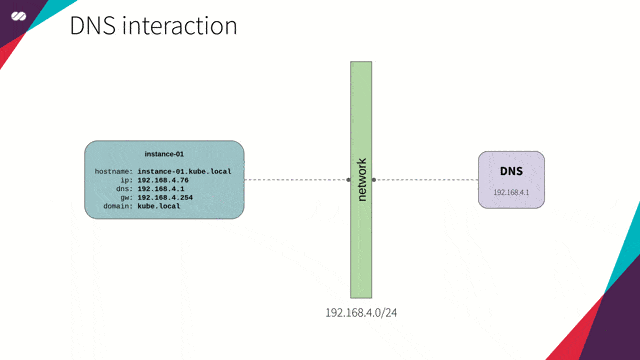
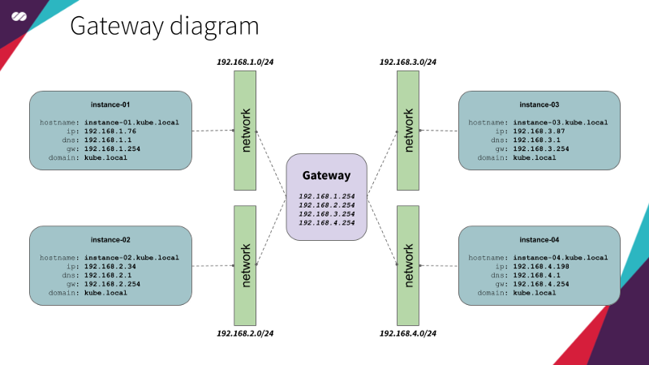
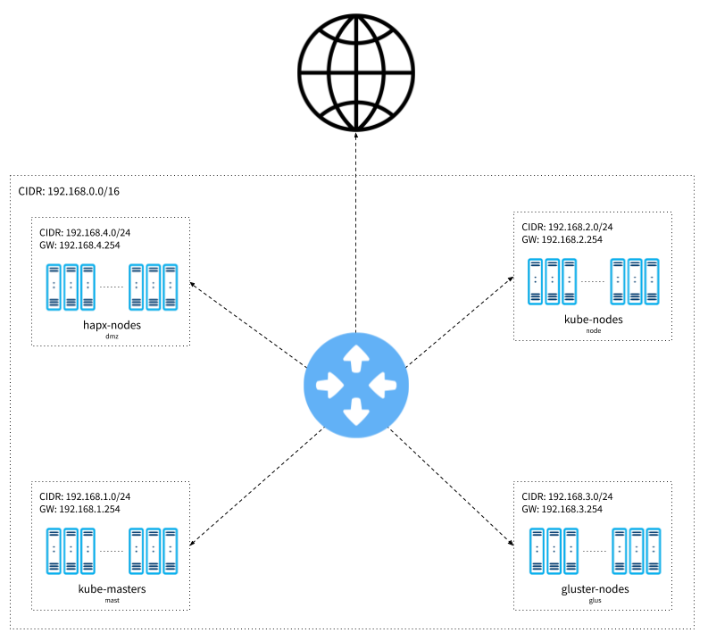

# Networking

## DNS

*“An Internet resource, for example, a Web site, can be identified in two ways: by its domain name, for example, “kubernetes.io” or by the IP address of the hosts that host it (for example, 45.54.44.102 is the IP associated with the kubernetes.io domain). IP addresses are used by the network layer to determine the physical and virtual location of the equipment. Domain names, however, are more mnemonic for user and businesses. We then need a mechanism to resolve a domain name to an IP address. This is the main function of DNS.*

*Occasionally, it is assumed that DNS serves only the purpose of mapping Internet host names to data (TXT, MX, etc) and map addresses to hostnames. However, DNS can store a wide variety of data types, for almost any purpose.”*

Reference: https://www.cloudflare.com/learning/dns/what-is-dns/

To simplify the concept, imagine a classroom where the teacher is calling the students by their names and they respond saying where exactly they are located in the class, providing the coordinates (line and row) of their seats. For example:

* **Teacher says**: “John Gow !!”
* **John Gow says**: “I’m here: row 4 line 10”
* **Teacher says**: “Ok, now I know your exact location: row 4 line 10”

In the above example, the teacher knows the exact address of **John Gow**. The same happens when we enter the address “kubernetes.io” in a browser and the **DNS** responds with “45.54.44.102”.

<p align="center">
  <br>
  DNS interaction concept
</p>

You can also find more information about **DNS** in our [Technology Stack](/documentation/technologies.md#dnsmasq).

## NAT

*“In computer networks, Network Address Translation (NAT), also known as masquerading, is a technique that consists of rewriting, using a hash table, the source IP addresses of a packet passing through a router or firewall in a manner that a computer on an internal network has access to the outside or World Wide Web (public network).”*

Reference: https://en.wikipedia.org/wiki/Network_address_translation

<p align="center">
  <br>
  NAT interaction concept
</p>

## DHCP
*“The DHCP, Dynamic Host Configuration Protocol (DHCP), is a TCP / IP service protocol that provides dynamic configuration to devices (VM instances, notebooks, tablets, mobile devices, IOT sensors etc) in a network, such as: IP addresses, subnet masks, default gateway addresses, IP addresses of DNS servers, DNS search suffixes, IP addresses of [WINS](https://docs.microsoft.com/en-us/previous-versions//bb727015%28v=technet.10%29) servers and so on.*
*This protocol is the successor of [BOOTP](https://en.wikipedia.org/wiki/Bootstrap_Protocol) which, although simpler, has become limited to current requirements. DHCP came standard by October 1993. [RFC 2131](https://www.ietf.org/rfc/rfc2131.txt) (1997) contains the most current specifications. The last standard for the specification of DHCP over IPv6 (DHCPv6) was published as [RFC 3315](https://tools.ietf.org/html/rfc3315) (2003).”*

Reference: https://en.wikipedia.org/wiki/Dynamic_Host_Configuration_Protocol

<p align="center">
  <br>
  DHCP interaction concept
</p>

If you don’t remember what a **DHCP** is, please refer back to our [Technology Stack](/documentation/technologies.md#dnsmasq).

## Gateway

*“Gateways, also called protocol converters, can operate on any network layer. The responsibilities of a gateway are more complex than those of a router or switch since they communicate using more than one protocol.*

*The computers of Internet users and the computers that serve pages for users are network nodes, and the nodes that connect the networks between them are gateways. For example, computers that control traffic between enterprise networks or computers used by Internet Service Providers (ISPs) to connect users to the Internet are gateway nodes.*

*In a company network, a server computer that acts as a gateway node is often also acting as a proxy server and firewall server. A gateway is often associated with a router, which knows where to direct a particular data packet that is received at the gateway and to switch it, which provides the gateway’s actual input and output path to a particular receiver.”*

Reference: https://en.wikipedia.org/wiki/Gateway_(telecommunications)

To simplify this concept, **Gateway** is the access point to/from computers outside your network. Depending on the complexity of your network, gateways may be only one or a few, as they provide exit and entry points to the network (just like doors in a home).

<p align="center">
  <br>
  Gateway diagram concept
</p>

## IP Address

The length of an IP address is 32 bits and is divided into 4 octets (8 bits). Each octet may be represented in a decimal format, separated by a dot.

```
192.168.134.123
 ^   ^   ^   ^
 8   8   8   8 ---> 8 bits (0-255)
```

## Network Segmentation

Network segmentation in a computer network is the practice of separating computer networks into subnets (network segments). The main advantages of this practice are to improve safety and performance.

### Benefits

#### Traffic reduction

* It causes network traffic to be isolated to each network segment, which means that each network segment has its own traffic volume, not influencing the entire network.

#### Safety

* Broadcast is restricted only to that network segment and not the entire network.
* The resources present in a network segment may be isolated from other networks or restricted from one subnet to another.
* Common attacks are restricted to each subnet, not the entire network. Given this, it is important to segment the network by type of resources (database, NFS, web, etc).

#### Isolation of problems

* Any network problem in one subnet is restricted to that subnet without affecting the entire network.

#### Accesses

* Limitation of access into and between each of the subnets (**subnet-a** can only access **subnet-b**, for example).

Reference: https://en.wikipedia.org/wiki/Network_segmentation

## Network classes

* **Class A** — Every IP with the first octet having its value in the 1–127 range is a **Class A** address.
* **Class B** — Every IP with the first octet having its value in the 128–191 range is a **Class B** address.
* **Class C** — Every IP with the first octet having its value in the 192–223 range is a **Class C** address.
* **Class D** — Every IP with the first octet having its value in the 224–239 range is a **Class D** address.
* **Class E** — Every IP with the first octet having its value in the 240–255 range is a **Class E** address.

## CIDR Notation

The **Classless Inter-Domain Routing**, or **CIDR**, is an alternative to traditional subnetting.

IP addresses are described with two groups of bits at the address: the most significant bits are the network prefix, which identifies the entire network or subnet, and the least significant set, the host identifier, which specifies a particular interface of a host on that network. This division is used as the basis for routing traffic between IP networks and for address allocation policies.

The basic idea here is to group the most significant bits at the beginning of the address. See the table below.

```text
+-------------------------+----------------+
| Subnet/Netmask          | Notation CIDR  |
+-------------------------+----------------+
|      10.0.0.0/255.0.0.0 |     10.0.0.0/8 |
|  172.16.0.0/255.240.0.0 |  172.16.0.0/12 |
| 192.168.0.0/255.255.0.0 | 192.168.0.0/16 |
+-------------------------+----------------+
```

Reference: https://en.wikipedia.org/wiki/Classless_Inter-Domain_Routing

## Localhost

The 127.0.0.0–127.255.255.255 IP range (or 127.0.0.0/8 in **CIDR** notation) is reserved for communication within the localhost. Any packets sent to these addresses won’t leave the computer that generated them. Still, they will be treated just like any other packets received from the network.

## Reserved Private Ranges

Of the 4,294,967,296 (0.0.0.0/0 - 2³²) addresses available, three ranges are reserved for private networks. The IP addresses contained in these ranges cannot be routed out of the private network and are not routable from public networks.

Classes **A**, **B**, and **C** were reserved for networks (standardized by [RFC 1918](http://www.ietf.org/rfc/rfc1918.txt) and also by RFCs [3330](http://www.ietf.org/rfc/rfc3330.txt) and [3927](http://www.ietf.org/rfc/Frfc3927.txt)) which are known as private network addresses. See the table below.

```text
+-------+-------------------------------+----------------+
| Class | Range                         | Notation CIDR  |
+-------+-------------------------------+----------------+
|   A   |    10.0.0.0 - 10.255.255.255  |     10.0.0.0/8 |
|   B   |  172.16.0.0 - 172.31.255.255  |  172.16.0.0/12 |
|   C   | 192.168.0.0 - 192.168.255.255 | 192.168.0.0/16 |
+-------+-------------------------------+----------------+
```

## Our Network Topology

<p align="center">
  <br>
  Network diagram concept
</p>

### Network

This is the IP address range for our main network. It provides us with up to 65534 addresses, allowing us to segment it into smaller, specialized blocks.

```text
+---------------+----------------+-------+-----------+
| Name          | Range          | Class | Addresses |
+---------------+----------------+-------+-----------+
| main network  | 192.168.0.0/16 |   C   |     65534 |
+---------------+----------------+-------+-----------+
```

### Subnets

Here, we define how our subnetworks will be segregated, allowing us to separate each resource category from the others. The main network will be an /16, while the smaller networks will be /24 and /25.

To simplify this concept, imagine we have a commercial building with many floors, with each floor dedicated to a professional specialization. For example, software developers would stay on the 1st floor, cooks on the 2nd, doctors on the 3rd and so on.

Basically, what we did was to get our building (the main network) and assign an address to each floor, specifying the maximum number of professionals (hosts) that each floor supports.

```text
+--------------+-------------+------------------+-------+-------+
| Type         | Subnet Name | Range            | Class |  IPs  |
+--------------+-------------+------------------+-------+-------+
| Kube Master  | mast        | 192.168.1.0/24   |   C   |   254 |
| MetalLB      | node        | 192.168.2.0/25   |   C   |   126 |
| Kube Worker  | node        | 192.168.2.128/25 |   C   |   126 |
| Gluster      | glus        | 192.168.3.0/24   |   C   |   254 |
| Floating IPs | dmz         | 192.168.4.0/27   |   C   |    30 |
| BusyBox      | dmz         | 192.168.4.32/27  |   C   |    30 |
| HAProxy      | dmz         | 192.168.4.128/25 |   C   |   126 |
+--------------+-------------+------------------+-------+-------+
```

The subnets will be segmented to accommodate 254 (/24) and 126 (/25) addresses, which are sufficient sizes to accommodate the number of instances, load balancers (**MetalLB**) and the **Floating IP**, for the complete deployment of our **Kubernetes** cluster.

You may be asking why these numbers aren’t 256 (2⁸ — (32–24)) and 128 (2⁷ — (32 -25)). The reason for this is that the first and last addresses are reserved for the network and broadcast, respectively.

### DNS

As explained above, it’s common practice to assign the first available address to the DNS server. Thus:

```text
+------------+---------------+
| Name       | Ip            |
+------------+---------------+
| DNS - mast |   192.168.1.1 |
| DNS - node |   192.168.2.1 |
| DNS - glus |   192.168.3.1 |
| DNS - dmz  |   192.168.4.1 |
| DNS - dmz  |  192.168.4.33 |
| DNS - dmz  | 192.168.4.129 |
+------------+---------------+
```

### DHCP

Here we define what our IP distribution range should be, guaranteeing that each subnetwork defined above will have enough IPs available to be assigned to the hosts that are launched into them.

Looking closer to it, we can see each IP range supports up 252 and 124 IPs. If the number of hosts in a given network is higher than this, we’ll face an IP exhaustion scenario. This means a new host trying to join the subnetwork won’t be able to receive an IP and, as a consequence, won’t be able to join the network.

```text
+-------------+-------------------------------+-------+
| Name        | Range                         | Hosts |
+-------------+-------------------------------+-------+
| DHCP - mast |   192.168.1.2 - 192.168.1.253 |   252 |
| DHCP - node | 192.168.2.130 - 192.168.2.253 |   124 |
| DHCP - glus |   192.168.3.2 - 192.168.3.253 |   252 |
| DHCP - dmz  | 192.168.4.130 - 192.168.4.253 |   124 |
+-------------+-------------+-----------------+-------+
```

*Notice the first addresses will be reserved for **DNS** servers and the last for **Gateways**. That’s the reason why we are referring to 252 (for /24) and 124 (for /25), instead of 254 and 126 addresses, respectively.*

If you don’t remember what a **DHCP** is, please refer back to our [Technology Stack](/documentation/technologies.md#dnsmasq).

### Gateways

It’s a common practice to reserve the first or last IP in a subnetwork as the gateway address. It’s technically possible to assign a different IP address to your gateway. Keep in mind though that this can make DHCP configuration harder.

For example, in a subnetwork with CIDR 192.168.5.0/24, if we arbitrarily assign the IP 192.168.5.127 to our gateway, our IP distribution range would have to be defined as either 192.168.5.1–192.168.5.126 or 192.168.5.128–192.168.5.254, making things less intuitive.

To make our lives easier, we will be using the last IP (notice we use 254 because 255 is reserved for broadcast) address of our subnetworks for our gateways.

```text
+----------------+---------------+
| Name           | Address       |
+----------------+---------------+
| Gateway - mast | 192.168.1.254 |
| Gateway - node | 192.168.2.254 |
| Gateway - glus | 192.168.3.254 |
| Gateway - dmz  |  192.168.4.30 |
| Gateway - dmz  |  192.168.4.62 |
| Gateway - dmz  | 192.168.4.254 |
+----------------+---------------+
```

### Floating IP

Our **Floating IP** address could be any IP address in our DMZ subnetwork 192.168.4.0/27. Thus, we will be using 192.168.4.20.

If you don’t remember what a **Floating IP** is, please refer back to our [Architecture Overview](/documentation/common-cluster.md#haproxy-cluster).

```text
+---------------+--------------+
| Name          | Address      |
+---------------+--------------+
| Floating IP   | 192.168.4.20 |
+---------------+--------------+
```

### LoadBalancer

If you don’t remember what a **Load Balancing** is, please refer back to our [Architecture Overview](/documentation/common-cluster.md#load-balancing).

```text
+---------+-----------------------------+---------------+
| Name    | Range                       | LoadBalancers |
+---------+-----------------------------+---------------+
| MetalLB | 192.168.2.2 - 192.168.2.126 |           125 |
+---------+-----------------------------+---------------+
```
