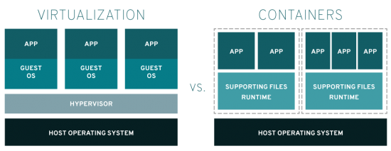
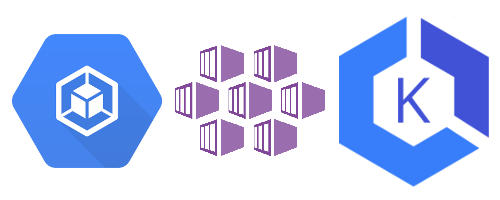

## Kubernetes Journey - Up and running out of the cloud

Hello there!

We have been following the industry transformation, especially with regards to IT infrastructure.

We testified the first application infrastructure modernization wave, through which corporations were able to reach great economies of scale by leveraging virtualization techniques. Having that in place, it was not necessary to wait for the acquisition of physical hardware in order to increase CPU, memory nor disk anymore. It was just a matter of changing configuration and everything was good again.

  
  Image by: https://www.redhat.com

Later, following the application development modernization movement, where applications became more and more complex, talking to each other through service interfaces, we watched the rise of the containerization movement. At first, limited to developers local environments, making it easy to develop and test applications locally, as well to run demos of products.

Then came the Cloud with a whole new modernization movement. Many companies have been moving their workloads to the cloud, taking advantage of the economies of scale and enabling themselves to implement the business changes required by the current scenario, in which the speed to respond to a change becomes a key component in the survivability of a business.

It was in this scenario, where we have applications that became complex systems, comprised of multiple integrated and ever evolving smaller parts, that Kubernetes was born. The main cloud providers each provide their own flavor of Kubernetes (name GKE, EKS, AKS, etc.)

  
  Kubernetes Flavors in the Cloud (GKE, AKS, EKS)

Having Kubernetes available through the big cloud providers brought many benefits to software developers and corporations. However, there is still a considerable amount of companies that can’t leverage cloud for a variety of reasons (regulations, for example) and want to take advantage of Kubernetes capabilities. It is this context, in which the public cloud is not an option and the company wants to install Kubernetes in its data-center, that we will explore and demystify in this series of articles.

We’ll deep dive into infrastructure concepts (networking, security, high availability, disaster recovery etc), that development teams are often not familiar with, but are definitely required to successfully install Kubernetes from scratch.

If you’re interested in this subject and want to understand how to setup a Kubernetes cluster in detail, you can’t miss this journey!
