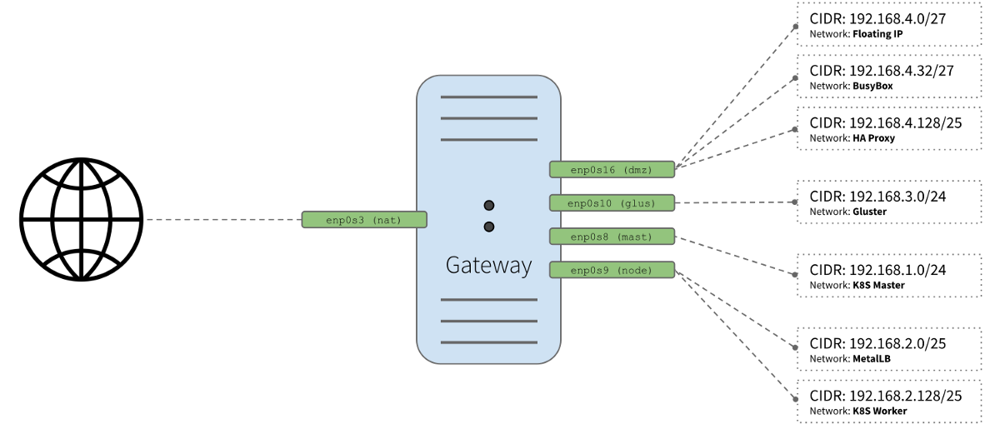

# How to setup the Gateway and Busybox components

We created the base image, for both Ubuntu and Debian, that we will use as the basis for creating the specific images for the following components of our solution:

* **Gateway** (one instance)
* **Busybox** (one instance)
* **HA Proxy** (two instances)
* **Kubernetes Master** (three instances)
* **Kubernetes Worker** (three instances)
* **Gluster nodes** (three instances)

Check our [Architecture Overview](common-cluster.md) for a better understanding of how these components interact with each other.

To avoid getting too long, we will focus on the configuration of the **Gateway** and **Busybox** components.

As we have seen on our [Networking](networking.md), the gateway instance will provide the following services: **DNS**, **NAT**, **DHCP** and **Gateway**. Please refer to it for more information about what each component is responsible for.

To configure our instances, we'll make use of cloud-init as well as a custom parameterized shell script that will help us to create each custom image using the base custom image we created in our last article.

## cloud-init

<p align="center">
  
</p>

*"cloud-init is developed and released as free software under both the GPLv3 open source license and Apache License version 2.0. It was originally designed for the Ubuntu distribution of Linux in Amazon EC2, but is now supported on many Linux and UNIX distributions in every major cloud."*

> Reference: https://cloud-init.io/

### Overview

cloud-init is a utility for instance initialization. It allows the automatic configuration of instances as they are initialized, transforming a generic Linux image into a configured server in a few seconds, quickly and easily.

The cloud-init program that is available in the latest Linux distributions is capable of running services, creating users, and installing and configuring packages. One of the most popular formats for [user-data](https://cloudinit.readthedocs.io/en/latest/topics/examples.html) scripts is the [cloud-config](https://cloudinit.readthedocs.io/en/latest/topics/examples.html) file format.

cloud-config files are special scripts designed to be processed by the cloud-init process. They are usually used for initial setup on the first startup of a server.

### Capabilities

* **run commands**: execute a list of commands with output to the console.
* **configure ssh keys**: add an entry for ~/.ssh/authorized_keys to the configured user.
* **install packages**: install additional packages on first startup.
* **configure network**: upgrade /etc/hosts, host name, etc.
* **write files**: write arbitrary files to disk.
* **add repository**: add an apt or yum repository.
* **create user and groups**: add groups and users to the system and set properties for them.
* **perform upgrade**: upgrade all packages.
* **reboot**: reboot or shut down when finished with cloud-init.

### What about Chef, Puppet and Salt?

One of the issues with tools like **Chef**/**Puppet**/**Salt** is that they need an agent to be deployed on the VM before they can start managing those servers. Cloud-init can come to the rescue in these scenarios, as there are modules in cloud-init to deploy the agents for **Chef**/**Puppet**/**Salt**.

> For a complete list of cloud-init modules, refer to the [documentation](https://cloudinit.readthedocs.io/en/latest/topics/modules.html).

### Seed ISO

The initialization of the data source used here will be [nocloud](https://cloudinit.readthedocs.io/en/latest/reference/datasources/nocloud.html). To boot the system in this way, you need to create an ISO file with a **meta-data** file and a **user-data** file, as shown below.

The filesystem volume label must be **cidata** or **CIDATA**.

```shell
$ genisoimage -input-charset utf-8 \
    -output hostname-cidata.iso \
    -volid cidata -joliet -rock meta-data user-data
```

When we create our custom images, the hostname-cidata.iso generated above will attached to the image and will be used by cloud-init to configure the instance.

You can observe this procedure in the create-image.sh script, which is detailed in the section below.

## create-image.sh

<p align="center">
  
</p>

Now let's create the images using a custom tool we created (create-image.sh) that will help us clone the base image and add the user-data, meta-data and network-config scripts that cloud-init will use to install the necessary packages and configurations.

```shell
./create-image.sh \
    -k or -ssh-pub-keyfile SSH_PUB_KEY_FILE \
    -u or -user-data USER_DATA_FILE \
    -m or -meta-data META_DATA_FILE \
    -n or -network-interfaces NETWORK_INTERFACES_FILE \
    -i or -post-config-interfaces POST_CONFIG_INTERFACES_FILE \
    -s or -post-config-storages POST_CONFIG_STORAGES_FILE \
    -r or -post-config-resources POST_CONFIG_RESOURCES_FILE \
    -o or -hostname HOSTNAME \
    -b or -base-image BASE_IMAGE \
    -l or -linux-distribution LINUX_DISTRIBUTION \
    -a or -auto-start AUTO_START
```

### Parameters

* **`-k`** is used to copy the **public key** from your host to the newly created VM.
* **`-u`** is used to specify the **user-data** file that will be passed as a parameter to the command that creates the cloud-init ISO file we mentioned before (check the source code of the script for a better understanding of how it's used). Default is **`/data/user-data`**.
* **`-m`** is used to specify the **meta-data** file that will be passed as a parameter to the command that creates the cloud-init ISO file we mentioned before (check the source code of the script for a better understanding of how it's used). Default is **`/data/meta-data`**.
* **`-n`** is used to pass a configuration file that will be used by cloud-init to configure the **network** for the instance.
* **`-i`** is used to pass a configuration file that our script will use to modify the **network interface** managed by **VirtualBox** that is attached to the instance that will be created from this image.
* **`-r`** is used to pass a configuration file that our script will use to configure the **number of processors and amount of memory** that is allocated to our instance by **VirtualBox**.
* **`-o`** is used to pass the **hostname** that will be assigned to our instance. This will also be the name used by **VirtualBox** to reference our instance.
* **`-l`** is used to inform which Linux distribution (**debian** or **ubuntu**) configuration files we want to use (notice this is used to specify which folder under data is referenced). Default is **`debian`**.
* **`-b`** is used to specify which **base image** should be used. This is the image name that was created on **VirtualBox** when we executed the installation steps from our [linux image](create-linux-image.md).
* **`-s`** is used to pass a configuration file that our script will use to configure **virtual disks** on **VirtualBox**. You'll notice this is used only on the **Gluster** configuration step.
* **`-a`** whether or not our instance **should be initialized** after it's created. Default is **`true`**.

## Gateway configuration

<p align="center">
  
  Gateway diagram
</p>

Full explanation in our [Network](networking.md).

### user-data TL;DR

This is the user-data file that is passed with the **`-u`** flag to our [create-image.sh](../create-image.sh) script. The specific file below is the user-data file that is used to configure our gateway. You can check the configuration for each component under **`/data/{distribution}/{component}/user-data`** in our repo. Check the comments in the file to better understand what each section represents.

```yaml
#cloud-config

write_files:

# CA ssh pub certificate
- path: /etc/ssh/ca.pub
  permissions: '0644'
  encoding: b64
  content: |
    c3NoLXJzYSBBQUFBQjNOemFDMXljMkVBQUFBREFRQUJBQUFDQVFERGozaTNSODZvQzNzZ0N3ZVRh
    R1dHZVZHRFpLbFdiOHM4QWVJVE9hOTB3NHl5UndSUWtBTWNGaWFNWGx5OEVOSDd0MHNpM0tFYnRZ
    M1B1ekpTNVMwTHY0MVFkaHlYMHJhUGxobTZpNnVDV3BvYWsycEF6K1ZFazhLbW1kZjdqMm5OTHlG
    Y3NQeVg0b0t0SlQrajh6R2QxWHRBWDBuS0JWOXFkOGNTTFFBZGpQVkdNZGxYdTNCZzdsNml3OHhK
    Ti9ld1l1Qm5DODZ5TlNiWFlDVVpLOE1oQUNLV2FMVWVnOSt0dXNyNTBSbGVRcGI0a2NKRE45LzFa
    MjhneUtORTRCVENYanEyTzVqRE1MRDlDU3hqNXJoNXRPUUlKREFvblIrMnljUlVnZTltc2hIQ05D
    VWU2WG16OFVJUFJ2UVpPNERFaHpHZ2N0cFJnWlhQajRoMGJoeGVMekUxcFROMHI2Q29GMDVpOFB0
    QXd1czl1K0tjUHVoQlgrVm9UbW1JNmRBTStUQkxRUnJ3SUorNnhtM29nWEMwYVpjdkdCVUVTcVll
    QjUyU0xjZEwyNnBKUlBrVjZYQ0Qyc3RleG5uOFREUEdjYnlZelFnaGNlYUYrb0psdWE4UDZDSzV2
    VStkNlBGK2o1aEE2NGdHbDQrWmw0TUNBcXdNcnBySEhpd2E3bzF0MC9JTmdoYlFvUUdSU3haQXMz
    UHdYcklMQ0xUeGN6V29UWHZIWUxuRXRTWW42MVh3SElldWJrTVhJamJBSysreStKWCswcm02aHRN
    N2h2R2QzS0ZvU1N4aDlFY1FONTNXWEhMYXBHQ0o0NGVFU3NqbVgzN1NwWElUYUhEOHJQRXBia0E0
    WWJzaVVoTXZPZ0VCLy9MZ1d0R2kvRVRxalVSUFkvWGRTVTR5dFE9PSBjYUBrdWJlLmRlbW8K

# Enable IP Forward
- path: /etc/sysctl.d/10-gateway.conf
  permissions: '0644'
  content: |
    net.ipv4.ip_forward=1

# DNS server configuration
- path: /etc/dnsmasq.d/dns
  permissions: '0644'
  content: |
    no-hosts
    domain-needed
    bogus-priv
    listen-address=127.0.0.1
    listen-address=192.168.1.1
    listen-address=192.168.2.1
    listen-address=192.168.3.1
    listen-address=192.168.4.1
    listen-address=192.168.4.33
    listen-address=192.168.4.129
    domain=kube.demo
    local=/kube.demo/
    address=/#HOSTNAME#.kube.demo/192.168.254.254

# Enable cache 10000 entries
- path: /etc/dnsmasq.d/cache
  permissions: '0644'
  content: |
    cache-size=10000

# DHCP server configuration per interfaces
- path: /etc/dnsmasq.d/dhcp
  permissions: '0644'
  content: |
    dhcp-range=enp0s8,192.168.1.2,192.168.1.253,255.255.255.0,192.168.1.255,12h
    dhcp-range=enp0s9,192.168.2.130,192.168.2.253,255.255.255.0,192.168.2.255,12h
    dhcp-range=enp0s10,192.168.3.2,192.168.3.253,255.255.255.0,192.168.3.255,12h
    dhcp-range=enp0s16.42,192.168.4.34,192.168.4.61,255.255.255.224,192.168.4.63,12h
    dhcp-range=enp0s16.43,192.168.4.130,192.168.4.253,255.255.255.128,192.168.4.128,12h

    dhcp-option=enp0s8,option:dns-server,192.168.1.1
    dhcp-option=enp0s9,option:dns-server,192.168.2.1
    dhcp-option=enp0s10,option:dns-server,192.168.3.1
    dhcp-option=enp0s16.42,option:dns-server,192.168.4.33
    dhcp-option=enp0s16.43,option:dns-server,192.168.4.129

    dhcp-option=enp0s8,option:domain-name,kube.demo
    dhcp-option=enp0s9,option:domain-name,kube.demo
    dhcp-option=enp0s10,option:domain-name,kube.demo
    dhcp-option=enp0s16.42,option:domain-name,kube.demo
    dhcp-option=enp0s16.43,option:domain-name,kube.demo

    dhcp-option=enp0s8,option:router,192.168.1.254
    dhcp-option=enp0s9,option:router,192.168.2.254
    dhcp-option=enp0s10,option:router,192.168.3.254
    dhcp-option=enp0s16.42,option:router,192.168.4.62
    dhcp-option=enp0s16.43,option:router,192.168.4.254

runcmd:
  # Apply kernel parameters
  - [ sysctl, --system ]
  # Disable systemd resolve
  - [ systemctl, stop, systemd-resolved ]
  - [ systemctl, disable, systemd-resolved ]
  - [ systemctl, mask, systemd-resolved ]
  - [ chown, -R, 'debian:debian', '/home/debian' ]
  # SSH server to trust the CA
  - echo '\nTrustedUserCAKeys /etc/ssh/ca.pub' | tee -a /etc/ssh/sshd_config

# NAT enable
bootcmd:
  # Clean up
  - iptables -t nat -F
  - iptables -t mangle -F
  - iptables -F
  - iptables -X

  # Default policy to drop all incoming packages
  - iptables -P INPUT DROP 
  - iptables -P FORWARD DROP 
  - iptables -P OUTPUT ACCEPT 

  # Accept incoming packages from localhost and the LAN interfaces
  - iptables -A INPUT -i lo -j ACCEPT
  - iptables -A INPUT -i enp0s8 -j ACCEPT
  - iptables -A INPUT -i enp0s9 -j ACCEPT
  - iptables -A INPUT -i enp0s10 -j ACCEPT
  - iptables -A INPUT -i enp0s16.41 -j ACCEPT
  - iptables -A INPUT -i enp0s16.42 -j ACCEPT
  - iptables -A INPUT -i enp0s16.43 -j ACCEPT

  # Accept incoming paclages from WAN if router initiated the connection
  - iptables -A INPUT -i enp0s3 -m conntrack --ctstate ESTABLISHED,RELATED -j ACCEPT

  # Forward LAN packages to the WAN
  - iptables -A FORWARD -i enp0s8 -j ACCEPT
  - iptables -A FORWARD -i enp0s9 -j ACCEPT
  - iptables -A FORWARD -i enp0s10 -j ACCEPT
  - iptables -A FORWARD -i enp0s16.41 -j ACCEPT
  - iptables -A FORWARD -i enp0s16.42 -j ACCEPT
  - iptables -A FORWARD -i enp0s16.43 -j ACCEPT
  - iptables -A FORWARD -i enp0s17 -j ACCEPT

  # Forward WAN packages to the LAN if the LAN initiated the connection
  - iptables -A FORWARD -i enp0s3 -m conntrack --ctstate ESTABLISHED,RELATED -j ACCEPT

  # NAT traffic going out the WAN interface
  - iptables -t nat -A POSTROUTING -o enp0s3 -j MASQUERADE

apt:
  sources_list: |
    deb http://deb.debian.org/debian/ $RELEASE main contrib non-free
    deb-src http://deb.debian.org/debian/ $RELEASE main contrib non-free

    deb http://deb.debian.org/debian/ $RELEASE-updates main contrib non-free
    deb-src http://deb.debian.org/debian/ $RELEASE-updates main contrib non-free

    deb http://deb.debian.org/debian-security $RELEASE/updates main
    deb-src http://deb.debian.org/debian-security $RELEASE/updates main
  conf: |
    APT {
      Get {
        Assume-Yes "true";
        Fix-Broken "true";
      };
    };

packages:
  - dnsmasq

users:
- name: debian
  gecos: Debian User
  sudo: ALL=(ALL) NOPASSWD:ALL
  shell: /bin/bash
  lock_passwd: true
- name: root
  lock_passwd: true

locale: en_US.UTF-8

timezone: UTC

ssh_deletekeys: 1

package_upgrade: true

ssh_pwauth: false

manage_etc_hosts: true

fqdn: #HOSTNAME#.kube.demo

hostname: #HOSTNAME#

power_state:
  mode: reboot
  timeout: 30
  condition: true
```

## BusyBox

Since we have a whole specific virtualized network created inside the VirtualBox space and our host machine, by default, doesn't have access to this network, we'll create a BusyBox instance. A BusyBox, also known as a Jump Box or Bastion Host, is an instance that will reside in the same network of our deployment and provide us with a single access point to the other instances. This provides us with the ability to connect to the instances in the other network with minimal configuration changes to our host machine.

Besides acting as an access point to our deployment, this machine will also have network diagnosis tools and the kubectl installed on it, so we don't need to mess with any existing installation we may have on our host machine.

### user-data TL;DR

```yaml
#cloud-config

write_files:

# Private ED25519 key
- path: /run/.ssh/id_ed25519
  permissions: '0600'
  encoding: b64
  content: |
    LS0tLS1CRUdJTiBPUEVOU1NIIFBSSVZBVEUgS0VZLS0tLS0KYjNCbGJuTnphQzFyWlhrdGRqRUFB
    QUFBQkc1dmJtVUFBQUFFYm05dVpRQUFBQUFBQUFBQkFBQUFNd0FBQUF0emMyZ3RaVwpReU5UVXhP
    UUFBQUNEVWtycGk2Yys0QVdZdlVEUFI1MEVoVXFuc1JNQmExWkV4MXg1TVVwU3o4QUFBQUppcGpq
    NzBxWTQrCjlBQUFBQXR6YzJndFpXUXlOVFV4T1FBQUFDRFVrcnBpNmMrNEFXWXZVRFBSNTBFaFVx
    bnNSTUJhMVpFeDF4NU1VcFN6OEEKQUFBRUJ3R0FNVWRVbGh5Ykt5eGFNUTcydGVYT2JRMFhMMk54
    QnRpY2VvOFZGTWc5U1N1bUxwejdnQlppOVFNOUhuUVNGUwpxZXhFd0ZyVmtUSFhIa3hTbExQd0FB
    QUFEbTEyWVd4c2FXMUFZMjl2YkdWeUFRSURCQVVHQnc9PQotLS0tLUVORCBPUEVOU1NIIFBSSVZB
    VEUgS0VZLS0tLS0K

# Public ED25519 key
- path: /run/.ssh/id_ed25519.pub
  permissions: '0644'
  encoding: b64
  content: |
    c3NoLWVkMjU1MTkgQUFBQUMzTnphQzFsWkRJMU5URTVBQUFBSU5TU3VtTHB6N2dCWmk5UU05SG5R
    U0ZTcWV4RXdGclZrVEhYSGt4U2xMUHcgZGViaWFuQGt1YmUuZGVtbwo=

# Signed ED25519 public key
- path: /run/.ssh/id_ed25519-cert.pub
  permissions: '0644'
  encoding: b64
  content: |
    c3NoLWVkMjU1MTktY2VydC12MDFAb3BlbnNzaC5jb20gQUFBQUlITnphQzFsWkRJMU5URTVMV05s
    Y25RdGRqQXhRRzl3Wlc1emMyZ3VZMjl0QUFBQUlOY0o0T2VockNnc3FLZ2dzU3M0RnVqVVFaQ1JF
    UWVCc0dRcmQvQXZwU3BJQUFBQUlOU1N1bUxwejdnQlppOVFNOUhuUVNGU3FleEV3RnJWa1RIWEhr
    eFNsTFB3QUFBQUFBQUFBQUFBQUFBQkFBQUFFR1JsWW1saGJrQnJkV0psTG1SbGJXOEFBQUFLQUFB
    QUJtUmxZbWxoYmdBQUFBQUFBQUFBLy8vLy8vLy8vLzhBQUFBQUFBQUFnZ0FBQUJWd1pYSnRhWFF0
    V0RFeExXWnZjbmRoY21ScGJtY0FBQUFBQUFBQUYzQmxjbTFwZEMxaFoyVnVkQzFtYjNKM1lYSmth
    VzVuQUFBQUFBQUFBQlp3WlhKdGFYUXRjRzl5ZEMxbWIzSjNZWEprYVc1bkFBQUFBQUFBQUFwd1pY
    SnRhWFF0Y0hSNUFBQUFBQUFBQUE1d1pYSnRhWFF0ZFhObGNpMXlZd0FBQUFBQUFBQUFBQUFBTXdB
    QUFBdHpjMmd0WldReU5UVXhPUUFBQUNCVlRKcERiWnhYd29yWEtVSG1ha0xsVC9naVZrWmw0OElZ
    a0l5ZG8wYW92d0FBQUZNQUFBQUxjM05vTFdWa01qVTFNVGtBQUFCQXpOZ3V5S0t4TTVYUnNCRUNO
    T2NqRDV1Y09rU2hUL1ZURENvVzJrc2JaYmFDZGxkellJQ2V6UmJHYnNYWURpVExibFUyTE9ZL1dm
    MnFsb1pEMHdYZENRPT0gZGViaWFuQGt1YmUuZGVtbwo=

apt:
  sources_list: |
    deb http://deb.debian.org/debian/ $RELEASE main contrib non-free
    deb-src http://deb.debian.org/debian/ $RELEASE main contrib non-free

    deb http://deb.debian.org/debian/ $RELEASE-updates main contrib non-free
    deb-src http://deb.debian.org/debian/ $RELEASE-updates main contrib non-free

    deb http://deb.debian.org/debian-security $RELEASE-security main
    deb-src http://deb.debian.org/debian-security $RELEASE-security main

  sources:
    kubernetes.list:
      source: deb https://apt.kubernetes.io/ kubernetes-xenial main

  conf: |
    APT {
      Get {
        Assume-Yes "true";
        Fix-Broken "true";
      };
    };

packages: 
  - apt-transport-https
  - software-properties-common
  - ca-certificates
  - gnupg2
  - dnsutils
  - screen
  - curl
  - git
  - vim
  - less
  - tmux

runcmd:
  - [ sh, -c, 'curl -fsSLo /etc/apt/trusted.gpg.d/kubernetes-archive-keyring.gpg https://dl.k8s.io/apt/doc/apt-key.gpg' ]
  - [ apt-get, update ]
  - [ apt-get, install, -y, 'kubectl=1.20.15-00' ]
  - [ apt-mark, hold, kubectl ]
  - [ sh, -c, 'mv -u /run/.ssh/* /home/debian/.ssh/.' ]
  - [ chown, -R, 'debian:debian', '/home/debian' ]

users:
- name: debian
  gecos: Debian User
  sudo: ALL=(ALL) NOPASSWD:ALL
  shell: /bin/bash
  lock_passwd: true
  ssh_authorized_keys:
    - #SSH-PUB-KEY#
- name: root
  lock_passwd: true

locale: en_US.UTF-8

timezone: UTC

ssh_deletekeys: 1

package_upgrade: true

ssh_pwauth: false

manage_etc_hosts: true

fqdn: #HOSTNAME#.kube.demo

hostname: #HOSTNAME#

power_state:
  mode: reboot
  timeout: 30
  condition: true
```

## Running

### Prerequisites (GNU/Linux Debian/Ubuntu)

The premise is that you already have **Virtualbox** properly installed on your local machine.

* Add your user on `vboxusers` group

  ```console
  sudo usermod -a -G vboxusers $USER
  ```

* Install `shyaml`

  ```console
  sudo apt-get install python3-pip
  sudo pip3 install shyaml
  ```

* Install `genisoimage`

  ```console
  sudo apt-get install genisoimage
  ```

* Install `uuid-runtime`

  ```console
  sudo apt-get install uuid-runtime
  ```

* Configure Host-Only Networking

  ```console
  sudo /bin/sh -c "echo '* 192.168.0.0/16 0:0:0:0:0:0:0:0/16' >> /etc/vbox/networks.conf"
  ```

* Configure Host Adapter VirtualBox

  ```console
  vboxmanage hostonlyif create
  vboxmanage hostonlyif ipconfig vboxnet0 --ip 192.168.254.1 --netmask 255.255.0.0
  ```

### Clone repository

```console
~$ git clone git@github.com:mvallim/kubernetes-under-the-hood.git

Cloning into 'kubernetes-under-the-hood'...
remote: Enumerating objects: 190, done.
remote: Counting objects: 100% (190/190), done.
remote: Compressing objects: 100% (141/141), done.
remote: Total 2527 (delta 117), reused 86 (delta 45), pack-reused 2337
Receiving objects: 100% (2527/2527), 47.89 MiB | 8.61 MiB/s, done.
Resolving deltas: 100% (1662/1662), done.

~$ cd kubernetes-under-the-hood
```

### Create VM's

To initialize and configure our instances using cloud-init, we'll use the configuration files versioned at the data directory from our repository.

Note: pay attention that, for each step, we pass the specific configuration files of the component being configured (gate, hapx, glus etc.)

* **Create Gateway**

  ```console
  ~/kubernetes-under-the-hood$ ./create-image.sh \
    -k ~/.ssh/id_rsa.pub \
    -u gate/user-data \
    -n gate/network-config \
    -i gate/post-config-interfaces \
    -r gate/post-config-resources \
    -o gate-node01 \
    -l debian \
    -b debian-base-image
  ```

  The responses should look similar to this:
  
  ```console
  Total translation table size: 0
  Total rockridge attributes bytes: 417
  Total directory bytes: 0
  Path table size(bytes): 10
  Max brk space used 0
  186 extents written (0 MB)
  0%...10%...20%...30%...40%...50%...60%...70%...80%...90%...100%
  Machine has been successfully cloned as "gate-node01"
  Waiting for VM "gate-node01" to power on...
  VM "gate-node01" has been successfully started.
  ```

  > ***NOTICE: Wait the gate-node01 finish the configuration and the VM to be started to execute the next step.***

* **Create BusyBox**

  ```console
  ~/kubernetes-under-the-hood$ ./create-image.sh \
    -k ~/.ssh/id_rsa.pub \
    -u busybox/user-data \
    -n busybox/network-config \
    -i busybox/post-config-interfaces \
    -r busybox/post-config-resources \
    -o busybox \
    -l debian \
    -b debian-base-image
  ```

  The responses should look similar to this:
  
  ```console
  Total translation table size: 0
  Total rockridge attributes bytes: 417
  Total directory bytes: 0
  Path table size(bytes): 10
  Max brk space used 0
  186 extents written (0 MB)
  0%...10%...20%...30%...40%...50%...60%...70%...80%...90%...100%
  Machine has been successfully cloned as "busybox"
  Waiting for VM "busybox" to power on...
  VM "busybox" has been successfully started.
  ```

### Configure your local routing

You need to add the route on your local machine to access the internal network of **Virtualbox**.

```console
~$ sudo ip route add 192.168.4.32/27 via 192.168.4.62 dev vboxnet0
```

### Access BusyBox

We need to get the **BusyBox IP** to access it via ssh

```console
~$ vboxmanage guestproperty get busybox "/VirtualBox/GuestInfo/Net/0/V4/IP"
```

The responses should look similar to this:

```console
Value: 192.168.4.57
```

Use the returned value to access.

```console
~$ ssh debian@192.168.4.57

Linux busybox 4.19.0-18-amd64 #1 SMP Debian 4.19.208-1 (2021-09-29) x86_64

The programs included with the Debian GNU/Linux system are free software;
the exact distribution terms for each program are described in the
individual files in /usr/share/doc/*/copyright.

Debian GNU/Linux comes with ABSOLUTELY NO WARRANTY, to the extent
permitted by applicable law.
```

Let's check **DNS** configuration, using **`nslookup`**

```console
debian@busybox:~$ nslookup gate-node01

Server:         192.168.4.1
Address:        192.168.4.1#53
Name:   gate-node01.kube.demo
Address: 192.168.254.254
```

Let's check access internet using **`curl`**

```console
debian@busybox:~$ curl -v google.com

* Rebuilt URL to: google.com/
*   Trying 172.217.29.142...
* TCP_NODELAY set
* Connected to google.com (172.217.29.142) port 80 (#0)
> GET / HTTP/1.1
> Host: google.com
> User-Agent: curl/7.52.1
> Accept: */*
>
< HTTP/1.1 301 Moved Permanently
< Location: http://www.google.com/
< Content-Type: text/html; charset=UTF-8
< Date: Sun, 24 Nov 2019 21:13:19 GMT
< Expires: Tue, 24 Dec 2019 21:13:19 GMT
< Cache-Control: public, max-age=2592000
< Server: gws
< Content-Length: 219
< X-XSS-Protection: 0
< X-Frame-Options: SAMEORIGIN
<
<HTML><HEAD><meta http-equiv="content-type" content="text/html;charset=utf-8">
<TITLE>301 Moved</TITLE></HEAD><BODY>
<H1>301 Moved</H1>
The document has moved
<A HREF="http://www.google.com/">here</A>.
</BODY></HTML>
* Curl_http_done: called premature == 0
* Connection #0 to host google.com left intact
```

Let's check **`kubectl`** version

```console
debian@busybox:~$ kubectl version --client

Client Version: version.Info{Major:"1", Minor:"20", GitVersion:"v1.20.15", GitCommit:"8f1e5bf0b9729a899b8df86249b56e2c74aebc55", GitTreeState:"clean", BuildDate:"2022-01-19T17:27:39Z", GoVersion:"go1.15.15", Compiler:"gc", Platform:"linux/amd64"}
```

Let's check access `gate-node01`

```console
debian@busybox:~$ ssh debian@gate-node01

Linux gate-node01 4.19.0-18-amd64 #1 SMP Debian 4.19.208-1 (2021-09-29) x86_64

The programs included with the Debian GNU/Linux system are free software;
the exact distribution terms for each program are described in the
individual files in /usr/share/doc/*/copyright.

Debian GNU/Linux comes with ABSOLUTELY NO WARRANTY, to the extent
permitted by applicable law.
```

## Conclusion

We have configured our **Gateway** instance as well as a **BusyBox** instance that will allow us to connect into all the instances that compose our solution, which reside in a network different than our host machine.
