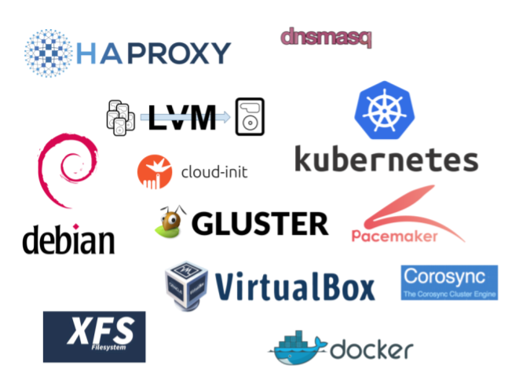

## Technologies

  

| Technology     | Description |
|----------------|-------------|
| **HAProxy**    | HAProxy is a free, very fast and reliable solution offering high availability, load balancing, and proxying for TCP and HTTP-based applications. It is particularly suited for very high traffic web sites and powers quite a number of the world's most visited ones. Over the years it has become the de-facto standard opensource load balancer, is now shipped with most mainstream Linux distributions, and is often deployed by default in cloud platforms. Since it does not advertise itself, we only know it's used when the admins report it :-) Reference: http://www.haproxy.org/ |
| **dnsmasq**    | Dnsmasq provides network infrastructure for small networks: DNS, DHCP, router advertisement and network boot. It is designed to be lightweight and have a small footprint, suitable for resource constrained routers and firewalls. It has also been widely used for tethering on smartphones and portable hotspots, and to support virtual networking in virtualisation frameworks. Supported platforms include Linux (with glibc and uclibc), Android, *BSD, and Mac OS X. Dnsmasq is included in most Linux distributions and the ports systems of FreeBSD, OpenBSD and NetBSD. Dnsmasq provides full IPv6 support.  Reference: http://thekelleys.org.uk/dnsmasq/doc.html |
| **lvm**        | LVM2 refers to the userspace toolset that provide logical volume management facilities on linux. It is reasonably backwards-compatible with the original LVM toolset. Reference: https://www.sourceware.org/lvm2/|
| **Kubernetes** | Kubernetes (K8s) is an open-source system for automating deployment, scaling, and management of containerized applications. Reference: https://kubernetes.io/|
| **Debian**     | Debian is a free operating system (OS) for your computer. An operating system is the set of basic programs and utilities that make your computer run. Reference: https://www.debian.org/ |
| **Ubuntu**     | Ubuntu is an open source software operating system that runs from the desktop, to the cloud, to all your internet connected things. Reference: https://www.ubuntu.com/ |
| **cloud-init** | The standard for customising cloud instances Reference: https://cloud-init.io/ |
| **Gluster**    | Gluster is a free and open source software scalable network filesystem. Reference: https://www.gluster.org/ |
| **Pacemaker**  | Pacemaker is an Open Source, High Availability resource manager suitable for both small and large clusters. Reference: https://clusterlabs.org/pacemaker/ |
| **Corosync**   | The Corosync Cluster Engine is a Group Communication System with additional features for implementing high availability within applications. Corosync is used as a High Availability framework by projects such as Apache Qpid and Pacemaker. Reference: https://clusterlabs.org/corosync.html |
| **XFS**        | XFS is a high-performance 64-bit journaling file system created by Silicon Graphics, Inc (SGI) in 1993. It was the default file system in SGI's IRIX operating system starting with its version 5.3. XFS was ported to the Linux kernel in 2001; as of June 2014, XFS is supported by most Linux distributions, some of which use it as the default file system. Reference: http://xfs.org/index.php/Main_Page |
| **Docker**     | Enterprise Container Platform for High Velocity Innovation. Reference: https://www.docker.com/ |
| **VirtualBox** | VirtualBox is a powerful x86 and AMD64/Intel64 virtualization product for enterprise as well as home use. Not only is VirtualBox an extremely feature rich, high performance product for enterprise customers, it is also the only professional solution that is freely available as Open Source Software under the terms of the GNU General Public License (GPL) version 2.  Reference: https://www.virtualbox.org/ |