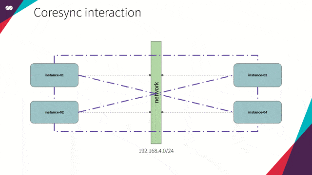
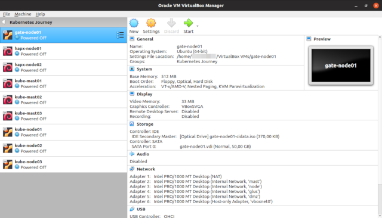
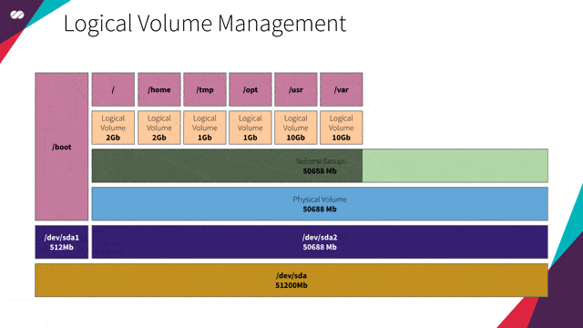
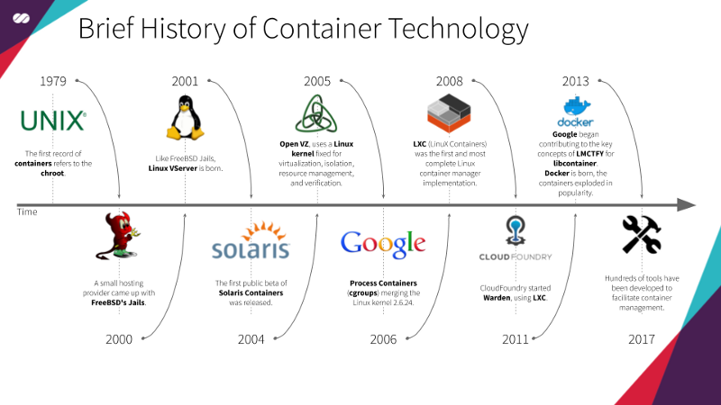

# Technology Stack

## HAProxy

*“HAProxy is a free, very fast and reliable solution offering high availability, load balancing, and proxying for TCP and HTTP-based applications. It is particularly suited for very high traffic web sites and powers quite a number of the world’s most visited ones. Over the years it has become the de-facto standard opensource load balancer, is now shipped with most mainstream Linux distributions, and is often deployed by default in cloud platforms. Since it does not advertise itself, we only know it’s used when the admins report it :-)”*

Reference: http://www.haproxy.org/

We’ll be using **HAProxy** to create a **Load Balancer (LB)** — as we’ve mentioned [here](/documentation/common-cluster.md#haproxy-cluster) — for the **Kubernetes API**.

Let’s imagine a scenario: What would happen if we had only one **HAProxy** instance performing the Load Balancing? We would introduce a Single Point of Failure ([SPOF](https://en.wikipedia.org/wiki/Single_point_of_failure)) to our architecture. I mean, if, for any reason, this single **HAProxy** failed, we would totally lose access to the **Kubernetes API**. Of course, this is a situation we want to avoid at all costs, given the importance of this component to our solution.

To solve this problem, **HAProxy** will be part of a **High Availability Cluster (HA)** powered by a **Floating IP** and with at least two **HAProxy** services configured, as already presented [here](/documentation/common-cluster.md#haproxy-cluster).

In summary, we will be creating a **Highly Available Cluster** for **Load Balancing**.

  

## Corosync

*“The Corosync Cluster Engine is a Group Communication System with additional features for implementing high availability within applications.*
*Corosync is used as a High Availability framework by projects such as Apache Qpid and Pacemaker.”*

Reference: https://clusterlabs.org/corosync.html

**Corosync** has two main purposes: **Keeping the status of the cluster** (knowing when a node joins or leaves the cluster) and **distributing messages to all the cluster members**.

### Keeping the status of the cluster

#### A node joins the cluster

To update the cluster status, all nodes of the cluster should have **Corosync** installed and configured the same way. Thus, every time a node containing **Corosync** starts, imagine the following conversation takes place:

* The new node sends a broadcast message saying: *“Is there any Corosync member there?”*
* The existing **Corosync** instances in the network receive the message and respond: *“I’m here!”*
* The new node receives the response from these existing instances and says: *“Hi there! I want to join the cluster. Here are my credentials!”*
* The existing **Corosync** instances receive this request-to-join message, evaluate the credentials (configuration) received and decide, based on the quorum configuration, if the new instance should or shouldn’t be accepted to this “very special club”.

  

#### A node leaves the cluster

After a node joins this “very special club”, it gets to know all the other nodes. On the same way, all the other nodes get to know the new node, as well as they already know all the previous members.

To know when a node leaves the cluster, **Corosync** continuously monitors the health of the node members. For this, imagine the following scenario:

* Each node has a list containing the addresses of all the other nodes;
* Each node will interact with the nodes in its local list;
* If for, any reason, the node is not able to interact with a given node from this local list, then it will consider that node as unhealthy;
* The node will then consult all the other members to check how they see this potentially unhealthy node.
* Each node will have a vote saying whether that node is healthy or unhealthy from their point of view.
* **Corosync** will then evaluate the quorum configuration against the received votes to decide whether the node should be marked as healthy or unhealthy.
* If the node is marked unhealthy it will still be known to the cluster but won’t be used while it is in that state.

  

## Pacemaker

*“Pacemaker is an Open Source, High Availability resource manager suitable for both small and large clusters.”*

Reference: https://clusterlabs.org/pacemaker/

*The definitive open-source high-availability stack for the Linux platform builds upon the Pacemaker cluster resource manager.” — LINUX Journal*

**Pacemaker** creates and configures resources in the cluster created and managed by **Corosync**.

The main purpose of **Pacemaker** here is to make our **Loader Balancer** Highly Available. To do so, we will use Pacemaker to declare a **Floating IP** and an **HAProxy** resource which will both be setup in the nodes managed by the **Corosync** cluster.

**Pacemaker** uses a declarative approach. It means we will create a configuration file specifying which resources should exist on each node and how these resources relate to each other. This relationship, in our case, is a mutual dependency between the **Floating IP** and the **HAProxy** resources. It means that they both depend on each other. The **Floating IP** should only be active in a given node if the **HAProxy** is active in the same node and vice-versa.

In simple terms, when a node is in active mode, we want the **Floating IP** and **HAProxy** to be assigned to and be executed on it, while all the other nodes will be in passive mode until, for any reason, the node or the resources attached to it fail. When that happens, the resources that are assigned to the active node are “migrated to” (or started on) one of the passive nodes where all the dependency conditions can be satisfied. Once this happens, the selected node becomes the active one and the previously active node transitions to the passive state. Check the animation below:

  

## dnsmasq

*“Dnsmasq provides network infrastructure for small networks: DNS, DHCP, router advertisement and network boot. It is designed to be lightweight and has a small footprint, suitable for resource-constrained routers and firewalls. It has also been widely used for tethering on smartphones and portable hotspots, and to support virtual networking in virtualization frameworks. Supported platforms include Linux (with glibc and uclibc), Android, \*BSD, and Mac OS X. Dnsmasq is included in most Linux distributions and the ports systems of FreeBSD, OpenBSD and NetBSD. Dnsmasq provides full IPv6 support.”*

Reference: http://thekelleys.org.uk/dnsmasq/doc.html

We will be using **dnsmasq** to provide the **DNS** and **DHCP** functionality for our hosts (nodes).

* [**DHCP**](https://en.wikipedia.org/wiki/Dynamic_Host_Configuration_Protocol) will be responsible for the distribution of IP addresses and network configuration for each new host (node) that joins the network. This removes the need for creating too many settings for each new host that joins the network as well as the need to do this manually. The host performs a [broadcast to the network](https://en.wikipedia.org/wiki/Broadcasting_%28networking%29), and the **DHCP** service responds with the settings needed. (check the animation below)
* [**DNS**](https://en.wikipedia.org/wiki/Domain_Name_System) is responsible for resolving names inside our internal network as well as names from the public internet.

**DHCP** and **DNS** will work in synchronization; that is, for each new host that joins the network, **DHCP** updates the **DNS** service with the mapping of this hostname to its provided IP so we can refer to a new host by its name — not by its IP — without worrying about its IP address.

As a more practical example, consider what usually happens when we create a new instance on cloud platforms (GCP, AWS, Azure, etc). Each new instance created immediately receives an IP, DNS resolvers, routes and hostname registration in the internal **DNS**. At the end of the day, it’s **DHCP**, together with **DNS**, who is doing this work for us behind the scenes.

  

## VirtualBox

*“VirtualBox is a powerful x86 and AMD64/Intel64 virtualization product for enterprise as well as home use. Not only is VirtualBox an extremely feature rich, high-performance product for enterprise customers, it is also the only professional solution that is freely available as Open Source Software under the terms of the GNU General Public License (GPL) version 2.”*

Reference: https://www.virtualbox.org/

Well, since we don’t have access to an actual bare-metal server, we’ll be using **VirtualBox** (an open source alternative) for simulating machines and networks in our data center.

This technology stack is all we need to exercise the concepts demonstrated throughout this series of articles.

  

## cloud-init

*“cloud-init is developed and released as free software under both the GPLv3 open source license and Apache License version 2.0. It was originally designed for the Ubuntu distribution of Linux in Amazon EC2, but is now supported on many Linux and UNIX distributions in every major cloud.”*

Reference: https://cloud-init.io/

**cloud-init** is a utility for instance initialization. It allows for automatic configuration of instances when they are initialized, transforming a generic image of Linux into a configured server in a few seconds, quickly and easily.

The **cloud-init** utility that is available in the latest Linux distributions is capable of performing the setup of services, users and packages. One of the most popular formats for [**user-data**](https://cloudinit.readthedocs.io/en/latest/topics/examples.html) scripts is the **cloud-config** file format.

cloud-config files are special scripts designed to be processed by the cloud-init utility. They are usually used to setup a server during its first boot.

We can see cloud-init in action below (tip: you can reduce the video velocity to see it in more detail):

  

## LVM

*“**LVM means Logical Volume Manager.***

***What is the Logical Volume Management?***

*The Logical volume management provides a higher-level abstraction of the disk storage on a computer system than the traditional view of disks and partitions. This gives the system administrator much more flexibility in allocating storage to applications and users.*

*Storage volumes created under the control of the logical volume manager can be resized and moved around almost at will.”*

Reference: http://tldp.org/HOWTO/LVM-HOWTO/

Imagine your company is to rent conference centers. The conferences hosted at these venues vary in size, ranging from huge events such as Google I/O and AWS re:Invent to smaller events like the Annual Whatever-Fancy-Convention-You-May-Imagine-Here.

To maximize the efficiency of use of these spaces, each venue is basically a huge hangar without any fixed divisions of its space. Having this configuration allows your company to divide the space into smaller slots, which may vary in size.

Imagine Google I/O, for example. During the conference, a bigger slot may be configured to host the keynote sessions and, right after these sessions end, the space may be reconfigured into smaller sections to hold the other sessions of the event.

That’s basically what **LVM** allows us to do with our disks. **LVM** allows us to configure our servers without having to know in advance what’s their intended use. We don’t need to know what services will run on them, neither what’s the expected volume of data these services will generate. It also allows us to manipulate and resize volumes in real time, just like in the example for venue space allocation in conferences above.

In our specific case, since we are going to create a VM image that will be the base for many other images (Gateway, HAProxy, Kubernetes master/worker nodes and Gluster), with each service having its own demand for space (our slots, in this case, would be /var, /usr, /tmp, /opt, / etc), **LVM** will provide us with the flexibility to resize our partition volumes as needed without having to worry about this details in advance.

   
  LVM extension concept in action

## Containerd

*"Containerd is an industry-standard core container runtime that manages the complete container lifecycle on a host system. It handles image transfer and storage, container execution and supervision, low-level storage, and network attachments. Containerd is designed to be embedded into larger systems, such as Kubernetes, rather than being used directly by developers."*

Reference: https://containerd.io/

Reference: https://github.com/containerd/containerd

**Containerd** was originally developed as part of Docker but was later extracted and donated to the Cloud Native Computing Foundation (CNCF) as an independent project. It provides a lightweight, focused runtime that implements the core container functionality needed by orchestration platforms, without the additional tooling and features that Docker includes for developer workflows.

   
  Above is a brief summary of the history of containers taken from Wikipedia and <a href="https://content.pivotal.io/infographics/moments-in-container-history">other sources</a>

Containerd serves as the underlying runtime that executes and manages containers on a host system. It handles critical low-level operations such as pulling and storing container images, creating and managing container filesystems, executing containers, and managing their lifecycle. This abstraction allows higher-level tools and orchestrators to focus on application-level concerns without worrying about the implementation details of container execution.

One of the great advantages of using containerd is its simplicity and focus. By providing only the essential container runtime functionality, it offers better performance, reduced resource consumption, and a smaller attack surface compared to full container platforms. Additionally, being a CNCF graduated project, containerd has become the de facto standard runtime for Kubernetes and other cloud-native platforms.

While containerd and Docker both enable containerization, containerd is specifically designed as a runtime daemon focused on core container operations, whereas Docker is a complete platform with developer tools, image building capabilities, and a CLI for direct user interaction. For a better understanding of this architectural difference, check the image below:

   
  Image by: https://www.redhat.com

When running containerized applications at scale, having a dedicated container runtime becomes essential. **Kubernetes** integrates directly with **containerd** through the Container Runtime Interface (CRI), eliminating the need for intermediate layers and improving overall efficiency. **Kubernetes** is an open-source container orchestration system for automating application deployment, scaling, and management, and containerd serves as its lightweight, efficient runtime engine that handles the actual execution of containers on each node.

## Kubernetes

*“Kubernetes (K8s) is an open-source system for automating deployment, scaling, and management of containerized applications.”*

Reference: https://kubernetes.io/

As we saw above, Kubernetes is an open-source container orchestration system for automating application deployment, scaling, and management, able to manage containers smartly and cleanly.

We’ll cover the internals of Kubernetes in detail in the other topic.

   

## Debian

*“Debian is a free operating system (OS) for your computer. An operating system is the set of basic programs and utilities that make your computer run.”*

Reference: https://www.debian.org/
